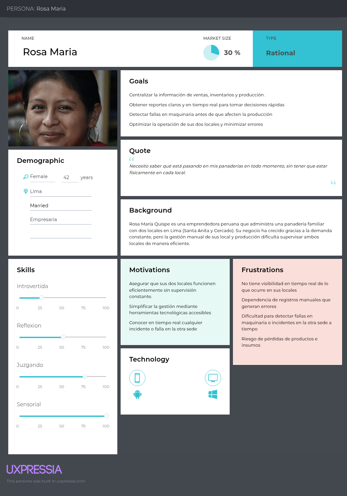
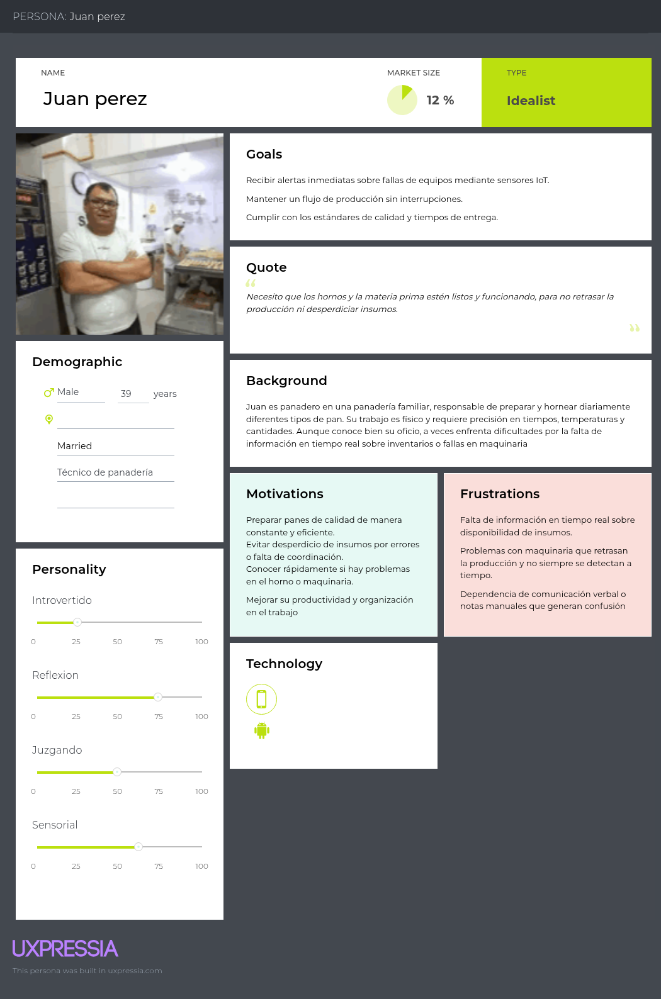
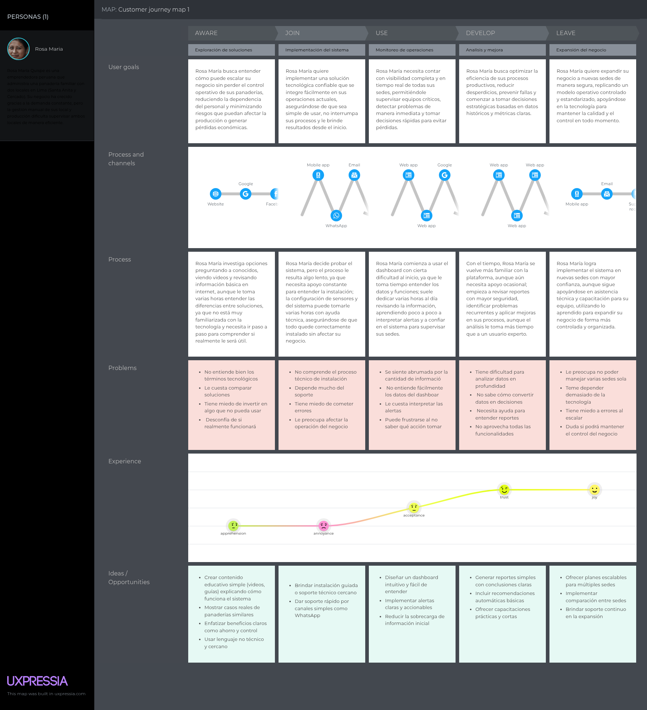
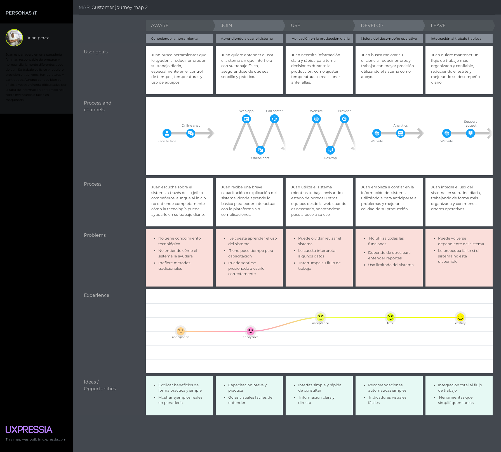
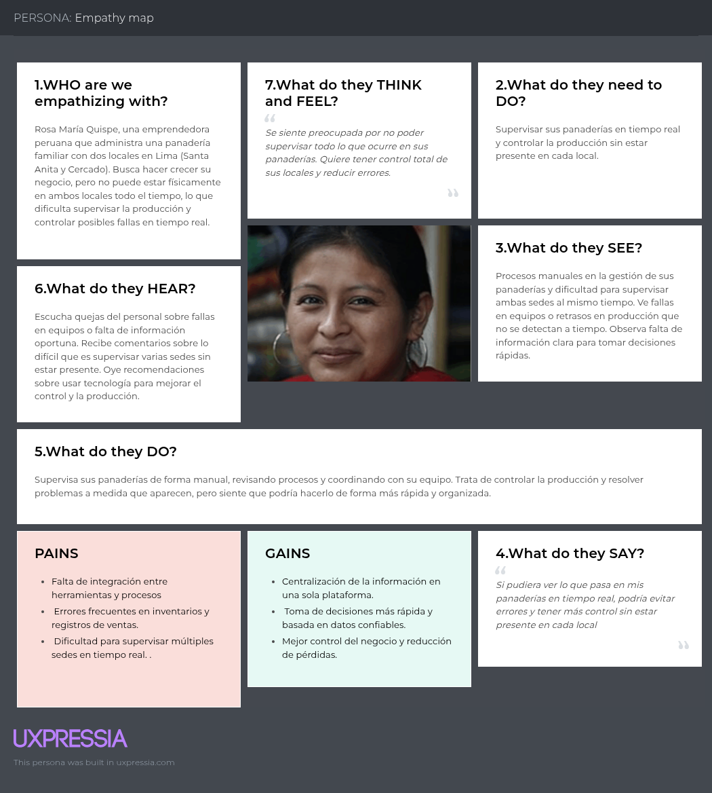
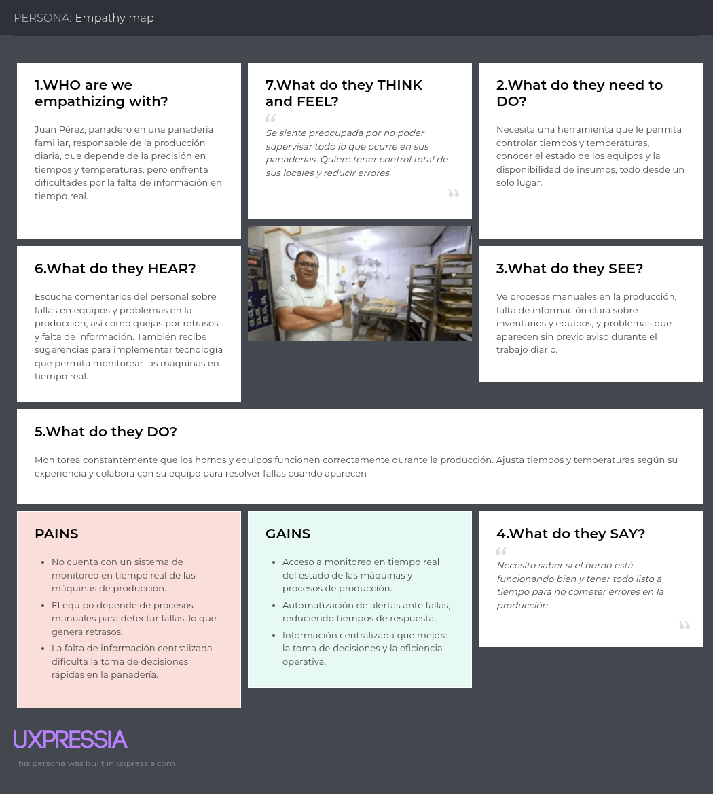

# Capítulo II: Requirements Elicitation & Analysis

## 2.1. Competidores

### Odoo

Odoo es una plataforma ERP desarrollada en 2005 que integra distintos módulos de gestión empresarial, tales como ventas, inventarios, contabilidad y producción. Se caracteriza por su flexibilidad y capacidad de adaptación a diversos tipos de negocio, incluidas las micro y pequeñas empresas. No obstante, su implementación suele implicar un alto nivel de complejidad técnica y no se encuentra específicamente orientada al sector panadero ni contempla, de manera nativa, funcionalidades de monitoreo de maquinaria mediante tecnologías IoT.

---

### Loyverse POS

Loyverse POS es un sistema de punto de venta diseñado para pequeños comercios, el cual facilita el registro de transacciones y el control básico de inventarios. Si bien destaca por su simplicidad y accesibilidad, presenta limitaciones en cuanto a la gestión integral del negocio, ya que no incorpora funcionalidades relacionadas con la planificación de la producción, la administración de múltiples sedes ni el monitoreo en tiempo real de equipos.

---

### FlexiBake

FlexiBake es una solución tecnológica especializada en la industria panadera, orientada a la gestión de procesos como la producción, el control de recetas y la administración de inventarios. A pesar de su enfoque sectorial, su adopción está principalmente dirigida a empresas de mediana o gran escala, lo que limita su accesibilidad para MYPES. Asimismo, no integra capacidades de monitoreo en tiempo real mediante IoT ni ofrece una solución simplificada adaptada a entornos de menor complejidad operativa.

### Competitive Analysis Landscape

#### ¿Por qué llevar a cabo este análisis?

El presente análisis tiene como objetivo identificar las soluciones tecnológicas existentes en el mercado, evaluar sus principales características y limitaciones, y determinar en qué medida responden a las necesidades del sector panadero.

Asimismo, permite evidenciar la oportunidad de desarrollar una herramienta integral que no solo centralice la gestión de inventarios, ventas y producción, sino que también incorpore capacidades de monitoreo en tiempo real mediante tecnologías IoT, orientadas específicamente a panaderías MYPES en proceso de crecimiento.

### Competitive Analysis Landscape

| **¿Por qué llevar a cabo este análisis?** | Escriba en el recuadro la pregunta que busca responder o el objetivo de este análisis. |
|------------------------------------------|----------------------------------------------------------------------------------------|
|                                          | El análisis permite identificar las soluciones existentes, evaluar sus limitaciones y evidenciar la necesidad de una herramienta integral para la gestión y monitoreo en panaderías MYPES. |

---
| **Segmento** | **Categoría** | **Odoo** | **Loyverse POS** | **FlexiBake** | **BakeryManager** |
|--------------|--------------|----------|------------------|---------------|-------------------|
|             |              |  |  |  |  |
| **PERFIL** | **Overview** | Plataforma ERP que permite gestionar ventas, inventarios, contabilidad y producción en una sola solución. | Sistema de punto de venta que facilita el registro de ventas y el control básico de inventarios en pequeños negocios. | Software especializado en panaderías que permite gestionar producción, recetas e inventarios. | Plataforma web de gestión para panaderías enfocada en la supervisión de producción y monitoreo IoT en tiempo real de maquinaria y condiciones ambientales. |
| **PERFIL** | **Ventaja Competitiva / ¿Qué valor ofrece?** | Gestión empresarial integral mediante una plataforma modular. | Solución accesible y fácil de usar para pequeños negocios. | Funcionalidades especializadas para producción panadera. | Monitoreo en tiempo real de procesos productivos mediante sensores IoT, con control centralizado y enfoque multisede. |
| **MARKETING** | **Mercado Objetivo** | Empresas de distintos tamaños que buscan una solución integral para gestionar sus operaciones empresariales. | Pequeños negocios y comercios minoristas que requieren un sistema sencillo para gestionar ventas e inventarios. | Panaderías de mediana y gran escala que necesitan optimizar sus procesos de producción y gestión operativa. | Panaderías MYPES en crecimiento que buscan optimizar y controlar sus procesos productivos mediante tecnología IoT, especialmente aquellas con múltiples sedes. |
| **MARKETING** | **Estrategias de Marketing** | Estrategia basada en marketing digital, modelo freemium y una red de partners que implementan y personalizan la solución para distintos sectores. | Estrategia enfocada en ofrecer una versión gratuita, promoción digital y posicionamiento en pequeños negocios mediante facilidad de uso y bajo costo. | Estrategia orientada a ventas directas B2B, demostraciones del producto y enfoque en clientes del sector panadero e industrial. | Estrategia basada en marketing digital y demostraciones del producto, destacando el monitoreo IoT, la automatización y el control de producción en tiempo real, con modelo de suscripción accesible. |
| **PRODUCTO** | **Productos y Servicios** | Ofrece la gestión integral de procesos empresariales como ventas, inventarios, contabilidad y producción en una sola plataforma. | Ofrece el registro y control de ventas junto con la gestión básica de inventarios para pequeños negocios. | Ofrece la gestión especializada de procesos productivos en panaderías, incluyendo recetas, producción e inventarios. | Ofrece una plataforma digital accesible desde web y dispositivos móviles para gestionar y monitorear la producción, integrando sensores IoT que supervisan maquinaria, temperatura, humedad y condiciones operativas en tiempo real. |
| **PRODUCTO** | **Precios y Costos** | Modelo de suscripción mensual por usuario y módulos adicionales; costos variables según personalización e implementación. | Modelo freemium, con funciones básicas gratuitas y costos adicionales por herramientas avanzadas y servicios complementarios. | Modelo de licenciamiento y suscripción, con costos elevados asociados a implementación, capacitación y soporte especializado. | Modelo freemium con plan gratuito limitado a funcionalidades básicas de monitoreo; planes escalables según número de sedes, sensores y equipos monitoreados. |
| **PRODUCTO** | **Canales de Distribución** | Distribución a través de su plataforma web oficial, red de partners certificados y servicios de implementación empresarial. | Distribución mediante aplicaciones móviles (App Store, Google Play) y su sitio web oficial. | Distribución directa mediante su página web, ventas consultivas y demostraciones personalizadas. | Distribución mediante plataforma web y aplicación móvil, complementada con marketing digital y demostraciones dirigidas al sector panadero. |
| **Análisis SWOT** | **Fortalezas** | Alta integración de procesos empresariales en una sola plataforma y gran capacidad de personalización. | Facilidad de uso, accesibilidad y rápida implementación para pequeños negocios. | Especialización en el sector panadero y enfoque en la gestión de producción. | Integración de monitoreo IoT con gestión de producción en una sola plataforma, con enfoque en control en tiempo real y operación multisede. |
| **Análisis SWOT** | **Debilidades** | Alta complejidad de implementación y necesidad de personalización técnica, lo que dificulta su adopción en MYPES. | Funcionalidad limitada, sin integración de producción, gestión de múltiples sedes ni monitoreo de maquinaria. | Alto costo y enfoque en empresas de mayor escala, lo que reduce su accesibilidad para pequeñas panaderías. | Dependencia de sensores IoT y necesidad de infraestructura tecnológica, lo que puede dificultar la adopción en panaderías con baja digitalización. |
| **Análisis SWOT** | **Oportunidades** | Creciente digitalización de las MYPES y necesidad de integrar procesos empresariales en una sola plataforma. | Incremento de pequeños negocios que buscan soluciones accesibles para digitalizar sus ventas. | Mayor demanda de herramientas especializadas en la industria alimentaria y de producción. | Creciente adopción de tecnologías IoT en el sector productivo y necesidad de optimizar la eficiencia y calidad en panaderías MYPES. |
| **Análisis SWOT** | **Amenazas** | Alta competencia de otros ERP más simples o especializados que pueden ser más accesibles para MYPES. | Aparición de soluciones más completas que integren producción y gestión avanzada del negocio. | Limitada adopción en mercados emergentes debido a costos elevados y barreras de implementación. | Aparición de soluciones similares con IoT y baja adopción tecnológica en algunas panaderías, además de competencia de sistemas más simples. |
### 2.1.2. Estrategias y tácticas frente a competidores

| **Matriz FODA / CAME** | **Descripción** | **Estrategias y Tácticas** |
|------------------------|----------------|-----------------------------|
| **Oportunidades (O)** | Creciente digitalización de MYPES y demanda de control operativo en tiempo real. | Aprovechar el contexto de digitalización para posicionar BakeryManager como una solución integral que unifica ventas, inventarios, producción y monitoreo de maquinaria en tiempo real. |
| **Amenazas (A)** | Competencia de sistemas POS, ERP y soluciones parciales de bajo costo. | Diferenciarse mediante una propuesta de valor completa frente a sistemas fragmentados como Odoo o Loyverse POS, destacando la integración con IoT y el enfoque especializado en panaderías. |
| **Fortalezas (F)** | Solución integral, monitoreo IoT y enfoque en panaderías MYPES. | Potenciar las ventajas competitivas resaltando la integración de procesos y el monitoreo en tiempo real, posicionando el producto como una herramienta especializada que mejora el control operativo y la toma de decisiones. |
| **Debilidades (D)** | Baja adopción inicial y limitaciones de recursos frente a competidores consolidados. | Implementar estrategias de captación mediante planes accesibles, facilitar la adopción progresiva del sistema y optimizar continuamente el producto para generar confianza y fidelización en los usuarios. |

## 2.2. Entrevistas
### 2.2.1. Diseño de entrevistas

En esta sección se presenta el diseño de las entrevistas realizadas a los principales actores involucrados en el dominio del problema, con el objetivo de comprender sus necesidades, dificultades y expectativas respecto a la gestión de panaderías en proceso de crecimiento.

---

### **Segmento 1: Propietarios y Administradores de Panaderías**

**Datos generales:**
- Nombre completo
- Edad
- Distrito de residencia
- Cargo
- Tipo de negocio

**Preguntas:**
1. ¿Cuántas sedes o locales administra actualmente su negocio?
2. ¿Cómo supervisa actualmente la producción en sus sedes?
3. ¿Cómo controla el estado de sus equipos (hornos, cámaras frigoríficas, etc.)?
4. ¿Ha tenido problemas recientes con maquinaria? ¿Qué tipo de fallas?
5. Cuando ocurre una falla (ej. horno malogrado), ¿cómo se entera?
6. ¿Cuánto tiempo tarda en reaccionar ante un problema operativo?
7. ¿Ha tenido pérdidas por fallas en equipos o condiciones inadecuadas? ¿Puede describir un caso?
8. ¿Qué tan difícil es supervisar múltiples sedes al mismo tiempo?
9. ¿Cuenta actualmente con información en tiempo real de lo que ocurre en su producción?
10. ¿Qué tan importante sería para usted recibir alertas automáticas ante fallas o riesgos?
11. ¿Qué opinaría de una plataforma que le permita monitorear sus equipos y producción en tiempo real mediante sensores?
12. ¿Qué beneficios esperaría obtener de una solución de este tipo?
13. ¿Qué aspectos le generarían desconfianza al implementar este tipo de tecnología?
---

### **Segmento 2: Personal Operativo (Cajeros y Encargados de Producción)**

**Datos generales:**
- Nombre completo
- Edad
- Distrito de residencia
- Cargo
- Tiempo de experiencia en el rubro

**Preguntas:**
1. ¿Qué tareas realiza en el proceso de producción diariamente?
2. ¿Cómo supervisa el funcionamiento de los equipos que utiliza?
3. ¿Ha tenido problemas con hornos u otros equipos? ¿Qué ocurrió?
4. ¿Cómo se dan cuenta cuando algo está fallando?
5. ¿Qué hacen cuando ocurre un problema con la maquinaria?
6. ¿Reciben algún tipo de aviso o alerta cuando hay fallas?
7. ¿Qué tan frecuente ocurren errores o problemas en producción?
8. ¿Considera que podría prevenirse si tuvieran información en tiempo real?
9. ¿Qué tan fácil o difícil sería usar una herramienta digital en su trabajo?
10. ¿Qué tipo de información le gustaría ver en una pantalla o sistema?
11. ¿Cree que recibir alertas automáticas le ayudaría en su trabajo diario? ¿Por qué?
---
### Preguntas complementarias (adaptadas a BakeryManager)

1. ¿Qué dispositivos utiliza con más frecuencia durante su trabajo en producción?
   (Ejemplo: celular, computadora, tablet)
   → ¿En qué momentos los utiliza dentro de la operación?

2. ¿Utiliza actualmente alguna aplicación o sistema para supervisar la producción o el estado de los equipos?
   → ¿Cuál? ¿Qué tan útil le resulta?

3. ¿Qué tan complicado o frustrante es supervisar manualmente el estado de los equipos o la producción?
   → ¿Qué problemas le genera?

4. Si tuviera una herramienta que le enviara alertas automáticas cuando ocurre una falla (por ejemplo, temperatura alta o falla en un horno),
   ¿cómo cambiaría su forma de trabajar?

5. ¿Qué tan útil sería para usted poder ver en tiempo real el estado de los equipos desde su celular?

6. En su opinión, ¿su negocio estaría dispuesto a invertir en una solución que ayude a prevenir fallas y reducir pérdidas?
   → ¿De qué dependería esa decisión? (precio, facilidad de uso, beneficios, etc.)

7. ¿Qué le generaría confianza para usar una plataforma que monitorea sus equipos mediante sensores IoT?

8. ¿Qué le preocuparía o generaría dudas al usar este tipo de tecnología?

### 2.2.2. Registro de entrevistas

Segmento 1 - Propietarios y administradores de panaderias

Segmento 2 - Personal Operativo

### 2.2.3. Análisis de entrevistas.

## 2.3. Needfinding
### 2.3.1. User Personas

#### Segmento 1 : PROPIETARIOS Y ADMINISTRADORES DE PANADERÍAS

---

#### Segmento 2 : PERSONAL OPERATIVO

### 2.3.2. User Task Matrix.

A continuación se presenta la User Task Matrix, construida a partir de los requerimientos del sistema de monitoreo IoT para panaderías.

Este artefacto permite visualizar las tareas clave que realizan los dos segmentos principales del sistema: Propietarios/Administradores y Personal Operativo. Además, permite evaluar la frecuencia con la que ejecutan estas tareas y la importancia que les asignan, facilitando la priorización de funcionalidades del sistema.

| ID   | Tarea                                               | Importancia (Administrador) | Frecuencia (Administrador) | Importancia (Operativo) | Frecuencia (Operativo) |
|------|-----------------------------------------------------|-----------------------------|-----------------------------|--------------------------|------------------------|
| U01  | Monitorear temperatura de fermentación             | Muy alta                    | D                           | Alta                     | D                      |
| U02  | Monitorear humedad en producción                   | Muy alta                    | D                           | Alta                     | D                      |
| U03  | Monitorear temperatura de hornos                   | Muy alta                    | D                           | Muy alta                 | D                      |
| U04  | Controlar refrigeración de insumos                 | Muy alta                    | D                           | Muy alta                 | D                      |
| U05  | Ver estado de máquinas                             | Alta                        | D                           | Alta                     | D                      |
| U06  | Revisar alertas en tiempo real                     | Muy alta                    | D                           | Alta                     | D                      |
| U07  | Registrar incidentes                                | Muy alta                    | O                           | Muy alta                 | O                      |
| U08  | Consultar historial de sensores                    | Alta                        | S                           | Media                    | S                      |
| U09  | Configurar rangos de temperatura y humedad         | Muy alta                    | O                           | Baja                     | O                      |
| U10  | Visualizar dashboard centralizado                  | Muy alta                    | D                           | Muy alta                 | D                      |
| U11  | Detectar anomalías en sensores                     | Muy alta                    | D                           | Alta                     | D                      |
| U12  | Comparar datos históricos de producción            | Alta                        | S                           | Media                    | S                      |
| U13  | Generar reportes de producción                     | Muy alta                    | D                           | Alta                     | D                      |
| U14  | Recibir notificaciones en tiempo real              | Muy alta                    | D                           | Muy alta                 | D                      |
| U15  | Confirmar incidentes                               | Alta                        | O                           | Muy alta                 | O                      |
| U16  | Cerrar incidentes                                  | Alta                        | O                           | Muy alta                 | O                      |
| U17  | Gestionar sensores IoT (registro/asignación)      | Muy alta                    | M                           | Baja                     | M                      |
| U18  | Visualizar tendencias de producción                | Alta                        | S                           | Media                    | S                      |
| U19  | Filtrar datos por tipo de sensor                   | Alta                        | S                           | Media                    | S                      |
| U20  | Visualizar resumen general de producción           | Muy alta                    | D                           | Alta                     | D                      |
---

### 2.3.3. User Journey Mapping.

Este conjunto de User Journey Maps presenta de manera integral el recorrido end-to-end de los dos segmentos clave: los propietarios y administradores de panaderías y el personal operativo. El mapa abarca las principales etapas del ciclo operativo del negocio, articulando en cada una las acciones, pensamientos, emociones, puntos de contacto y problemáticas existentes. Su propósito es identificar los momentos donde la fricción impacta la eficiencia operativa, el control de recursos y la seguridad, así como detectar oportunidades de mejora. Este análisis permite derivar requerimientos funcionales, priorizar soluciones según su impacto y definir indicadores clave (KPIs) orientados a optimizar la gestión, la toma de decisiones y el aprovechamiento de tecnologías como los sensores IoT.

#### Segmento 1: Propietarios y Administradores de Panaderías

#### Segmento 2: Personal Operativo

### 2.3.4. Empathy Mapping
#### Empathy Map – Propietarios y Administradores de Panadería

#### Empathy Map – Personal Operativo

## 2.4. Big Picture Event Storming

## 2.5. Ubiquitous Language.
| Término                 | Definición                                                                                                                             |
|-------------------------|----------------------------------------------------------------------------------------------------------------------------------------|
| Staff                   | Usuario del sistema que realiza tareas operativas dentro de la panadería y puede tener distintos roles según sus permisos.             |
| Administrator / Manager | Usuario del sistema responsable de supervisar las operaciones, gestionar usuarios y controlar la configuración del sistema y permisos. |
| Sale                    | Transacción comercial registrada en el sistema correspondiente a la venta de productos de panadería.                                   |
| Receipt                 | Documento comprobante generado para una transacción de venta registrada en el sistema.                                                 |
| Inventory               | Conjunto de registros que representan la disponibilidad, movimiento y estado de los productos dentro de la panadería.                  |
| Stock                   | Cantidad disponible de un producto específico dentro del inventario.                                                                   |
| Sales Report            | Resumen analítico generado a partir de las ventas para evaluar el rendimiento en un periodo de tiempo.                                 |
| Sales History           | Registro completo de todas las transacciones de venta realizadas en el sistema.                                                        |
| IoT Sensor              | Dispositivo que recopila datos en tiempo real como temperatura, humedad, gas o humo y los envía al sistema.                            |
| Incident                | Evento anómalo detectado por el sistema relacionado con riesgos operativos o fallas en equipos.                                        |
| Alert                   | Notificación automática generada cuando se detecta un incidente o condición crítica.                                                   |
| Event History           | Registro estructurado donde se almacenan automáticamente los incidentes y eventos relevantes del sistema.                              |
| Refrigeration Chamber   | Área de almacenamiento utilizada para conservar insumos bajo condiciones de temperatura controlada.                                    |
| Oven                    | Equipo utilizado en el proceso de horneado que requiere control de temperatura y tiempo.                                               |
| Sensor Status           | Estado operativo de un sensor: activo, inactivo o con fallas.                                                                          |
| Permission              | Permisos de acceso que definen qué acciones puede realizar un usuario dentro del sistema.                                              |
