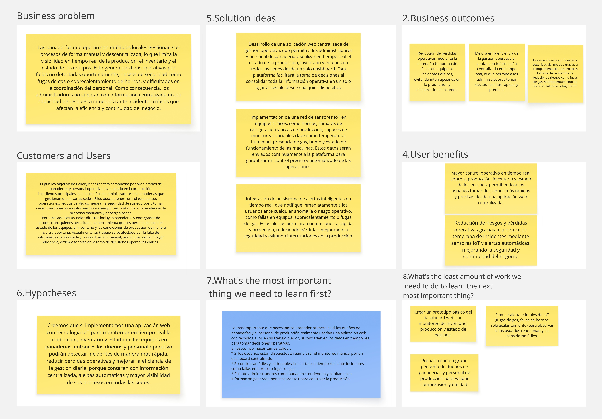

# Capítulo I: Introducción
## 1.1. Startup Profile
### 1.1.1. Descripción de la Startup

Somos Brainova, un equipo de estudiantes de la Universidad Peruana de Ciencias Aplicadas comprometidos con el desarrollo de soluciones tecnológicas innovadoras para optimizar la gestión de negocios como panaderías, pastelerías y otros emprendimientos en crecimiento. Nuestra propuesta consiste en una plataforma web que permite mejorar la eficiencia operativa, automatizar procesos y facilitar la toma de decisiones mediante el uso de tecnología.

Para ello, uno de nuestros productos es **BakeryManager**, una solución enfocada en negocios de panadería que integra el control de producción, monitoreo de maquinaria y supervisión de condiciones operativas mediante sensores IoT, permitiendo una gestión más eficiente, centralizada y en tiempo real de sus operaciones, especialmente en entornos multisede.

**Misión:**  
Nuestra misión es desarrollar soluciones digitales que optimicen la gestión operativa de panaderías en crecimiento, mediante el monitoreo en tiempo real de sus procesos productivos y equipos a través de tecnología IoT. Buscamos mejorar la eficiencia, reducir pérdidas y facilitar la supervisión de múltiples sedes a través de una plataforma centralizada.

**Visión:**  
Nuestra visión es ser una solución tecnológica líder en la digitalización del sector panadero, destacando por integrar monitoreo inteligente mediante IoT y gestión operativa en una sola plataforma, contribuyendo al crecimiento sostenible y a la modernización de las panaderías MYPES.
## 1.1.2. Perfiles de integrantes del equipo

## 1.1.2.1 Integrantes del Equipo

| Foto                                                     | Nombre | Código | Descripción |
|----------------------------------------------------------|--------|--------|-------------|
|                    | **Tufiño Argüelles Luis Angel** | U202216240 | Elegí la carrera de Ingeniería de Software motivado por mi interés en comprender cómo funcionan los programas. Durante la pandemia, comencé a modificar juegos sencillos, iniciando así mi camino en la programación. Tengo conocimientos en C++, Python y JavaScript, además de experiencia en desarrollo web con HTML y CSS y en la creación de bots usando Python. También desarrollé una aplicación web para el negocio familiar, aplicando conceptos de bases de datos y diseño UX/UI. Considero que mi creatividad y capacidad de trabajo en equipo aportan positivamente al desarrollo de este proyecto. |
|                  | **Molina Vásquez Manuel Alejandro** | U20221G231 | Escogí la carrera de Ingeniería de Software porque me interesa comprender el funcionamiento de diversos programas y los algoritmos utilizados en ellos. Tengo conocimientos en C#, C++, Python, HTML y CSS, además de experiencia en el desarrollo de aplicaciones web y manejo de bases de datos. Considero que una de mis principales fortalezas es mi capacidad de trabajo en equipo, lo cual contribuye al cumplimiento de los objetivos del proyecto. |
|  | **Cespedes Pillco, Jarod Jack** | U202318588 | Elegí la carrera de Ingeniería de Software por el interés mío de entender cómo los videojuegos y programas en general funcionaban y cómo eran creados. Tengo experiencia con los lenguajes de programación C++, C#, Visual Basic, Python y Java, además tengo habilidad en el desarrollo de interfaces web con el lenguaje de tipado HTML y CSS. Considero que soy una persona creativa y colaborativa, siempre listo para aportar ideas a mi equipo. |
|  | **Chipana Huarancca, Emanuel Wilfredo** | U202214074 | Decidí estudiar Ingeniería de Software motivado por mi pasión de unir el diseño visual con la lógica de programación para crear soluciones útiles. Tengo sólidos conocimientos en C++, Python y JavaScript. Además, destaco en el diseño de interfaces y experiencia de usuario (UI/UX), con un fuerte dominio de Figma para la creación de prototipos interactivos y wireframes. Disfruto conceptualizar ideas y asegurar una navegación fluida antes de pasar al código. Me considero proactivo y colaborativo; habilidades que aportaré para que nuestro sistema sea tan intuitivo como funcional. |
|  | **Vidal Malaga, Jareth Beycker** | U202316878 |Decidí estudiar Ingeniería de Software para transformar desafíos en soluciones digitales, combinando mi base técnica en C++, Python y JavaScript con una mentalidad analítica. Como estudiante de sexto ciclo, destaco por mi adaptabilidad y responsabilidad, valores que refuerzo a través de la disciplina del deporte y un aprendizaje constante. Mi enfoque se centra en trabajar de manera colaborativa para crear software que no solo sea funcional, sino también eficiente y orientado a resultados. |

## 1.2. Solution Profile
### 1.2.1 Antecedentes y problemática

#### Contexto del mercado y oportunidad

En el panorama económico actual, la industria de la panificación en el Perú se ha visto sometida a una presión financiera sin precedentes debido a la volatilidad en el precio de los commodities, especialmente el trigo, que representa hasta el 40% de los costos de producción de una panadería tradicional (BCRP, 2024). Según el Ministerio de la Producción (2024), el sector manufactura, donde se incluye la panificación, presenta una brecha tecnológica significativa, donde más del 60% de las microempresas operan sin herramientas digitales de gestión, dependiendo de procesos manuales y conocimientos empíricos. Esta falta de control técnico deriva en ineficiencias operativas que elevan la merma de insumos. De acuerdo con el INEI (2024). Esta falta de control técnico no solo incrementa la merma operativa hasta en un 15% por errores de producción, sino que limita la capacidad de respuesta de los dueños ante las fluctuaciones del mercado (Ministerio de la Producción, 2024). Es en este contexto de necesidad de eficiencia y optimización de recursos donde surge BrainNova, una propuesta tecnológica diseñada para cerrar la brecha digital en el sector panadero mediante el monitoreo en tiempo real y la gestión inteligente de datos.

A pesar de la importancia cultural y económica del pan en la dieta peruana, la sostenibilidad de las panaderías artesanales se ve amenazada por cuellos de botella que trascienden la simple preparación del producto. Para identificar las raíces de estas ineficiencias, se ha elaborado el siguiente diagrama de Ishikawa, el cual permite visualizar de manera sistémica cómo la carencia de herramientas tecnológicas afecta la maquinaria, los métodos y la rentabilidad final del negocio (Vásquez, 2024):

El análisis sistémico a través del diagrama de Ishikawa revela que la vulnerabilidad de las panaderías ante la crisis de costos (BCRP, 2024) se debe principalmente a la ausencia de un ecosistema digital que conecte la maquinaria con la gestión de materiales. Mientras los métodos sigan siendo manuales y el monitoreo de la maquinaria sea visual, la merma del 15% seguirá erosionando los márgenes de ganancia. BrainNova interviene precisamente en los ejes de Maquinaria y Medida, transformando datos en tiempo real en herramientas de ahorro directo para el microempresario panadero.

---

#### Who — ¿Quiénes son los involucrados?

Los principales involucrados son los propietarios y administradores de panaderías MYPE que buscan optimizar sus operaciones, controlar costos y sostener el crecimiento del negocio. Este grupo toma decisiones estratégicas relacionadas con producción, compras, mantenimiento, personal y apertura de nuevas sedes.

También forman parte del entorno del problema los encargados de producción, operarios y responsables de tienda, quienes necesitan información clara y oportuna para controlar hornos, cámaras frigoríficas, insumos, tiempos de preparación y estado de los equipos. Su desempeño impacta directamente en la calidad del producto final y en la eficiencia del negocio.

---

#### What — ¿Qué se necesita?

Se necesita una solución tecnológica integrada que centralice la gestión de producción, el monitoreo de maquinaria, el control de condiciones operativas y la supervisión de múltiples sedes. Esta solución debe permitir que los responsables del negocio accedan a información en tiempo real sobre variables críticas como temperatura, humedad, estado de hornos, cámaras frigoríficas, alertas de fallas y avance de la producción.

Desde una perspectiva de negocio, la solución debe contribuir a mejorar la eficiencia operativa, reducir pérdidas por fallas o desperdicio de insumos, aumentar la trazabilidad de los procesos y facilitar decisiones gerenciales basadas en datos.

---

#### Where — ¿Dónde ocurre el problema?

El problema se presenta principalmente en panaderías ubicadas en zonas urbanas y comerciales, donde existe una alta demanda diaria de productos panificados y una necesidad constante de producción eficiente. También se intensifica en panaderías que operan más de una sede, ya que la supervisión descentralizada exige mayor coordinación, control y visibilidad operativa.

---

#### When — ¿Cuándo surge esta necesidad?

La necesidad surge cuando la panadería incrementa su volumen de producción, amplía su cartera de productos o abre nuevas sedes. En esta etapa, los métodos manuales dejan de ser suficientes porque el negocio requiere mayor control, estandarización de procesos y monitoreo continuo.

También aparece en situaciones críticas, como fallas de hornos, pérdida de refrigeración, inconsistencias en la cocción, retrasos en la producción o desperdicio de insumos. Estos eventos afectan directamente la rentabilidad y la experiencia del cliente.

---

#### Why — ¿Por qué existe esta necesidad?

Esta necesidad existe porque las panaderías dependen de procesos productivos sensibles al tiempo, la temperatura, la humedad y el correcto funcionamiento de sus equipos. Cuando estas variables no se monitorean de manera constante, se incrementa el riesgo de errores operativos, productos defectuosos, pérdida de insumos y baja productividad.

Además, la falta de integración entre producción, inventario, mantenimiento y supervisión impide tener una visión completa del negocio. Esto limita la capacidad del propietario o administrador para identificar cuellos de botella, anticipar fallas, controlar costos y tomar decisiones estratégicas.

---

#### How — ¿Cómo se manifiesta el problema?

El problema se manifiesta a través de procesos manuales, comunicación informal entre trabajadores, registros incompletos y falta de alertas tempranas. Por ejemplo, el administrador puede no detectar a tiempo que un horno está operando fuera del rango adecuado de temperatura o que una cámara frigorífica presenta una falla que compromete los insumos.

También se evidencia cuando el negocio tiene varias sedes y no cuenta con una plataforma centralizada para supervisar la producción de cada local. Esto genera pérdida de control, duplicidad de tareas, baja trazabilidad y dificultad para mantener estándares uniformes de calidad.

---

#### How Much — ¿Qué magnitud tiene el problema?

La magnitud del problema es alta porque impacta directamente en indicadores clave del negocio, como costos operativos, desperdicio de insumos, productividad del personal, calidad del producto, continuidad operativa y rentabilidad.

Aunque la magnitud exacta debe validarse mediante entrevistas y pruebas con usuarios, se identifican como métricas críticas: reducción de mermas, disminución de fallas no detectadas, mejora en tiempos de producción, reducción de productos defectuosos, aumento de la visibilidad operativa y mejora en la capacidad de supervisar múltiples sedes.

---

### Descripción consolidada de la problemática
Las panaderías MYPE en el Perú enfrentan dificultades para gestionar sus operaciones de manera eficiente, ya que dependen de procesos manuales y herramientas no integradas, lo que limita el control sobre la producción y el monitoreo en tiempo real de los equipos. Esto afecta la calidad del producto, aumenta los costos operativos y dificulta la expansión, especialmente cuando se gestionan múltiples sedes.

La solución **BakeryManager** busca centralizar la gestión operativa mediante sensores IoT y un dashboard en tiempo real, optimizando la eficiencia, reduciendo desperdicios y mejorando la calidad del producto. Esta plataforma permitirá la gestión eficiente de múltiples sedes, garantizando un crecimiento escalable y sostenible para las panaderías.

## 1.2.2. Lean UX Process
### 1.2.2.1. Lean UX Problem Statements

Los dueños y trabajadores de panaderías que gestionan operaciones en una o varias sedes enfrentan dificultades para supervisar en tiempo real la producción y el estado de los equipos, debido al uso de procesos manuales y sistemas no digitalizados. Esto genera falta de visibilidad operativa, detección tardía de incidentes como fallas en hornos, fugas de gas o problemas de refrigeración, y dificultades en la coordinación del personal, lo que afecta la eficiencia, la
seguridad y la continuidad de la producción diaria.
Las soluciones actuales no integran tecnología IoT junto con una aplicación web centralizada que permita monitorear en tiempo real los equipos críticos ni generar alertas automáticas basadas en datos de sensores, lo que limita la
capacidad de prevención y respuesta ante riesgos operativos.
Nuestra solución abordará este problema mediante BakeryManager, una aplicación web con tecnología IoT que conectará sensores instalados en equipos como hornos, cámaras de refrigeración y áreas de producción para recopilar datos en tiempo real (temperatura, estado de máquinas, gas y humo). Esta información será visualizada en un
dashboard web centralizado, permitiendo a los usuarios supervisar múltiples sedes desde cualquier dispositivo, recibir alertas automáticas ante anomalías y optimizar la gestión operativa. Inicialmente, el enfoque estará en panaderías
multisede en ciudades como Lima Metropolitana.

### 1.2.2.2. Lean UX Assumptions

#### **Business Outcomes**

- **Reducción de Merma:** Lograr una disminución del 10% en el desperdicio de insumos por lotes quemados o mal gestionados en los primeros 6 meses de uso.
   
- **Adopción de Mercado** Conseguir que el 15% de las panaderías artesanales del sector objetivo se registren en la plataforma durante el primer año.
      
- **Eficiencia de Tiempo:** El sistema asegura que el 95% de las condiciones operativas sean monitoreadas en tiempo real, con alertas automáticas sobre variaciones críticas.
    
- **Definition of Done:** Una funcionalidad se considera finalizada cuando ha sido probada en el entorno de despliegue, cumple con los criterios de aceptación Gherkin y es validada por el usuario final mediante pruebas de usabilidad.

---

#### **Business Outcomes**

- **Dueño de Panadería:** Busca maximizar la rentabilidad y tener tranquilidad mental mediante el control remoto de su negocio.
   
- **Maestro Panadero:** Busca precisión en el horneado y una herramienta que le facilite el reporte de insumos utilizados.
      
- **Beneficio:** Obtención de alertas preventivas que eviten la pérdida de producción y reportes analíticos para compras inteligentes.
    
---

#### **Features & Solutions**

- Dashboard administrativo con indicadores clave (KPIs) de ventas y stock.
   
- Sistema de monitoreo IoT para temperatura y humedad de hornos y almacén
      
- Módulo de gestión de inventario con alertas de stock mínimo.

---

### 1.2.2.3. Lean UX Hypothesis Statements

**Hipótesis 1:**

Creemos que la fidelización de los clientes se logrará si los dueños de panaderías obtienen reportes de rentabilidad precisos con el uso de un dashboard analítico de ventas e insumos.

---

**Hipótesis 2:**

Creemos que la eficiencia operativa se logrará si el maestro panadero evita la pérdida de lotes de producción mediante un sistema de alertas de temperatura por sensores IoT.

---

**Hipótesis 3:**

Creemos que la reducción de costos operativos se logrará si el dueño de negocio obtiene un mejor control sobre el flujo de caja con un módulo de inventario automatizado que previene el vencimiento de insumos.

---

**Hipótesis 4:**

Creemos que la optimización del tiempo se logrará si el equipo de producción obtiene un registro de tareas diario automatizado con la herramienta de gestión de órdenes de producción.

---

**Hipótesis 5:**

Creemos que la generación de alertas automáticas ante incidentes y la disponibilidad de información en tiempo real incrementará la capacidad de respuesta del negocio.
Tendremos éxito si se reduce el tiempo de reacción ante eventos críticos y se mejora la continuidad operativa de las panaderías.

---

### 1.2.2.4 Lean UX Canvas

## 1.3. Segmentos objetivo

En el presente proyecto se identifican dos segmentos principales de usuarios, directamente vinculados con el dominio del problema: los propietarios y administradores de panaderías en proceso de crecimiento, y el personal operativo encargado de la ejecución diaria de las actividades del negocio. A continuación, se describen ambos perfiles.

---

### Propietarios y Administradores de Panaderías

Este segmento corresponde a personas naturales o jurídicas responsables de la gestión integral de panaderías y negocios afines, como pastelerías y minimarkets, quienes buscan optimizar sus operaciones y expandir sus actividades mediante la apertura de nuevas sedes.

#### Características demográficas

- **Ubicación:** Zonas urbanas y comerciales con alta demanda de productos de consumo diario.
- **Edad promedio:** Entre 30 y 55 años.
- **Nivel socioeconómico:** Medio.
- **Tipo de negocio:** Micro y pequeñas empresas, en muchos casos de carácter familiar.

#### Datos relevantes

- El sector panadero en el Perú está conformado por miles de unidades productivas a nivel nacional, en su mayoría micro y pequeñas empresas, lo que evidencia su alta representatividad dentro de la economía.
- La industria panadera ha registrado pérdidas económicas significativas, lo que pone en evidencia deficiencias en la gestión operativa, el control de recursos y la toma de decisiones dentro del sector.
- Durante campañas estacionales, como la Navidad, se proyecta la producción de millones de unidades de productos, lo que evidencia un incremento significativo en la demanda y en la carga operativa, exigiendo mayor capacidad de planificación y control.

#### Necesidades clave

- Centralización de la información operativa, incluyendo ventas, inventarios y producción, en una única plataforma.
- Monitoreo en tiempo real del estado de las sedes y maquinaria mediante tecnologías IoT.
- Control eficiente del flujo de ventas y gestión financiera básica.
- Supervisión y administración de múltiples locales de manera integrada.
- Reducción de pérdidas operativas a través de una gestión optimizada de recursos.

---

### Personal Operativo

Este segmento está conformado por los trabajadores responsables de la ejecución de las actividades productivas y el monitoreo básico de las condiciones operativas del negocio. Son usuarios clave del sistema, ya que interactúan directamente con Bakery Manager durante la jornada laboral.

#### Características demográficas

- **Edad:** Entre 20 y 45 años.
- **Nivel educativo:** Secundaria completa o formación técnica.
- **Ocupación:** Panaderos, asistentes de producción y encargados de turno.
- **Nivel de experiencia:** Variable, con predominio de aprendizaje práctico en el entorno laboral.
- **Nivel tecnológico:** Básico a intermedio.

#### Datos relevantes

- En muchas panaderías, los procesos de producción se gestionan de forma manual, lo que incrementa errores en tiempos de horneado, control de lotes y uso de insumos.
- La supervisión de condiciones críticas (temperatura, humedad, estado de equipos) suele ser limitada o no sistematizada.
- La detección de incidentes depende frecuentemente de la observación humana, lo que retrasa la reacción ante fallas o riesgos.
- En periodos de alta demanda, la presión operativa incrementa la probabilidad de errores y reduce la capacidad de respuesta ante incidencias.

#### Necesidades clave

- Monitoreo en tiempo real de variables críticas como temperatura, humedad y estado de maquinaria.
- Recepción de alertas inmediatas ante condiciones anómalas o posibles incidentes (por ejemplo, sobrecalentamiento o riesgo de incendio).
- Interfaces simples que permitan interpretar rápidamente la información del sistema.
- Reducción de la dependencia de la supervisión manual mediante automatización basada en sensores IoT.
- Apoyo en la toma de decisiones operativas durante la producción (ajustes, pausas, revisión de equipos).
- Mejora en la coordinación con administradores ante incidentes, sin necesidad de reportes manuales.  
