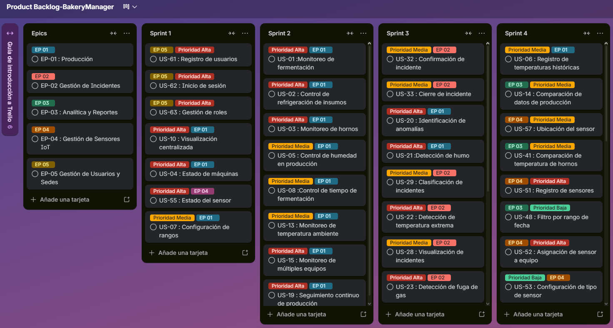

# Capítulo III: Requirements Specification
## 3.1. User Stories

| User Story ID | Título | Descripción | Criterio de Aceptación | Epic |
|---------------|--------|-------------|-------------------------|------|
| US-01 | Registro de Usuario | Como usuario nuevo, quiero registrarme en BakeryManager, para poder acceder a todas las funcionalidades de la aplicación. | Escenario 1: Registro exitoso. Dado que el usuario no tiene cuenta, Cuando completa los campos obligatorios, Entonces el sistema crea el perfil y muestra un mensaje de éxito. Escenario 2: Datos incompletos. Dado que el usuario omite campos mandatorios, Cuando intenta registrarse, Entonces el sistema impide la creación y resalta errores en inglés. | EP-01 |
| US-02 | Inicio de Sesión | Como usuario registrado, quiero poder iniciar sesión en la aplicación, para acceder a mi cuenta. | Escenario 1: Inicio de sesión exitoso. Dado que el usuario se ha registrado, Cuando ingresa sus credenciales válidas, Entonces el sistema otorga un token de acceso autorizado. Escenario 2: Credenciales inválidas. Dado que el usuario ingresa datos erróneos, Cuando intenta autenticarse, Entonces el sistema deniega el acceso y muestra "Invalid credentials". | EP-01 |
| US-03 | Recuperación de Contraseña | Como usuario registrado, quiero tener la opción de recuperación de contraseña, para acceder a mi cuenta sin problemas. | Escenario 1: Solicitud exitosa. Dado que el usuario olvidó su contraseña, Cuando ingresa su correo registrado, Entonces el sistema envía un enlace de "Reset Password". Escenario 2: Correo no registrado. Dado un email inexistente en el sistema, Cuando solicita la recuperación, Entonces el sistema informa que la cuenta no existe. | EP-01 |
| US-04 | Actualización de Perfil | Como usuario, quiero actualizar mi información personal, para mantener mis datos vigentes. | Escenario 1: Actualización exitosa. Dado que el usuario ha iniciado sesión, Cuando modifica sus datos en la configuración, Entonces el sistema persiste los cambios en la base de datos. Escenario 2: Validación de datos. Dado un formato de dato inválido, Cuando el usuario intenta guardar, Entonces el sistema rechaza la actualización y notifica el error. | EP-01 |
| US-05 | Cierre de Sesión | Como usuario activo, quiero cerrar mi sesión, para proteger la privacidad de mis datos. | Escenario 1: Cierre de sesión seguro. Dado que el usuario termina sus tareas, Cuando selecciona "Sign out", Entonces el sistema invalida el token y redirige al Landing Page. Escenario 2: Intento de acceso post-logout. Dado que el usuario cerró sesión, Cuando intenta volver atrás a una ruta protegida, Entonces el sistema lo redirige automáticamente al login. | EP-01 |
| US-06 | Monitoreo de fermentación | Como maestro panadero, quiero monitorear la temperatura y humedad del área de fermentación, para asegurar la calidad del pan. | Escenario 1: Monitoreo en tiempo real. Dado sensores activos en el área, Cuando el sistema recibe solicitud de estado, Entonces muestra valores de temperatura y humedad en el dashboard. Escenario 2: Alerta fuera de rango. Dado límites definidos, Cuando se superan, Entonces el sistema genera una alerta de "Quality Risk". | EP-02 |
| US-07 | Control de refrigeración | Como maestro panadero, quiero monitorear la temperatura de las refrigeradoras, para evitar la pérdida de insumos. | Escenario 1: Visualización. Dado sensor de frío operativo, Cuando el sistema sincroniza datos, Entonces reporta la temperatura interna actual. Escenario 2: Alerta. Dado límite de seguridad, Cuando la temperatura excede dicho valor, Entonces se envía una notificación de "Insumo Risk". | EP-02 |
| US-08 | Monitoreo de hornos | Como maestro panadero, quiero visualizar la temperatura del horno, para asegurar una cocción adecuada. | Escenario 1: Visualización en tiempo real. Dado sensor térmico activo, Cuando el horno está en cocción, Entonces el sistema actualiza el gráfico de calor. Escenario 2: Alerta. Dado límite crítico, Cuando se detecta sobrecalentamiento, Entonces el sistema emite una alerta de alta prioridad. | EP-02 |
| US-09 | Estado de máquinas | Como encargado de sede, quiero conocer el estado de las máquinas, para evitar interrupciones. | Escenario 1: Estado activo/inactivo. Dado sensores de actividad, Cuando el sistema recibe telemetría, Entonces el sistema visualiza si el equipo está operando. Escenario 2: Alerta por falla. Dado inactividad no programada, Cuando el sistema detecta el paro, Entonces genera una alerta de "Machine Down". | EP-02 |
| US-10 | Control de humedad en producción | Como maestro panadero, quiero monitorear la humedad del ambiente, para mantener condiciones óptimas. | Escenario 1: Visualización. Dado sensores calibrados, Cuando el usuario consulta el panel, Entonces ve el porcentaje de humedad relativa. Escenario 2: Alerta. Dado rango de seguridad, Cuando la humedad cae del umbral, Entonces el sistema notifica una advertencia ambiental. | EP-02 |
| US-11 | Registro de temperaturas históricas | Como encargado de sede, quiero visualizar el historial de temperaturas, para analizar la producción. | Escenario 1: Consulta. Dado registros en base de datos, Cuando el usuario selecciona rango de fechas, Entonces el sistema muestra la tabla histórica. Escenario 2: Filtro. Dado múltiples sensores, Cuando se selecciona uno específico, Entonces el sistema visualiza los datos de dicho hardware. | EP-02 |
| US-12 | Configuración de rangos | Como encargado de sede, quiero definir límites de temperatura y humedad, para controlar la producción. | Escenario 1: Configuración. Dado acceso administrativo, Cuando se ingresan nuevos valores, Entonces el sistema actualiza las reglas de alerta. Escenario 2: Validación. Dado datos guardados, Cuando se monitorean sensores, Entonces el sistema los compara contra los nuevos límites. | EP-02 |
| US-13 | Control de tiempo de fermentación | Como maestro panadero, quiero medir el tiempo de fermentación, para asegurar consistencia. | Escenario 1: Inicio. Dado proceso en marcha, Cuando el sistema registra el tiempo de inicio, Entonces comienza el conteo de duración. Escenario 2: Alerta. Dado tiempo límite, Cuando el proceso excede la duración estimada, Entonces el sistema emite notificación de fin de tiempo. | EP-02 |
| US-14 | Detección de uso de hornos | Como encargado de sede, quiero saber cuánto tiempo están encendidos los hornos, para mejorar eficiencia. | Escenario 1: Registro. Dado sensor activo, Cuando el horno se enciende, Entonces el sistema comienza a acumular horas de uso. Escenario 2: Consulta. Dado datos históricos, Cuando el usuario accede al reporte, Entonces visualiza el total de horas operativas. | EP-02 |
| US-15 | Visualización centralizada | Como encargado de sede, quiero ver todos los sensores en un dashboard, para controlar la producción. | Escenario 1: Vista general. Dado múltiples dispositivos IoT, Cuando el usuario carga el Home, Entonces visualiza el estado consolidado de la sede. Escenario 2: Estado visual. Dado cambios de estado, Cuando un equipo falla, Entonces el dashboard cambia el color del indicador a rojo. | EP-02 |
| US-16 | Alertas en tiempo real | Como maestro panadero, quiero recibir alertas inmediatas, para actuar rápidamente. | Escenario 1: Generación. Dado evento de anomalía, Cuando ocurre en milisegundos, Entonces el sistema procesa la notificación Push. Escenario 2: Visualización. Dado alerta generada, Cuando el usuario revisa su dispositivo móvil, Entonces puede visualizar el detalle del incidente. | EP-02 |
| US-17 | Registro de incidentes | Como encargado de sede, quiero registrar incidentes, para llevar control de fallas. | Escenario 1: Registro automático. Dado fallo crítico, Cuando el sistema detecta el error, Entonces se guarda una entrada en el log de seguridad. Escenario 2: Consulta. Dado registros existentes, Cuando el usuario filtra por severidad, Entonces visualiza el historial de incidentes. | EP-02 |
| US-18 | Monitoreo de temperatura ambiente | Como maestro panadero, quiero conocer la temperatura del ambiente, para ajustar la producción. | Escenario 1: Visualización. Dado sensor ambiental, Cuando el sistema sincroniza lectura, Entonces se muestra la temperatura del local. Escenario 2: Alerta. Dado límite superior, Cuando el local se calienta en exceso, Entonces el sistema notifica para ajustar ventilación. | EP-02 |
| US-19 | Comparación de datos de producción | Como encargado de sede, quiero comparar datos históricos, para mejorar decisiones. | Escenario 1: Selección. Dado periodos distintos, Cuando el usuario solicita comparativa, Entonces se visualizan diferencias en gráficas superpuestas. Escenario 2: Visualización. Dado comparación activa, Cuando el sistema procesa datos, Entonces el usuario identifica tendencias de mejora o caída. | EP-02 |
| US-20 | Monitoreo de múltiples equipos | Como encargado de sede, quiero monitorear varios equipos a la vez, para tener control total. | Escenario 1: Visualización múltiple. Dado varios sensores, Cuando se accede a la vista de lista, Entonces se ven todos los estados en paralelo. Escenario 2: Identificación. Dado fallo en cadena, Cuando ocurre el incidente, Entonces el sistema resalta exactamente cuál equipo originó el error. | EP-02 |
| US-21 | Notificación por inactividad de horno | Como maestro panadero, quiero saber si un horno no está funcionando, para evitar retrasos. | Escenario 1: Detección. Dado sensor inactivo en horario de turno, Cuando se valida la falta de calor, Entonces se registra el estado "Down". Escenario 2: Alerta. Dado tiempo de espera, Cuando la inactividad persiste, Entonces se envía alerta de prioridad media al maestro. | EP-02 |
| US-22 | Configuración de alertas personalizadas | Como encargado de sede, quiero personalizar alertas, para adaptarlas a la producción. | Escenario 1: Configuración. Dado acceso de edición, Cuando el usuario define condiciones propias, Entonces el sistema guarda la regla de negocio. Escenario 2: Activación. Dado condición cumplida, Cuando los datos matchean la regla, Entonces se dispara la acción personalizada. | EP-02 |
| US-23 | Visualización por tipo de equipo | Como encargado de sede, quiero filtrar sensores por tipo de equipo, para facilitar el monitoreo. | Escenario 1: Filtro. Dado listado extenso, Cuando se elige "Refrigeración", Entonces solo se visualizan sensores térmicos de frío. Escenario 2: Visualización. Dado filtro aplicado, Cuando el usuario navega, Entonces ve datos relevantes sin ruido de otros equipos. | EP-02 |
| US-24 | Seguimiento continuo de producción | Como maestro panadero, quiero monitorear continuamente las condiciones, para mantener calidad constante. | Escenario 1: Monitoreo continuo. Dado conexión estable, Cuando los sensores envían datos, Entonces la UI se refresca automáticamente. Escenario 2: Visualización. Dado flujo constante, Cuando el usuario observa el dashboard, Entonces percibe cambios menores en las variables IoT. | EP-02 |
| US-25 | Identificación de anomalías | Como encargado de sede, quiero detectar comportamientos anormales, para prevenir fallas. | Escenario 1: Detección. Dado motor de reglas analítico, Cuando un valor sale del patrón histórico, Entonces el sistema lo marca como "Anomaly". Escenario 2: Alerta. Dado anomalía crítica, Cuando el sistema confirma el riesgo, Entonces notifica inmediatamente para revisión preventiva. | EP-02 |
| US-26 | Detección de humo | Como encargado de sede, quiero detectar la presencia de humo, para actuar ante posibles incendios. | Escenario 1: Detección. Dado sensor de humo activo, Cuando el nivel de partículas excede el umbral, Entonces se registra evento de seguridad. Escenario 2: Alerta. Dado evento confirmado, Cuando ocurre la detección, Entonces se envía notificación de emergencia "Fire Threat". | EP-03 |
| US-27 | Detección de temperatura extrema | Como encargado de sede, quiero detectar temperaturas anormales, para prevenir incidentes. | Escenario 1: Monitoreo. Dado sensor térmico, Cuando la temperatura rompe el límite máximo histórico, Entonces se guarda el incidente. Escenario 2: Alerta. Dado registro de calor extremo, Cuando el sistema procesa el riesgo, Entonces alerta de "High Heat Danger". | EP-03 |
| US-28 | Detección de fuga de gas | Como encargado de sede, quiero detectar fugas de gas, para evitar riesgos. | Escenario 1: Detección. Dado sensor de gas combustible, Cuando detecta presencia de gas, Entonces se registra el evento de riesgo químico. Escenario 2: Alerta. Dado fuga activa, Cuando el sensor confirma lectura, Entonces se envía alerta crítica "Gas Leak Detected". | EP-03 |
| US-29 | Notificación al maestro panadero | Como maestro panadero, quiero recibir alertas de incidentes, para actuar rápidamente. | Escenario 1: Envío. Dado fallo en zona de trabajo, Cuando el sistema detecta el error, Entonces el maestro recibe el mensaje en su terminal. Escenario 2: Visualización. Dado notificación en bandeja, Cuando el usuario la abre, Entonces lee instrucciones rápidas de mitigación. | EP-03 |
| US-30 | Notificación al encargado de sede | Como encargado de sede, quiero recibir alertas en tiempo real, para tomar decisiones. | Escenario 1: Envío. Dado fallo administrativo o de equipo, Cuando ocurre el desvío, Entonces el encargado recibe notificación en tiempo real. Escenario 2: Registro. Dado alerta generada, Cuando el usuario consulta el log, Entonces visualiza el historial de alertas recibidas. | EP-03 |
| US-31 | Notificación al jefe | Como jefe, quiero recibir alertas de incidentes críticos, para conocer el estado de mi sede. | Escenario 1: Envío. Dado incidente de severidad alta, Cuando el sistema clasifica el riesgo, Entonces el jefe de sede recibe el reporte inmediato. Escenario 2: Visualización. Dado acceso gerencial, Cuando abre el mensaje, Entonces ve el impacto estimado del incidente. | EP-03 |
| US-32 | Registro de incidentes automático | Como encargado de sede, quiero que los incidentes se registren automáticamente, para tener control histórico. | Escenario 1: Registro. Dado evento disruptivo, Cuando el sistema lo identifica, Entonces crea una entrada permanente en la BD de incidentes. Escenario 2: Consulta. Dado interfaz de reportes, Cuando el usuario solicita el mes, Entonces ve el acumulado automático. | EP-03 |
| US-33 | Visualización de incidentes | Como encargado de sede, quiero visualizar los incidentes en un panel, para monitorear la situación. | Escenario 1: Vista. Dado dashboard de seguridad, Cuando existen fallos activos, Entonces se listan en el panel central. Escenario 2: Detalle. Dado incidente específico, Cuando el usuario hace selección, Entonces el sistema despliega datos técnicos del fallo. | EP-03 |
| US-34 | Clasificación de incidentes | Como encargado de sede, quiero clasificar los incidentes, para priorizar atención. | Escenario 1: Clasificación automática. Dado origen del sensor, Cuando se recibe el dato, Entonces el sistema etiqueta como "Technical" o "Safety". Escenario 2: Visualización. Dado panel de prioridad, Cuando el usuario filtra, Entonces ve primero los incidentes de mayor criticidad. | EP-03 |
| US-35 | Historial de incidentes | Como jefe, quiero revisar el historial de incidentes, para evaluar la seguridad de la sede. | Escenario 1: Consulta. Dado permisos de auditoría, Cuando solicita el reporte anual, Entonces visualiza el resumen ejecutivo de incidentes. Escenario 2: Filtro. Dado búsqueda por fecha, Cuando ingresa el rango, Entonces obtiene resultados específicos del periodo. | EP-03 |
| US-36 | Alerta por múltiples incidentes | Como encargado de sede, quiero detectar múltiples incidentes simultáneos, para actuar rápidamente. | Escenario 1: Detección. Dado eventos concurrentes, Cuando ocurren en menos de un minuto, Entonces el sistema los agrupa como fallo masivo. Escenario 2: Alerta. Dado fallo masivo, Cuando se confirma la saturación, Entonces se envía alerta prioritaria de "System Critical Failure". | EP-03 |
| US-37 | Confirmación de incidente | Como encargado de sede, quiero confirmar un incidente, para indicar que está siendo atendido. | Escenario 1: Confirmación. Dado incidente "Open", Cuando el usuario acepta el ticket, Entonces el estado cambia a "In Progress". Escenario 2: Estado. Dado cambio de estado, Cuando se guarda la acción, Entonces el sistema registra quién está a cargo. | EP-03 |
| US-38 | Cierre de incidente | Como encargado de sede, quiero cerrar un incidente, para completar su gestión. | Escenario 1: Cierre. Dado incidente "Atendido", Cuando el usuario marca resolución, Entonces el estado finaliza en "Closed". Escenario 2: Registro. Dado cierre efectuado, Cuando se procesa el fin del evento, Entonces queda guardada la hora de finalización. | EP-03 |
| US-39 | Visualización de estado de sede | Como jefe, quiero ver el estado general de la sede, para conocer si hay incidentes activos. | Escenario 1: Vista general. Dado mapa de calor de sede, Cuando existen sensores en alerta, Entonces se reflejan áreas en rojo. Escenario 2: Indicadores. Dado conteo de incidentes, Cuando hay 0 activos, Entonces el sistema muestra indicador "Safe Status". | EP-03 |
| US-40 | Alertas priorizadas | Como encargado de sede, quiero que las alertas se prioricen, para atender primero las más críticas. | Escenario 1: Priorización. Dado motor de reglas, Cuando entran alertas de humo y temperatura, Entonces la de humo se coloca al inicio. Escenario 2: Visualización. Dado lista de notificaciones, Cuando el usuario la revisa, Entonces ve orden cronológico-prioritario. | EP-03 |
| US-41 | Notificación por sensor desconectado | Como encargado de sede, quiero saber si un sensor deja de funcionar, para mantener el sistema activo. | Escenario 1: Detección. Dado sensor que pierde señal, Cuando se cumple el tiempo de timeout, Entonces se registra desconexión. Escenario 2: Alerta. Dado desconexión confirmada, Cuando ocurre el fallo, Entonces se envía alerta de "Hardware Offline". | EP-03 |
| US-42 | Ubicación del incidente | Como encargado de sede, quiero conocer la ubicación del incidente, para actuar rápidamente. | Escenario 1: Registro. Dado evento de sensor, Cuando se dispara la alerta, Entonces el sistema guarda el nombre del área física. Escenario 2: Visualización. Dado detalle del incidente, Cuando el usuario consulta, Entonces ve mapa con el punto exacto del fallo. | EP-03 |
| US-43 | Tiempo de respuesta | Como jefe, quiero conocer el tiempo de respuesta a incidentes, para evaluar desempeño. | Escenario 1: Registro. Dado incidente cerrado, Cuando se calcula el delta entre apertura y atención, Entonces se guarda la métrica. Escenario 2: Consulta. Dado reporte de KPIs, Cuando accede al panel, Entonces ve el promedio de tiempo de respuesta. | EP-03 |
| US-44 | Notificaciones múltiples | Como maestro panadero, quiero recibir alertas en diferentes dispositivos, para no perder incidentes. | Escenario 1: Envío. Dado fallo crítico, Cuando se procesa el envío, Entonces el sistema manda señal a web y móvil simultáneamente. Escenario 2: Recepción. Dado dispositivo conectado, Cuando llega la señal, Entonces el usuario visualiza el aviso Push. | EP-03 |
| US-45 | Detección continua de incidentes | Como encargado de sede, quiero monitoreo continuo, para detectar incidentes en todo momento. | Escenario 1: Monitoreo. Dado sistema en ejecución, Cuando los sensores envían telemetría, Entonces el evaluador de reglas está siempre activo. Escenario 2: Detección. Dado anomalía nocturna, Cuando ocurre el desvío, Entonces el sistema registra el fallo sin intervención humana. | EP-03 |
| US-46 | Comparación de temperatura de hornos | Como encargado de sede, quiero comparar la temperatura de los hornos en el tiempo, para identificar variaciones en la cocción. | Escenario 1: Selección. Dado datos de hornos A y B, Cuando solicita comparativa, Entonces ve líneas de tendencia superpuestas. Escenario 2: Comparación. Dado periodos distintos, Cuando selecciona rango mensual, Entonces visualiza deltas de calor entre hornos. | EP-04 |
| US-47 | Tendencia de temperatura de hornos | Como maestro panadero, quiero ver la tendencia de temperatura de los hornos, para mejorar la cocción. | Escenario 1: Visualización. Dado historial térmico, Cuando accede a analítica, Entonces visualiza la curva de tendencia mensual. Escenario 2: Identificación. Dado curva descendente, Cuando el sistema analiza, Entonces el usuario identifica fatiga en el equipo. | EP-04 |
| US-48 | Comparación de humedad en fermentación | Como maestro panadero, quiero comparar la humedad en fermentación por día, para mejorar la calidad del pan. | Escenario 1: Selección de días. Dado datos del lunes y martes, Cuando solicita vista dividida, Entonces ve diferencias porcentuales de humedad. Escenario 2: Visualización. Dado reporte diario, Cuando el sistema procesa, Entonces el panadero identifica el día de mejor fermentación. | EP-04 |
| US-49 | Tendencia de humedad | Como encargado de sede, quiero ver la tendencia de humedad, para controlar condiciones de producción. | Escenario 1: Visualización. Dado telemetría ambiental, Cuando solicita reporte, Entonces ve gráfico de dispersión de humedad. Escenario 2: Análisis. Dado tendencia al alza, Cuando ocurre el cambio, Entonces el usuario detecta posibles fallas en ventilación. | EP-04 |
| US-50 | Comparación de incidentes | Como jefe, quiero comparar la cantidad de incidentes en diferentes periodos, para evaluar la seguridad de la sede. | Escenario 1: Selección. Dado datos de Q1 y Q2, Cuando solicita comparativa, Entonces ve gráfico de barras con totales de fallos. Escenario 2: Comparación. Dado datos procesados, Cuando compara periodos, Entonces identifica reducción o aumento de riesgos. | EP-04 |
| US-51 | Tendencia de incidentes | Como jefe, quiero ver la tendencia de incidentes, para tomar decisiones de mejora. | Escenario 1: Visualización. Dado log de seguridad, Cuando accede al gráfico, Entonces ve la línea de tiempo de incidentes anual. Escenario 2: Identificación. Dado pico de fallos, Cuando analiza la tendencia, Entonces detecta épocas de mayor criticidad. | EP-04 |
| US-52 | Visualización de datos en gráficos | Como encargado de sede, quiero ver los datos en gráficos, para entender mejor la información. | Escenario 1: Generación. Dado set de datos crudos, Cuando el sistema los procesa, Entonces renderiza gráficos de líneas y barras. Escenario 2: Interacción. Dado gráficos interactivos, Cuando el usuario hace hover en un punto, Entonces ve el valor numérico exacto. | EP-04 |
| US-53 | Filtro por rango de fechas | Como usuario, quiero filtrar datos por fechas, para analizar periodos específicos. | Escenario 1: Selección. Dado selector de calendario, Cuando el usuario ingresa rango, Entonces las tablas se actualizan al periodo. Escenario 2: Actualización. Dado filtro aplicado, Cuando el sistema recalcula, Entonces los gráficos reflejan solo los datos seleccionados. | EP-04 |
| US-54 | Comparación entre días de producción | Como maestro panadero, quiero comparar condiciones de producción entre días, para mejorar procesos. | Escenario 1: Selección. Dado histórico de producción, Cuando elige dos fechas, Entonces ve tabla comparativa de variables. Escenario 2: Resultado. Dado datos procesados, Cuando observa resultados, Entonces identifica qué día fue más eficiente. | EP-04 |
| US-55 | Resumen general de datos | Como jefe, quiero ver un resumen de temperaturas, humedad e incidentes, para conocer el estado general. | Escenario 1: Visualización. Dado pantalla de Dashboard, Cuando carga la app, Entonces ve tarjetas con resúmenes diarios. Escenario 2: Actualización. Dado nuevos datos IoT, Cuando entran al sistema, Entonces el resumen se refresca automáticamente. | EP-04 |
| US-56 | Registro de sensores | Como encargado de sede, quiero registrar nuevos sensores IoT, para integrarlos al sistema. | Escenario 1: Registro. Dado formulario de alta, Cuando ingresa ID y tipo, Entonces el sensor queda guardado en la BD. Escenario 2: Confirmación. Dado éxito en persistencia, Cuando se guarda, Entonces el sistema confirma con mensaje "Sensor Registered". | EP-05 |
| US-57 | Asignación de sensor a equipo | Como encargado de sede, quiero asignar sensores a equipos, para monitorear correctamente. | Escenario 1: Asignación. Dado sensor "Huérfano", Cuando se selecciona equipo "Oven 1", Entonces se crea la relación lógica. Escenario 2: Visualización. Dado sensor asignado, Cuando accede a equipo, Entonces visualiza qué hardware lo está monitoreando. | EP-05 |
| US-58 | Configuración de tipo de sensor | Como encargado de sede, quiero definir el tipo de sensor, para identificar su función. | Escenario 1: Selección. Dado sensor genérico, Cuando elige tipo "Smoke", Entonces el sistema activa reglas de incendio. Escenario 2: Visualización. Dado configuración guardada, Cuando consulta la lista, Entonces ve icono y etiqueta del tipo asignado. | EP-05 |
| US-59 | Visualización de sensores | Como encargado de sede, quiero ver todos los sensores registrados, para tener control. | Escenario 1: Listado. Dado BD de hardware, Cuando accede a inventario, Entonces ve tabla con todos los dispositivos. Escenario 2: Detalle. Dado sensor específico, Cuando hace click, Entonces ve parámetros técnicos y última lectura. | EP-05 |
| US-60 | Estado del sensor | Como encargado de sede, quiero conocer el estado de los sensores, para asegurar su funcionamiento. | Escenario 1: Activo. Dado sensor enviando pulso, Cuando consulta estado, Entonces ve etiqueta verde "Healthy". Escenario 2: Inactivo. Dado sensor sin pulso, Cuando ocurre la caída, Entonces el sistema cambia el estado a "Disconnected". | EP-05 |
| US-61 | Detección de sensor desconectado | Como encargado de sede, quiero detectar sensores desconectados, para tomar acciones. | Escenario 1: Detección. Dado watchdog activo, Cuando el sensor deja de transmitir, Entonces se genera un aviso de pérdida de señal. Escenario 2: Alerta. Dado pérdida confirmada, Cuando ocurre el timeout, Entonces notifica de inmediato al equipo de mantenimiento. | EP-05 |
| US-62 | Ubicación del sensor | Como encargado de sede, quiero asignar una ubicación a cada sensor, para identificar dónde está instalado. | Escenario 1: Asignación. Dado campo de ubicación, Cuando ingresa "Warehouse A", Entonces se asocia el sensor al área física. Escenario 2: Visualización. Dado consulta de inventario, Cuando revisa sensor, Entonces ve la ubicación física asignada. | EP-05 |
| US-63 | Edición de sensores | Como encargado de sede, quiero editar la información de los sensores, para mantener datos actualizados. | Escenario 1: Edición. Dado sensor existente, Cuando cambia nombre o tipo, Entonces el sistema actualiza la fila en la BD. Escenario 2: Validación. Dado guardado efectuado, Cuando se procesan cambios, Entonces el sistema verifica que no haya conflictos de ID. | EP-05 |
| US-64 | Eliminación de sensores | Como encargado de sede, quiero eliminar sensores, para mantener el sistema actualizado. | Escenario 1: Eliminación. Dado sensor obsoleto, Cuando confirma borrado, Entonces el dispositivo se remueve del listado activo. Escenario 2: Confirmación. Dado acción iniciada, Cuando confirma en el modal, Entonces el sistema ejecuta la baja definitiva. | EP-05 |
| US-65 | Asociación de sensor a sede | Como jefe, quiero asociar sensores a una sede, para organizar el monitoreo. | Escenario 1: Asociación. Dado sensor global, Cuando lo vincula a "Main HQ", Entonces el sensor aparece en el dashboard de dicha sede. Escenario 2: Visualización. Dado acceso a sede, Cuando filtra por local, Entonces ve solo el hardware perteneciente a su área. | EP-05 |
| US-66 | Registro de usuarios administrativos | Como administrador, quiero registrar nuevos usuarios en el sistema, para otorgar acceso a la plataforma. | Escenario 1: Registro. Dado nuevo empleado, Cuando el admin ingresa credenciales y rol, Entonces se crea la cuenta en el sistema. Escenario 2: Validación. Dado formulario incompleto, Cuando intenta guardar, Entonces el sistema muestra error por falta de campos obligatorios. | EP-06 |
| US-67 | Gestión de roles y accesos | Como administrador, quiero asignar roles a los usuarios, para controlar permisos dentro del sistema. | Escenario 1: Asignación. Dado usuario existente, Cuando el admin cambia de "User" a "Manager", Entonces se actualizan sus permisos de acceso. Escenario 2: Visualización. Dado perfil de usuario, Cuando se consulta, Entonces se muestra claramente el rol jerárquico asignado. | EP-06 |
| US-68 | Configuración de permisos | Como administrador, quiero gestionar permisos de usuarios, para controlar qué puede hacer cada rol en el sistema. | Escenario 1: Configuración. Dado matriz de seguridad, Cuando el admin habilita "Delete", Entonces el rol correspondiente adquiere dicha capacidad. Escenario 2: Validación. Dado usuario restringido, Cuando intenta borrar equipo, Entonces el sistema deniega la acción por falta de permisos. | EP-06 |
| US-69 | Identidad Visual y Branding | Como visitante, quiero ver una sección de impacto con el branding de BakeryManager, para entender rápidamente qué ofrece la plataforma. | Escenario 1: Carga de página. Dado estilos CSS definidos, Cuando el visitante carga el sitio, Entonces ve la combinación oficial "Cream Caramel" y fuentes Playfair. Escenario 2: Botón de acción. Dado botón "Get Started", Cuando el usuario interactúa, Entonces es redirigido suavemente a la sección comercial. | EP-07 |
| US-70 | Diseño Responsivo y Móvil | Como dueño de panadería que usa su celular, quiero navegar por el sitio cómodamente, para informarme mientras estoy en mi local. | Escenario 1: Visualización móvil. Dado dispositivo móvil, Cuando carga la landing, Entonces el sistema reordena los elementos en un layout vertical. Escenario 2: Menú táctil. Dado interacción táctil, Cuando abre el menú, Entonces ve opciones en formato hamburguesa adaptadas a gestos. | EP-07 |
| US-71 | Redacción de Contenidos (Copywriting) | Como usuario interesado, quiero leer textos claros y persuasivos, para entender los beneficios de BakeryManager. | Escenario 1: Lectura de beneficios. Dado el acceso a la landing, Cuando el usuario lee la sección de características, Entonces comprende cómo el sistema optimiza su producción. Escenario 2: Claridad de lenguaje. Dado un visitante sin conocimientos técnicos, Cuando lee el sitio, Entonces entiende el valor del monitoreo IoT sin confusiones. | EP-07 |
| US-72 | Formulario de Contacto Comercial | Como cliente potencial, quiero poder enviar un mensaje de contacto, para solicitar una demostración o presupuesto. | Escenario 1: Envío exitoso. Dado que el usuario completa el formulario de contacto, Cuando presiona enviar, Entonces el sistema registra la solicitud y confirma el envío. Escenario 2: Error de envío. Dado un fallo en el servidor de correo, Cuando el usuario intenta enviar, Entonces el sistema notifica que hubo un problema técnico. | EP-07 |
| US-73 | Bloque de Testimonios | Como visitante, quiero leer opiniones de otros panaderos, para confiar en la efectividad del sistema. | Escenario 1: Visualización de testimonios. Dado que existen reseñas de clientes, Cuando el usuario llega a la sección de testimonios, Entonces visualiza fotos y citas de panaderos satisfechos. Escenario 2: Variedad de perfiles. Dado el bloque de testimonios, Cuando el usuario navega, Entonces ve opiniones de diferentes tipos de negocios. | EP-07 |
| US-74 | Enlaces a Redes Sociales | Como usuario, quiero ver enlaces a las redes sociales de BakeryManager, para seguir las novedades de la startup. | Escenario 1: Acceso a redes. Dado el footer del sitio, Cuando el usuario hace clic en el icono de Instagram, Entonces es redirigido a la cuenta oficial. Escenario 2: Iconografía visible. Dado el diseño del Landing Page, Cuando el usuario llega al final de la página, Entonces identifica claramente los iconos. | EP-07 |
| US-75 | Registro al Boletín Informativo | Como visitante interesado, quiero suscribirme al boletín informativo, para recibir noticias y actualizaciones en mi correo. | Escenario 1: Suscripción exitosa. Dado que el usuario ingresa un email válido, Cuando confirma la acción, Entonces el sistema lo agrega a la lista de correos. Escenario 2: Email duplicado. Dado que el correo ya está suscrito, Cuando intenta registrarse de nuevo, Entonces el sistema le informa que ya forma parte de la lista. | EP-07 |
| US-76 | Preguntas Frecuentes (FAQ) | Como usuario nuevo, quiero una sección de preguntas frecuentes, para resolver dudas rápidas sobre el servicio. | Escenario 1: Consulta de dudas. Dado que el visitante accede a la sección FAQ, Cuando selecciona una pregunta, Entonces el sistema despliega la respuesta correspondiente. Escenario 2: Navegación simple. Dado un listado de dudas comunes, Cuando el usuario hace scroll, Entonces identifica fácilmente las categorías de ayuda. | EP-07 |
| US-77 | Mapa de Ubicación de la Startup | Como cliente potencial, quiero ver la ubicación de las oficinas de BakeryManager, para saber dónde se encuentra la empresa físicamente. | Escenario 1: Visualización de mapa. Dado el mapa interactivo en la landing, Cuando el usuario carga la sección de contacto, Entonces visualiza el marcador de ubicación. Escenario 2: Dirección física. Dado el footer o sección de contacto, Cuando el usuario consulta los datos, Entonces encuentra la dirección escrita de la sede central. | EP-07 |
| US-78 | Equipo de Desarrollo (About Us) | Como visitante, quiero conocer al equipo detrás de BakeryManager, para generar confianza en la startup. | Escenario 1: Vista de perfiles. Dado la sección "About Us", Cuando el usuario navega por ella, Entonces visualiza fotos y cargos de los fundadores. Escenario 2: Resumen técnico. Dado el perfil de un integrante, Cuando el usuario lee su descripción, Entonces identifica su rol y aporte técnico al proyecto. | EP-07 |
| US-79 | Sección de Blog y Noticias | Como usuario interesado, quiero acceder a artículos técnicos sobre tecnología en panaderías, para aprender más del sector. | Escenario 1: Lectura de posts. Dado que existen artículos publicados, Cuando el usuario selecciona una previsualización, Entonces es redirigido al contenido completo del blog. Escenario 2: Categorización de temas. Dado el feed del blog, Cuando el usuario busca por etiquetas, Entonces el sistema filtra los artículos por temas como "IoT" o "Eficiencia". | EP-07 |
| US-80 | Galería de Implementaciones | Como cliente potencial, quiero ver fotos de sensores instalados en panaderías reales, para validar la viabilidad del producto. | Escenario 1: Visualización de galería. Dado que existen fotos de instalaciones, Cuando el usuario accede a la galería de proyectos, Entonces visualiza imágenes de hardware IoT en funcionamiento. Escenario 2: Descripción de casos. Dado una imagen de la galería, Cuando el usuario la selecciona, Entonces el sistema muestra una breve descripción de la panadería donde se implementó. | EP-07 |
| US-81 | Crear lote de producción | Como maestro panadero, quiero crear un nuevo lote de producción, para planificar la fabricación de productos. | Escenario 1: Creación exitosa. Dado que el usuario accede al formulario de nuevo lote, Cuando completa código, producto, cantidad planificada, sede y equipo, Entonces el sistema registra el lote con estado PLANNED. Escenario 2: Datos incompletos. Dado que el usuario omite campos obligatorios, Cuando intenta crear, Entonces el sistema impide el envío y resalta los errores. | EP-08 |
| US-82 | Modal de creación de lote | Como maestro panadero, quiero crear el lote desde un modal, para no perder el contexto del dashboard. | Escenario 1: Apertura del modal. Dado que el usuario está en el dashboard de producción, Cuando hace clic en "Crear Lote", Entonces aparece un modal con el formulario de creación. Escenario 2: Cancelación. Dado que el modal está abierto, Cuando el usuario presiona "Cancelar", Entonces el modal se cierra sin guardar cambios. | EP-08 |
| US-83 | Iniciar lote de producción | Como maestro panadero, quiero iniciar un lote planificado, para registrar el comienzo de la producción. | Escenario 1: Inicio exitoso. Dado un lote en estado PLANNED, Cuando el usuario presiona "Iniciar", Entonces el sistema cambia el estado a IN_PROGRESS y registra la hora de inicio. Escenario 2: Restricción de estado. Dado un lote ya iniciado o completado, Cuando el usuario intenta iniciarlo, Entonces el sistema no muestra la opción de inicio. | EP-08 |
| US-84 | Completar lote con cantidad producida | Como maestro panadero, quiero registrar la cantidad real producida al completar un lote, para medir la eficiencia de la producción. | Escenario 1: Ingreso de cantidad. Dado un lote en estado IN_PROGRESS, Cuando el usuario abre el modal de completar e ingresa la cantidad producida, Entonces el sistema acepta un valor entre 0 y la cantidad planificada. Escenario 2: Validación de rango. Dado que el usuario ingresa una cantidad mayor a la planificada, Cuando intenta confirmar, Entonces el sistema limita el valor al máximo permitido. | EP-08 |
| US-85 | Confirmar finalización de lote | Como maestro panadero, quiero confirmar la finalización del lote, para actualizar el estado en el sistema. | Escenario 1: Completado exitoso. Dado que el usuario confirmó la cantidad producida en el modal, Cuando presiona "Confirmar", Entonces el sistema cambia el estado a COMPLETED y registra la hora de finalización. Escenario 2: Cancelación del modal. Dado el modal de completar abierto, Cuando el usuario presiona "Cancelar", Entonces el lote permanece en estado IN_PROGRESS. | EP-08 |
| US-86 | Cancelar lote de producción | Como maestro panadero, quiero cancelar un lote, para registrar que la producción no se llevó a cabo. | Escenario 1: Cancelación exitosa. Dado un lote en estado PLANNED o IN_PROGRESS, Cuando el usuario presiona "Cancelar", Entonces el sistema cambia el estado a CANCELLED. Escenario 2: Restricción. Dado un lote en estado COMPLETED o CANCELLED, Cuando el usuario lo consulta, Entonces el sistema no muestra la opción de cancelar. | EP-08 |
| US-87 | Visualizar progreso del lote | Como maestro panadero, quiero ver el progreso de un lote en curso, para saber cuánto falta para completarlo. | Escenario 1: Barra de progreso. Dado un lote en estado IN_PROGRESS, Cuando el usuario consulta la tarjeta del lote, Entonces ve una barra de progreso con el porcentaje producido vs planificado. Escenario 2: Lote planificado. Dado un lote en estado PLANNED, Cuando el usuario lo visualiza, Entonces la barra de progreso aparece en 0%. | EP-08 |
| US-88 | Listar lotes de producción | Como encargado de sede, quiero ver todos los lotes de producción, para tener una visión general del estado de la producción. | Escenario 1: Listado completo. Dado que existen lotes registrados, Cuando el usuario accede al dashboard de producción, Entonces el sistema muestra todas las tarjetas de lotes con su estado actual. Escenario 2: Lista vacía. Dado que no existen lotes registrados, Cuando el usuario accede al dashboard, Entonces el sistema muestra un mensaje de "No hay lotes de producción". | EP-08 |
| US-89 | Ver detalle de lote | Como encargado de sede, quiero ver el detalle de un lote específico, para revisar su información completa. | Escenario 1: Visualización de detalle. Dado un lote registrado, Cuando el usuario consulta la tarjeta, Entonces ve código de lote, producto, cantidad planificada, cantidad producida y estado. Escenario 2: Estado visual. Dado el estado del lote, Cuando el usuario lo visualiza, Entonces el sistema muestra un badge con el color correspondiente al estado. | EP-08 |
| US-90 | Resumen de producción en dashboard | Como encargado de sede, quiero ver un resumen de indicadores de producción, para conocer el estado general del turno. | Escenario 1: Tarjetas de resumen. Dado que existen lotes en el sistema, Cuando el usuario carga el dashboard, Entonces visualiza tarjetas con total de lotes activos, en progreso, completados y eficiencia promedio. Escenario 2: Actualización dinámica. Dado un cambio de estado en un lote, Cuando el usuario actualiza la vista, Entonces los indicadores del resumen se recalculan automáticamente. | EP-08 |
| US-91 | Reporte de producción por sede | Como jefe, quiero generar un reporte de producción, para evaluar la eficiencia del turno. | Escenario 1: Generación de reporte. Dado que existen lotes registrados, Cuando el usuario presiona "Ver Reporte", Entonces el sistema genera un reporte con total de lotes, completados, cancelados y porcentaje de eficiencia. Escenario 2: Resumen textual. Dado el reporte generado, Cuando el usuario lo consulta, Entonces ve un mensaje descriptivo de la eficiencia del turno con la fecha y hora de generación. | EP-08 |

#### EPICS (actualizado)
| Epic ID | Título | Descripción | Relacionado con (User Story ID) |
| :--- | :--- | :--- | :--- |
| EP-01 | Gestión de Identidad y Accesos | Como administrador del sistema, quiero gestionar el acceso, perfiles y autenticación de los usuarios, para garantizar la seguridad y privacidad de la información en BakeryManager. | US-01, US-02, US-03, US-04, US-05 |
| EP-02 | Monitoreo IoT de Panadería | Como maestro panadero, quiero monitorear en tiempo real las variables de temperatura y humedad mediante sensores, para asegurar la calidad y consistencia de la producción de pan. | US-06, US-07, US-08, US-09, US-10, US-11, US-12, US-13, US-14, US-15, US-16, US-17, US-18, US-19, US-20, US-21, US-22, US-23, US-24, US-25 |
| EP-03 | Gestión de Seguridad e Incidentes | Como encargado de sede, quiero detectar y gestionar alertas críticas de seguridad (humo, gas, calor extremo), para proteger la integridad física del local y del personal. | US-26, US-27, US-28, US-29, US-30, US-31, US-32, US-33, US-34, US-35, US-36, US-37, US-38, US-39, US-40, US-41, US-42, US-43, US-44, US-45 |
| EP-04 | Analítica y Reportes de Datos | Como jefe de sede, quiero visualizar gráficos comparativos y tendencias de datos históricos, para tomar decisiones estratégicas basadas en el rendimiento de la producción. | US-46, US-47, US-48, US-49, US-50, US-51, US-52, US-53, US-54, US-55 |
| EP-05 | Gestión de Dispositivos IoT | Como encargado de mantenimiento, quiero administrar el inventario, configuración y estado de los sensores IoT, para asegurar el correcto funcionamiento del ecosistema de monitoreo. | US-56, US-57, US-58, US-59, US-60, US-61, US-62, US-63, US-64, US-65 |
| EP-06 | Administración y Control de Accesos | Como administrador global, quiero gestionar sedes, roles y permisos específicos, para organizar la estructura operativa de la startup de manera eficiente. | US-66, US-67, US-68 |
| EP-07 | Presencia Comercial del Landing Page | Como visitante interesado, quiero navegar por una plataforma comercial con identidad visual clara y contenido persuasivo, para conocer la propuesta de valor y suscribirme al servicio. | US-69, US-70, US-71, US-72, US-73, US-74, US-75, US-76, US-77, US-78, US-79, US-80 |
| EP-08 | Gestión de Producción de Lotes | Como maestro panadero, quiero crear, iniciar, completar y cancelar lotes de producción, para gestionar y monitorear el ciclo de vida completo de la producción en la panadería. | US-81, US-82, US-83, US-84, US-85, US-86, US-87, US-88, US-89, US-90, US-91 |

## 3.2. Impact Mapping

## 3.3 Product Backlog
Para el desarrollo de la plataforma **BakeryManager IoT**, se ha definido un **Product Backlog**, el cual representa una lista priorizada y dinámica de todas las funcionalidades, características y tareas técnicas necesarias para la evolución del proyecto. Este backlog permite organizar el trabajo del equipo, enfocándose en entregar valor de negocio de manera incremental.

Con el objetivo de estimar el esfuerzo requerido para cada **User Story**, se emplea la escala de **Fibonacci (1, 2, 3, 5, 8, 13, 21)** mediante el uso de **Story Points**. Esta técnica facilita la planificación y priorización del trabajo, permitiendo al equipo tomar decisiones más precisas sobre qué funcionalidades desarrollar en cada sprint.

La interpretación de la escala es la siguiente:

- **1:** Tareas simples y rápidas de implementar.
- **2:** Tareas de baja complejidad con un esfuerzo moderado.
- **3:** Tareas que requieren mayor dedicación y tiempo.
- **5:** Tareas complejas que implican mayor análisis o desarrollo.
- **8:** Tareas de alta complejidad que impactan múltiples componentes del sistema.

| Orden | User Story ID | Título | Descripción | Story Points |
|------|--------------|--------|------------|--------------|
| 1 | US-01 | Monitoreo de fermentación | Como maestro panadero, quiero monitorear temperatura y humedad para asegurar calidad del pan | 5 |
| 2 | US-03 | Monitoreo de hornos | Como maestro panadero, quiero visualizar temperatura del horno para correcta cocción | 5 |
| 3 | US-02 | Control de refrigeración | Como maestro panadero, quiero monitorear refrigeradoras para evitar pérdida de insumos | 5 |
| 4 | US-04 | Estado de máquinas | Como encargado, quiero conocer estado de máquinas para evitar interrupciones | 5 |
| 5 | US-10 | Visualización centralizada | Como encargado, quiero ver todos los sensores en un dashboard | 8 |
| 6 | US-19 | Seguimiento continuo | Como panadero, quiero monitoreo continuo para mantener calidad | 5 |
| 7 | US-15 | Monitoreo múltiples equipos | Como encargado, quiero ver varios equipos a la vez | 5 |
| 8 | US-05 | Control de humedad | Como panadero, quiero monitorear humedad para condiciones óptimas | 3 |
| 9 | US-13 | Temperatura ambiente | Como panadero, quiero conocer temperatura ambiente | 3 |
| 10 | US-07 | Configuración de rangos | Como encargado, quiero definir límites de sensores | 5 |
| 11 | US-20 | Identificación de anomalías | Como encargado, quiero detectar comportamientos anormales | 8 |
| 12 | US-06 | Historial de temperaturas | Como encargado, quiero ver historial para análisis | 5 |
| 13 | US-14 | Comparación de datos | Como encargado, quiero comparar datos históricos | 8 |
| 14 | US-47 | Visualización en gráficos | Como encargado, quiero ver datos en gráficos | 5 |
| 15 | US-48 | Filtro por fechas | Como usuario, quiero filtrar datos por fechas | 3 |
| 16 | US-50 | Resumen general | Como jefe, quiero ver resumen de datos | 5 |
| 17 | US-41 | Comparación hornos | Como encargado, quiero comparar temperatura de hornos | 5 |
| 18 | US-42 | Tendencia de temperatura | Como panadero, quiero ver tendencias | 5 |
| 19 | US-44 | Tendencia de humedad | Como encargado, quiero analizar humedad | 5 |
| 20 | US-45 | Comparación incidentes | Como jefe, quiero comparar incidentes | 5 |
| 21 | US-46 | Tendencia de incidentes | Como jefe, quiero ver tendencias | 5 |
| 22 | US-21 | Detección de humo | Como encargado, quiero detectar humo | 8 |
| 23 | US-23 | Detección de fuga de gas | Como encargado, quiero detectar gas | 8 |
| 24 | US-22 | Temperatura extrema | Como encargado, quiero detectar temperaturas críticas | 5 |
| 25 | US-28 | Visualización incidentes | Como encargado, quiero ver incidentes | 5 |
| 26 | US-27 | Registro de incidentes | Como encargado, quiero registrar incidentes | 5 |
| 27 | US-29 | Clasificación incidentes | Como encargado, quiero clasificar incidentes | 5 |
| 28 | US-35 | Alertas priorizadas | Como encargado, quiero priorizar alertas | 5 |
| 29 | US-34 | Estado de sede | Como jefe, quiero ver estado general | 3 |
| 30 | US-30 | Historial de incidentes | Como jefe, quiero revisar historial | 5 |
| 31 | US-38 | Tiempo de respuesta | Como jefe, quiero medir tiempos | 5 |
| 32 | US-31 | Múltiples incidentes | Como encargado, quiero detectar múltiples eventos | 8 |
| 33 | US-32 | Confirmación incidente | Como encargado, quiero confirmar incidentes | 3 |
| 34 | US-33 | Cierre incidente | Como encargado, quiero cerrar incidentes | 3 |
| 35 | US-40 | Monitoreo continuo incidentes | Como encargado, quiero monitoreo constante | 5 |
| 36 | US-51 | Registro sensores | Como encargado, quiero registrar sensores | 5 |
| 37 | US-52 | Asignación sensores | Como encargado, quiero asignar sensores | 5 |
| 38 | US-54 | Visualización sensores | Como encargado, quiero ver sensores | 3 |
| 39 | US-55 | Estado sensor | Como encargado, quiero ver estado sensores | 3 |
| 40 | US-56 | Sensor desconectado | Como encargado, quiero detectar fallas | 5 |
| 41 | US-57 | Ubicación sensor | Como encargado, quiero ubicar sensores | 3 |
| 42 | US-58 | Edición sensores | Como encargado, quiero editar sensores | 3 |
| 43 | US-59 | Eliminación sensores | Como encargado, quiero eliminar sensores | 2 |
| 44 | US-60 | Asociación sede | Como jefe, quiero asociar sensores | 3 |
| 45 | US-61 | Registro usuarios | Como admin, quiero registrar usuarios | 5 |
| 46 | US-62 | Inicio de sesión | Como usuario, quiero iniciar sesión | 3 |
| 47 | US-63 | Gestión de roles | Como admin, quiero asignar roles | 5 |
| 48 | US-70 | Gestión de permisos | Como admin, quiero gestionar permisos | 5 |
| 49 | US-69 | Asignación usuarios | Como admin, quiero asignar usuarios | 3 |
| 50 | US-66 | Creación de sedes | Como admin, quiero crear sedes | 3 |
| 51 | US-67 | Edición de sedes | Como admin, quiero editar sedes | 2 |
| 52 | US-68 | Eliminación de sedes | Como admin, quiero eliminar sedes | 2 |
| 53 | US-64 | Edición usuarios | Como admin, quiero editar usuarios | 3 |
| 54 | US-65 | Eliminación usuarios | Como admin, quiero eliminar usuarios | 2 |