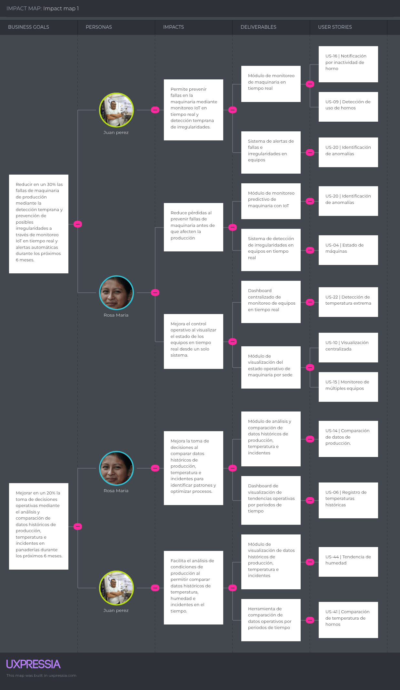

# Capítulo III: Requirements Specification
## 3.1. User Stories

| User Story ID | Título | Descripción | Criterio de Aceptación | Epic |
|---------------|--------|------------|------------------------|------|
| US-01 | Monitoreo de fermentación | Como maestro panadero, quiero monitorear la temperatura y humedad del área de fermentación, para asegurar la calidad del pan. | Escenario 1: Monitoreo en tiempo real. Dado sensores activos, Cuando accedo al dashboard, Entonces visualizo temperatura y humedad. Escenario 2: Alerta fuera de rango. Dado límites definidos, Cuando se superan, Entonces recibo alerta. | EP-01 |
| US-02 | Control de refrigeración de insumos | Como maestro panadero, quiero monitorear la temperatura de las refrigeradoras, para evitar la pérdida de insumos. | Escenario 1: Visualización. Dado sensores activos, Cuando accedo, Entonces veo temperatura actual. Escenario 2: Alerta. Dado límite, Cuando se supera, Entonces se envía alerta. | EP-01 |
| US-03 | Monitoreo de hornos | Como maestro panadero, quiero visualizar la temperatura del horno, para asegurar una cocción adecuada. | Escenario 1: Visualización en tiempo real. Dado sensor activo, Cuando accedo, Entonces veo temperatura. Escenario 2: Alerta. Dado límite, Cuando se supera, Entonces alerta. | EP-01 |
| US-04 | Estado de máquinas | Como encargado de sede, quiero conocer el estado de las máquinas, para evitar interrupciones en la producción. | Escenario 1: Estado activo/inactivo. Dado sensores, Cuando accedo, Entonces veo estado. Escenario 2: Alerta por falla. Dado inactividad, Cuando ocurre, Entonces alerta. | EP-01 |
| US-05 | Control de humedad en producción | Como maestro panadero, quiero monitorear la humedad del ambiente, para mantener condiciones óptimas. | Escenario 1: Visualización. Dado sensores, Cuando accedo, Entonces veo humedad. Escenario 2: Alerta. Dado rango, Cuando se supera, Entonces alerta. | EP-01 |
| US-06 | Registro de temperaturas históricas | Como encargado de sede, quiero visualizar el historial de temperaturas, para analizar la producción. | Escenario 1: Consulta. Dado datos, Cuando selecciono fechas, Entonces veo historial. Escenario 2: Filtro. Dado múltiples sensores, Cuando selecciono uno, Entonces veo datos específicos. | EP-01 |
| US-07 | Configuración de rangos | Como encargado de sede, quiero definir límites de temperatura y humedad, para controlar la producción. | Escenario 1: Configuración. Dado acceso, Cuando ingreso valores, Entonces se guardan. Escenario 2: Validación. Dado datos, Cuando se monitorean, Entonces se comparan. | EP-01 |
| US-08 | Control de tiempo de fermentación | Como maestro panadero, quiero medir el tiempo de fermentación, para asegurar consistencia. | Escenario 1: Inicio. Dado proceso, Cuando inicia, Entonces registra tiempo. Escenario 2: Alerta. Dado límite, Cuando se supera, Entonces alerta. | EP-01 |
| US-09 | Detección de uso de hornos | Como encargado de sede, quiero saber cuánto tiempo están encendidos los hornos, para mejorar eficiencia. | Escenario 1: Registro. Dado sensor, Cuando horno se enciende, Entonces registra tiempo. Escenario 2: Consulta. Dado datos, Cuando accedo, Entonces veo uso. | EP-01 |
| US-10 | Visualización centralizada | Como encargado de sede, quiero ver todos los sensores en un dashboard, para controlar la producción. | Escenario 1: Vista general. Dado sensores, Cuando accedo, Entonces veo panel. Escenario 2: Estado visual. Dado estados, Cuando cambian, Entonces se muestran. | EP-01 |
| US-11 | Alertas en tiempo real | Como maestro panadero, quiero recibir alertas inmediatas, para actuar rápidamente. | Escenario 1: Generación. Dado evento, Cuando ocurre, Entonces alerta. Escenario 2: Visualización. Dado alerta, Cuando accedo, Entonces la veo. | EP-01 |
| US-12 | Registro de incidentes | Como encargado de sede, quiero registrar incidentes, para llevar control de fallas. | Escenario 1: Registro automático. Dado evento, Cuando ocurre, Entonces se guarda. Escenario 2: Consulta. Dado registros, Cuando accedo, Entonces veo historial. | EP-01 |
| US-13 | Monitoreo de temperatura ambiente | Como maestro panadero, quiero conocer la temperatura del ambiente, para ajustar la producción. | Escenario 1: Visualización. Dado sensores, Cuando accedo, Entonces veo temperatura. Escenario 2: Alerta. Dado límite, Cuando se supera, Entonces alerta. | EP-01 |
| US-14 | Comparación de datos de producción | Como encargado de sede, quiero comparar datos históricos, para mejorar decisiones. | Escenario 1: Selección de fechas. Dado datos, Cuando comparo periodos, Entonces veo diferencias. Escenario 2: Visualización. Dado comparación, Cuando se muestra, Entonces entiendo tendencias. | EP-01 |
| US-15 | Monitoreo de múltiples equipos | Como encargado de sede, quiero monitorear varios equipos a la vez, para tener control total. | Escenario 1: Visualización múltiple. Dado varios sensores, Cuando accedo, Entonces veo todos. Escenario 2: Identificación. Dado equipos, Cuando hay fallo, Entonces identifico cuál. | EP-01 |
| US-16 | Notificación por inactividad de horno | Como maestro panadero, quiero saber si un horno no está funcionando, para evitar retrasos. | Escenario 1: Detección. Dado sensor, Cuando no hay actividad, Entonces se registra. Escenario 2: Alerta. Dado inactividad, Cuando ocurre, Entonces alerta. | EP-01 |
| US-17 | Configuración de alertas personalizadas | Como encargado de sede, quiero personalizar alertas, para adaptarlas a la producción. | Escenario 1: Configuración. Dado acceso, Cuando defino condiciones, Entonces se guardan. Escenario 2: Activación. Dado condiciones, Cuando se cumplen, Entonces alerta. | EP-01 |
| US-18 | Visualización por tipo de equipo | Como encargado de sede, quiero filtrar sensores por tipo de equipo, para facilitar el monitoreo. | Escenario 1: Filtro. Dado sensores, Cuando selecciono tipo, Entonces se filtran. Escenario 2: Visualización. Dado filtro, Cuando se aplica, Entonces veo datos relevantes. | EP-01 |
| US-19 | Seguimiento continuo de producción | Como maestro panadero, quiero monitorear continuamente las condiciones, para mantener calidad constante. | Escenario 1: Monitoreo continuo. Dado sensores, Cuando están activos, Entonces envían datos constantes. Escenario 2: Visualización. Dado datos, Cuando accedo, Entonces veo actualización constante. | EP-01 |
| US-20 | Identificación de anomalías| Como encargado de sede, quiero detectar comportamientos anormales, para prevenir fallas. Escenario 1: Detección. Dado datos, Cuando hay valores inusuales, Entonces se identifican. Escenario 2: Alerta. Dado anomalía, Cuando ocurre, Entonces se notifica. | EP-01 |
| US-21 | Detección de humo | Como encargado de sede, quiero detectar la presencia de humo, para actuar ante posibles incendios. | Escenario 1: Detección. Dado sensor de humo activo, Cuando detecta humo, Entonces se registra evento. Escenario 2: Alerta. Dado detección, Cuando ocurre, Entonces se envía alerta. | EP-02 |
| US-22 | Detección de temperatura extrema | Como encargado de sede, quiero detectar temperaturas anormales, para prevenir incidentes. | Escenario 1: Monitoreo. Dado sensor activo, Cuando temperatura supera límite, Entonces se registra. Escenario 2: Alerta. Dado evento, Cuando ocurre, Entonces alerta. | EP-02 |
| US-23 | Detección de fuga de gas | Como encargado de sede, quiero detectar fugas de gas, para evitar riesgos. | Escenario 1: Detección. Dado sensor de gas, Cuando detecta fuga, Entonces se registra evento. Escenario 2: Alerta. Dado fuga, Cuando ocurre, Entonces alerta inmediata. | EP-02 |
| US-24 | Notificación al maestro panadero | Como maestro panadero, quiero recibir alertas de incidentes, para actuar rápidamente. | Escenario 1: Envío. Dado incidente, Cuando ocurre, Entonces recibo notificación. Escenario 2: Visualización. Dado alerta, Cuando accedo, Entonces la veo. | EP-02 |
| US-25 | Notificación al encargado de sede | Como encargado de sede, quiero recibir alertas en tiempo real, para tomar decisiones. | Escenario 1: Envío. Dado incidente, Cuando ocurre, Entonces recibo alerta. Escenario 2: Registro. Dado alerta, Cuando se genera, Entonces queda guardada. | EP-02 |
| US-26 | Notificación al jefe | Como jefe, quiero recibir alertas de incidentes críticos, para conocer el estado de mi sede. | Escenario 1: Envío. Dado incidente crítico, Cuando ocurre, Entonces se notifica al jefe. Escenario 2: Visualización. Dado alerta, Cuando accede, Entonces ve detalles. | EP-02 |
| US-27 | Registro de incidentes | Como encargado de sede, quiero que los incidentes se registren automáticamente, para tener control histórico. | Escenario 1: Registro. Dado evento, Cuando ocurre, Entonces se guarda. Escenario 2: Consulta. Dado registros, Cuando accedo, Entonces veo historial. | EP-02 |
| US-28 | Visualización de incidentes | Como encargado de sede, quiero visualizar los incidentes en un panel, para monitorear la situación. | Escenario 1: Vista. Dado incidentes, Cuando accedo, Entonces veo lista. Escenario 2: Detalle. Dado incidente, Cuando selecciono, Entonces veo información. | EP-02 |
| US-29 | Clasificación de incidentes | Como encargado de sede, quiero clasificar los incidentes, para priorizar atención. | Escenario 1: Clasificación automática. Dado evento, Cuando ocurre, Entonces se categoriza. Escenario 2: Visualización. Dado categorías, Cuando accedo, Entonces veo tipo. | EP-02 |
| US-30 | Historial de incidentes | Como jefe, quiero revisar el historial de incidentes, para evaluar la seguridad de la sede. | Escenario 1: Consulta. Dado registros, Cuando accedo, Entonces veo historial. Escenario 2: Filtro. Dado datos, Cuando filtro por fecha, Entonces obtengo resultados. | EP-02 |
| US-31 | Alerta por múltiples incidentes | Como encargado de sede, quiero detectar múltiples incidentes simultáneos, para actuar rápidamente. | Escenario 1: Detección. Dado varios eventos, Cuando ocurren, Entonces se registran. Escenario 2: Alerta. Dado múltiples eventos, Cuando ocurren, Entonces alerta prioritaria. | EP-02 |
| US-32 | Confirmación de incidente | Como encargado de sede, quiero confirmar un incidente, para indicar que está siendo atendido. | Escenario 1: Confirmación. Dado incidente, Cuando lo selecciono, Entonces marco como atendido. Escenario 2: Estado. Dado acción, Cuando se guarda, Entonces cambia estado. | EP-02 |
| US-33 | Cierre de incidente | Como encargado de sede, quiero cerrar un incidente, para completar su gestión. | Escenario 1: Cierre. Dado incidente atendido, Cuando lo cierro, Entonces cambia estado. Escenario 2: Registro. Dado cierre, Cuando ocurre, Entonces queda guardado. | EP-02 |
| US-34 | Visualización de estado de sede | Como jefe, quiero ver el estado general de la sede, para conocer si hay incidentes activos. | Escenario 1: Vista general. Dado sistema, Cuando accedo, Entonces veo estado. Escenario 2: Indicadores. Dado incidentes, Cuando existen, Entonces se reflejan. | EP-02 |
| US-35 | Alertas priorizadas | Como encargado de sede, quiero que las alertas se prioricen, para atender primero las más críticas. | Escenario 1: Priorización. Dado incidentes, Cuando ocurren, Entonces se ordenan. Escenario 2: Visualización. Dado prioridades, Cuando accedo, Entonces veo orden. | EP-02 |
| US-36 | Notificación por sensor desconectado | Como encargado de sede, quiero saber si un sensor deja de funcionar, para mantener el sistema activo. | Escenario 1: Detección. Dado sensor, Cuando se desconecta, Entonces se registra. Escenario 2: Alerta. Dado evento, Cuando ocurre, Entonces alerta. | EP-02 |
| US-37 | Ubicación del incidente | Como encargado de sede, quiero conocer la ubicación del incidente, para actuar rápidamente. | Escenario 1: Registro. Dado evento, Cuando ocurre, Entonces guarda ubicación. Escenario 2: Visualización. Dado incidente, Cuando accedo, Entonces veo ubicación. | EP-02 |
| US-38 | Tiempo de respuesta | Como jefe, quiero conocer el tiempo de respuesta a incidentes, para evaluar desempeño. | Escenario 1: Registro. Dado incidente, Cuando se atiende, Entonces se mide tiempo. Escenario 2: Consulta. Dado datos, Cuando accedo, Entonces veo tiempos. | EP-02 |
| US-39 | Notificaciones múltiples | Como maestro panadero, quiero recibir alertas en diferentes dispositivos, para no perder incidentes. | Escenario 1: Envío. Dado incidente, Cuando ocurre, Entonces se envía a varios canales. Escenario 2: Recepción. Dado notificación, Cuando llega, Entonces la visualizo. | EP-02 |
| US-40 | Detección continua de incidentes | Como encargado de sede, quiero monitoreo continuo, para detectar incidentes en todo momento. | Escenario 1: Monitoreo. Dado sensores, Cuando están activos, Entonces envían datos constantes. Escenario 2: Detección. Dado datos, Cuando hay evento, Entonces se detecta. | EP-02 |
| US-41 | Comparación de temperatura de hornos | Como encargado de sede, quiero comparar la temperatura de los hornos en el tiempo, para identificar variaciones en la cocción. | Escenario 1: Selección de fechas. Dado datos históricos, Cuando selecciono un rango, Entonces veo la temperatura en el tiempo. Escenario 2: Comparación. Dado dos periodos, Cuando los comparo, Entonces visualizo diferencias. | EP-03 |
| US-42 | Tendencia de temperatura de hornos | Como maestro panadero, quiero ver la tendencia de temperatura de los hornos, para mejorar la cocción. | Escenario 1: Visualización. Dado datos, Cuando accedo, Entonces veo gráfica de tendencia. Escenario 2: Identificación. Dado tendencia, Cuando la analizo, Entonces identifico patrones. | EP-03 |
| US-43 | Comparación de humedad en fermentación | Como maestro panadero, quiero comparar la humedad en fermentación por día, para mejorar la calidad del pan. | Escenario 1: Selección de días. Dado datos históricos, Cuando selecciono días, Entonces veo comparación. Escenario 2: Visualización. Dado datos, Cuando accedo, Entonces veo diferencias. | EP-03 |
| US-44 | Tendencia de humedad | Como encargado de sede, quiero ver la tendencia de humedad, para controlar condiciones de producción. | Escenario 1: Visualización. Dado datos, Cuando accedo, Entonces veo tendencia. Escenario 2: Análisis. Dado tendencia, Cuando reviso, Entonces detecto variaciones. | EP-03 |
| US-45 | Comparación de incidentes | Como jefe, quiero comparar la cantidad de incidentes en diferentes periodos, para evaluar la seguridad de la sede. | Escenario 1: Selección. Dado datos, Cuando elijo periodos, Entonces veo cantidad de incidentes. Escenario 2: Comparación. Dado datos, Cuando comparo, Entonces identifico diferencias. | EP-03 |
| US-46 | Tendencia de incidentes | Como jefe, quiero ver la tendencia de incidentes, para tomar decisiones de mejora. | Escenario 1: Visualización. Dado datos históricos, Cuando accedo, Entonces veo tendencia. Escenario 2: Identificación. Dado tendencia, Cuando analizo, Entonces detecto aumentos o disminuciones. | EP-03 |
| US-47 | Visualización de datos en gráficos | Como encargado de sede, quiero ver los datos en gráficos, para entender mejor la información. | Escenario 1: Generación. Dado datos, Cuando accedo, Entonces se muestran gráficos. Escenario 2: Interacción. Dado gráficos, Cuando interactúo, Entonces veo detalles. | EP-03 |
| US-48 | Filtro por rango de fechas | Como usuario, quiero filtrar datos por fechas, para analizar periodos específicos. | Escenario 1: Selección. Dado datos, Cuando elijo fechas, Entonces se filtran. Escenario 2: Actualización. Dado filtro, Cuando se aplica, Entonces se actualizan gráficos. | EP-03 |
| US-49 | Comparación entre días de producción | Como maestro panadero, quiero comparar condiciones de producción entre días, para mejorar procesos. | Escenario 1: Selección de días. Dado datos, Cuando selecciono días, Entonces veo comparación. Escenario 2: Resultado. Dado comparación, Cuando se muestra, Entonces identifico diferencias. | EP-03 |
| US-50 | Resumen general de datos | Como jefe, quiero ver un resumen de temperaturas, humedad e incidentes, para conocer el estado general. | Escenario 1: Visualización. Dado datos, Cuando accedo, Entonces veo resumen. Escenario 2: Actualización. Dado nuevos datos, Cuando se registran, Entonces el resumen se actualiza. | EP-03 |
| US-51         | Registro de sensores             | Como encargado de sede, quiero registrar nuevos sensores IoT, para integrarlos al sistema.                                 | Escenario 1: Registro. Dado formulario, Cuando ingreso tipo de sensor y nombre, Entonces se guarda. Escenario 2: Confirmación. Dado registro exitoso, Cuando se guarda, Entonces mensaje de confirmación. | EP-04 |
| US-52         | Asignación de sensor a equipo    | Como encargado de sede, quiero asignar sensores a equipos, para monitorear correctamente.                                  | Escenario 1: Asignación. Dado sensor registrado, Cuando selecciono equipo, Entonces se asigna. Escenario 2: Visualización. Dado asignación, Cuando accedo, Entonces veo relación. | EP-04 |
| US-53         | Configuración de tipo de sensor  | Como encargado de sede, quiero definir el tipo de sensor, para identificar su función.                                     | Escenario 1: Selección. Dado sensor, Cuando selecciono tipo (temperatura, humo, etc.), Entonces se guarda. Escenario 2: Visualización. Dado configuración, Cuando accedo, Entonces veo tipo. | EP-04 |
| US-54         | Visualización de sensores        | Como encargado de sede, quiero ver todos los sensores registrados, para tener control.                                     | Escenario 1: Listado. Dado sensores, Cuando accedo, Entonces veo lista. Escenario 2: Detalle. Dado sensor, Cuando selecciono, Entonces veo información. | EP-04 |
| US-55         | Estado del sensor                | Como encargado de sede, quiero conocer el estado de los sensores, para asegurar su funcionamiento.                         | Escenario 1: Activo. Dado sensor funcionando, Cuando accedo, Entonces veo estado activo. Escenario 2: Inactivo. Dado falla, Cuando ocurre, Entonces se muestra estado inactivo. | EP-04 |
| US-56         | Detección de sensor desconectado | Como encargado de sede, quiero detectar sensores desconectados, para tomar acciones.                                       | Escenario 1: Detección. Dado sensor, Cuando deja de enviar datos, Entonces se registra evento. Escenario 2: Alerta. Dado evento, Cuando ocurre, Entonces se notifica alerta. | EP-04 |
| US-57         | Ubicación del sensor             | Como encargado de sede, quiero asignar una ubicación a cada sensor, para identificar dónde está instalado.                 | Escenario 1: Asignación. Dado sensor, Cuando ingreso ubicación, Entonces se guarda. Escenario 2: Visualización. Dado sensor, Cuando accedo, Entonces veo ubicación. | EP-04 |
| US-58         | Edición de sensores              | Como encargado de sede, quiero editar la información de los sensores, para mantener datos actualizados.                    | Escenario 1: Edición. Dado sensor, Cuando modifico datos, Entonces se actualiza. Escenario 2: Validación. Dado cambios, Cuando guardo, Entonces se validan. | EP-04 |
| US-59         | Eliminación de sensores          | Como encargado de sede, quiero eliminar sensores, para mantener el sistema actualizado.                                     | Escenario 1: Eliminación. Dado sensor, Cuando selecciono eliminar, Entonces se elimina. Escenario 2: Confirmación. Dado acción, Cuando confirmo, Entonces se ejecuta. | EP-04 |
| US-60         | Asociación de sensor a sede      | Como jefe, quiero asociar sensores a una sede, para organizar el monitoreo.                                                 | Escenario 1: Asociación. Dado sensor, Cuando selecciono sede, Entonces se asigna. Escenario 2: Visualización. Dado asignación, Cuando accedo, Entonces veo relación. | EP-04 |
| US-61         | Registro de usuarios      | Como administrador, quiero registrar nuevos usuarios en el sistema, para otorgar acceso a la plataforma.             | Escenario 1: Registro. Dado formulario, Cuando ingreso datos del usuario, Entonces se crea el usuario. Escenario 2: Validación. Dado datos incompletos, Entonces se muestra error.          | EP-05 |
| US-62         | Inicio de sesión          | Como usuario, quiero iniciar sesión, para acceder al sistema según mi rol.                                            | Escenario 1: Acceso válido. Dado credenciales correctas, Cuando inicio sesión, Entonces ingreso al sistema. Escenario 2: Acceso inválido, Entonces se rechaza el acceso.                    | EP-05 |
| US-63         | Gestión de roles          | Como administrador, quiero asignar roles a los usuarios, para controlar permisos dentro del sistema.                 | Escenario 1: Asignación. Dado usuario, Cuando asigno rol, Entonces se actualizan permisos. Escenario 2: Visualización, Entonces veo el rol asignado.                                       | EP-05 |
| US-64         | Edición de usuarios       | Como administrador, quiero editar la información de los usuarios, para mantener los datos actualizados.              | Escenario 1: Edición. Dado usuario, Cuando modifico datos, Entonces se actualiza. Escenario 2: Validación, Entonces se guardan cambios correctamente.                                      | EP-05 |
| US-65         | Eliminación de usuarios   | Como administrador, quiero eliminar usuarios del sistema, para mantener control de accesos.                          | Escenario 1: Eliminación. Dado usuario, Cuando confirmo eliminación, Entonces se elimina. Escenario 2: Confirmación, Entonces solicita validación antes de borrar.                           | EP-05 |
| US-66         | Creación de sedes         | Como administrador, quiero registrar nuevas sedes, para organizar la operación del sistema por ubicación.            | Escenario 1: Registro. Dado formulario de sede, Cuando ingreso datos, Entonces se crea la sede. Escenario 2: Validación, Entonces se verifica información obligatoria.                      | EP-05 |
| US-67         | Edición de sedes          | Como administrador, quiero editar sedes existentes, para mantener la información actualizada.                        | Escenario 1: Edición. Dado sede, Cuando modifico datos, Entonces se actualiza. Escenario 2: Confirmación, Entonces se guardan cambios.                                                     | EP-05 |
| US-68         | Eliminación de sedes      | Como administrador, quiero eliminar sedes, para mantener el sistema limpio y actualizado.                            | Escenario 1: Eliminación. Dado sede, Cuando confirmo acción, Entonces se elimina. Escenario 2: Restricción, Entonces se valida que no tenga sensores activos.                              | EP-05 |
| US-69         | Asignación de usuarios    | Como administrador, quiero asignar usuarios a sedes, para controlar el acceso por ubicación.                        | Escenario 1: Asignación. Dado usuario y sede, Cuando asigno relación, Entonces se guarda. Escenario 2: Visualización, Entonces se muestra relación usuario-sede.                           | EP-05 |
| US-70         | Gestión de permisos       | Como administrador, quiero gestionar permisos de usuarios, para controlar qué puede hacer cada rol en el sistema.    | Escenario 1: Configuración. Dado rol, Cuando asigno permisos, Entonces se actualiza acceso. Escenario 2: Validación, Entonces se aplican restricciones correctamente.                      | EP-05 |

#### EPICS

| Epic   | Nombre                     | Descripción |
|--------|---------------------------|-------------|
| EP-01 | Producción | Gestión y monitoreo en tiempo real de los procesos productivos de la panadería mediante sensores IoT, controlando temperatura, humedad, estado de máquinas y garantizando la calidad del producto. |
| EP-02 | Gestión de Incidentes | Detección, notificación y control de incidentes como humo, fugas de gas, temperaturas extremas o fallas de sensores, permitiendo una respuesta rápida para proteger la sede. |
| EP-03 | Analítica y Reportes | Análisis de datos históricos mediante gráficos, comparaciones y tendencias para apoyar la toma de decisiones estratégicas en la producción y seguridad. |
| EP-04 | Gestión de Sensores IoT | Registro, configuración, asignación, edición y eliminación de sensores IoT, asegurando el correcto funcionamiento y organización del sistema de monitoreo. |
| EP-05 | Gestión de Usuarios y Sedes | Administración de usuarios, roles, permisos y sedes, permitiendo controlar accesos y la estructura organizacional del sistema. |

## 3.2. Impact Mapping

## 3.3 Product Backlog

