# Capítulo V: Product Implementation, Validation & Deployment

## 5.1. Software Configuration Management

### 5.1.1. Software Development Environment Configuration

A continuación, se listan las herramientas y estándares adoptados por el equipo para el desarrollo colaborativo del sistema:

| Actividad | Herramienta / Guía  | Propósito                   | Tipo de Acceso / Ruta                                         |
| --------- |---------------------|-----------------------------|---------------------------------------------------------------|
| Project Management | Trello              | Seguimiento de backlog, tareas y sprints | [https://trello.com/](https://trello.com/)                         |
| Requirements Management | Gherkin Conventions | Escritura legible de requisitos con formato Given/When/Then | [https://cucumber.io/docs/gherkin/](https://cucumber.io/docs/gherkin/) |
| Product UX/UI Design | Figma               | Prototipos y diseño Responsive | [https://figma.com](https://figma.com)                        |
| Version Control | Git + GitHub        | Gestión colaborativa del código fuente | [https://github.com](https://github.com)                      |
| Software Deployment | Netlify             | Despliegue de Landing Pages | [https://www.netlify.com](https://www.netlify.com)            |

### 5.1.2. Source Code Management

En esta sección el equipo establece los medios y esquema de organización que aplicará para el seguimiento de modificaciones. Para ello se utilizará **GitHub** como plataforma y sistema de control de versiones.

A continuación se indican los URLs de los repositorios de GitHub para cada producto:

- **Business Web Page**: [https://github.com/1ASI0730-2610-20262-TBL-BrainNova/BakeryManager-report-repo](https://github.com/1ASI0730-2610-20262-TBL-BrainNova/BakeryManager-report-repo)

#### GitFlow Workflow

Se implementará el modelo de ramificación propuesto por Vincent Driessen en su artículo *“A successful Git branching model”*, conocido como **GitFlow**. Este modelo organiza el trabajo en las siguientes ramas:

- `main`: Rama principal, contiene siempre el código en producción.
- `develop`: Rama de desarrollo principal, donde se integran las funcionalidades antes de pasar a producción.
- `feature/*`: Ramas creadas a partir de `develop` para desarrollar nuevas funcionalidades.**Convención de nombres:** `feature/<nombre-corto-descriptivo>`_Ejemplo: `feature/login-auth`_
  **Convención de nombres:** `feature/<descripción-corta>`
  _Ejemplo: `feature/version-testing`_

#### Convenciones de Commits

Se utilizará el estándar de **Conventional Commits** para los mensajes de commits. Esto facilitará la automatización en los procesos de integración continua y generación de changelogs.

**Ejemplos:**

- `feat: add login functionality`
- `fix: correct null pointer exception on user service`
- `chore: update dependencies`
- `docs: add and update documents`

### 5.1.3. Source Code Style Guide & Conventions

#### Frontend (Landing Page - HTML, CSS, JavaScript)

##### Convenciones generales:

- **Idioma**: Nombres de variables, funciones y clases están escritos en **inglés**.
- **Formato de archivos**: `.html`, `.css`, `.js`
- **Estilo de código adoptado**:
    - [W3Schools HTML Style Guide](https://www.w3schools.com/html/html5_syntax.asp)
    - [Google HTML/CSS Style Guide](https://google.github.io/styleguide/htmlcssguide.html)

##### Nomenclatura:

- **Clases CSS**: `kebab-case` (ej. `main-container`)
- **IDs HTML**: `camelCase` (ej. `mainContent`)
- **Variables JS**: `camelCase` (ej. `userName`)

### 5.1.4. Software Deployment Configuration

Esta sección detalla los pasos necesarios para desplegar de forma satisfactoria los productos digitales que actualmente componen la solución: el **Business-Web-Page**, partiendo desde sus respectivos repositorios de código fuente.

**1. Business-Web-Page - HTML, CSS y Javascript**

**Tecnología Base**

* **Lenguajes**: HTML5, CSS3, JavaScript
* **Hosting**: Netlify

**Configuración y Despliegue**

* **Repositorio de Código Fuente**:
  La Business-Web-Page se desarrolla utilizando HTML, CSS y JavaScript puro. ...

**Configuración del despliegue en Netlify:**

**Publicación:**

**Actualizaciones:**

---

## 5.2. Landing Page, Services & Applications Implementation

### 5.2.1. Sprint 1

#### 5.2.1.1. Sprint Planning 1
El **sprint** es aquel periodo corto y de periodo fijo durante el cual es desarrollado un conjunto de tareas o actividades específicas en un proyecto, el cual está estrechamente relacionado con metodologías ágiles como **Scrum**.

El **Sprint #1** tiene como fecha de inicio el **07/04/2026** y plantea elaborar una **Landing Page** atractiva para **BakeryManager** que capte la atención de nuestros segmentos objetivos.

| **Sprint #** | Sprint 1 |
| :---- | :---- |
| **Sprint Planning Background** | **Sprint Planning Background** |
| **Date** | 07/04/2026 |
| **Time** | 5:00 PM - 6:30 PM |
| **Location** | Google Meet |
| **Prepared by** | Molina Vásquez Manuel Alejandro |
| **Attendees** | • Molina Vásquez, Manuel Alejandro (u20221g231) • Tufiño Argüelles, Luis Angel (U202216240) • Céspedes Pillco, Jarod Jack (u202318588) • Vidal Malaga, Jareth Beycker (u202316878) • Chipana Huarancca, Emanuel (u202214074) |
| **Sprint Goal & User Stories** | **Sprint Goal & User Stories** |
| **Sprint 1 Goal** | Our focus is on creating, designing and deploying an attractive and informative Landing Page for our project We believe it delivers a nice perspective of the BakeryManager application to our future users, such as bakers This will be confirmed when potential users subscribe to our plans and send positive feedback to the team |
| **Sprint 1 Velocity** | 15 |
| **Sum of Story Point** | 18 |

#### 5.2.1.2. Aspect Leaders and Collaborators

| Team Member (Last Name, First Name) | GitHub Username | Identidad Visual - Leader (L) / Collaborator (C) | Exposición de Pains - Leader (L) / Collaborator (C) | Catálogo de Features - Leader (L) / Collaborator (C) | Sistema de Suscripción - Leader (L) / Collaborator (C) | Adaptabilidad Móvil - Leader (L) / Collaborator (C) |
|-------------------------------------|-----------------|--------------------------------------------------|-----------------------------------------------------|------------------------------------------------------|--------------------------------------------------------|-----------------------------------------------------|
| Molina Vásquez, Manuel Alejandro    | AleDusty        | L                                                | C                                                   | C                                                    | C                                                      | C                                                   |
| Tufiño Argüelles, Luis Angel        | LuisTufino2     | C                                                | C                                                   | C                                                    | L                                                      | C                                                   |
| Céspedes Pillco, Jarod Jack         | JJ-UDEV         | C                                                | L                                                   | C                                                    | C                                                      | C                                                   |
| Vidal Malaga, Jareth Beycker        | Jareth341       | C                                                | C                                                   | L                                                    | C                                                      | C                                                   |
| Chipana Huarancca, Emanuel          | Ema-owo         | C                                                | C                                                   | C                                                    | C                                                      | L                                                   |

#### 5.2.1.3. Sprint Backlog 1

El objetivo principal del Sprint 1 es desarrollar y desplegar una **Landing Page** funcional para el proyecto BakeryManager. A continuación, listamos las historias de usuario (US) que serán trabajadas en esta primera entrega.

| US Id | User Story Title | Task Id | Task Title | Description | Est. (h) | Assigned To | Status |
|:---|:---|:---|:---|:---|:---|:---|:-------|
| **US-71** | Identidad Visual | **W-01** | Implementación de Branding | Como visitante quiero ver una sección de impacto con el branding de BakeryManager para entender la plataforma. | 4h | Luis Tufiño | `Done` |
| **US-72** | Exposición de Pains | **W-02** | Sección de Problemáticas | Como dueño de panadería quiero leer sobre los problemas comunes para sentir que la plataforma entiende mi negocio. | 3h | Jareth Vidal | `Done` |
| **US-73** | Catálogo de Features | **W-03** | Módulos de Sensores | Como usuario interesado quiero ver qué sensores se ofrecen para saber si mejoraré mi producción. | 4h | Manuel Molina | `Done` |
| **US-74** | Sistema de Suscripción | **W-04** | Tabla de Planes | Como cliente potencial quiero ver cuánto cuesta el servicio para evaluar si se ajusta a mi presupuesto. | 3h | Emanuel Chipana | `Done` |
| **US-75** | Adaptabilidad Móvil | **W-05** | Interfaz Responsive | Como dueño de panadería que usa celular quiero navegar por el sitio cómodamente para informarme en mi local. | 4h | Jarod Céspedes | `Done` |
#### 5.2.1.4. Development Evidence for Sprint Review
El equipo ha desarrollado una **Landing Page** atractiva y funcional que cumple con los objetivos planteados durante el Sprint 1.

| **Repository**      | **Branch** | Commit ID | Commit Message | Commit Message (Body) | Committed on (Date) | 
|:--------------------|:-----------|:----------|:---------------|:----------------------|:--------------------|
| **Acceptance Test** | main       |  fa9a2e7925696677093ce01ece70e55bd11c6e10         | initial commit | -                     | 12/04/2026          |
| **Acceptance Test** | main       |3f7feebb31f96bbb05383a2441fd3a15f9cb55ab| initial comit  | -                     | 12/04/2026          |
| **Acceptance Test** | main       |02ce604b2c9c5163e4d2e181ec5d73233f2eae73| feat:complete landing page with IoT monitoring, EN/ES i18n, dashboard, alerts, pricing and logo          | -                     | 19/04/2026          |
#### 5.2.1.5. Execution Evidence for Sprint Review

A continuación, mostramos capturas de pantallas donde se visualiza a la **Landing Page** en ejecución:

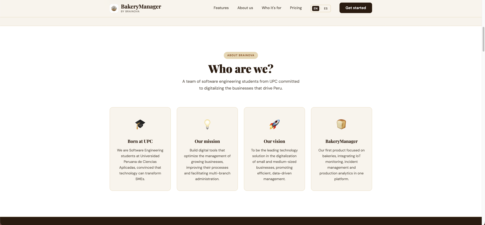
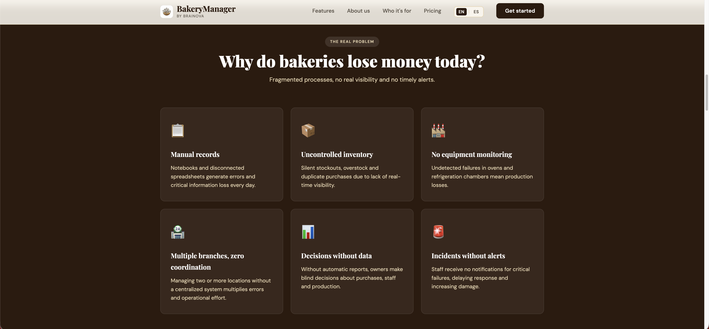
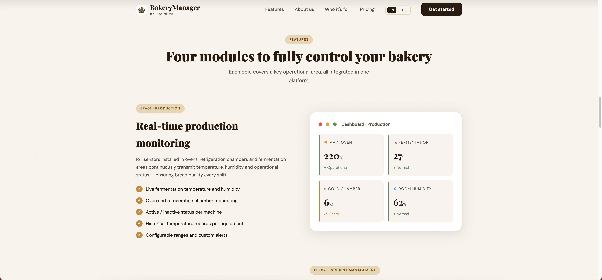
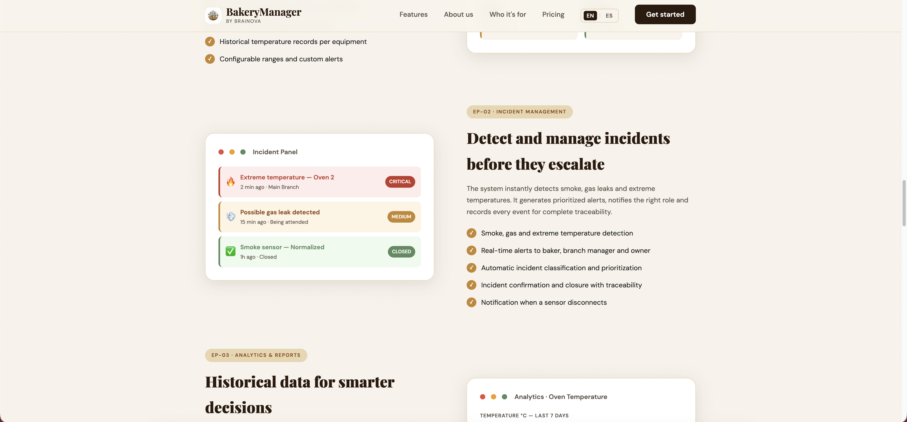
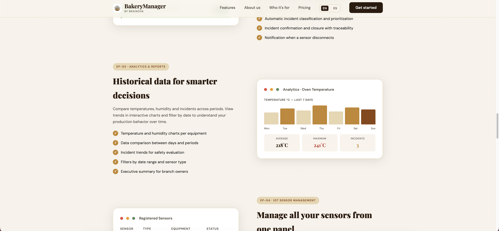
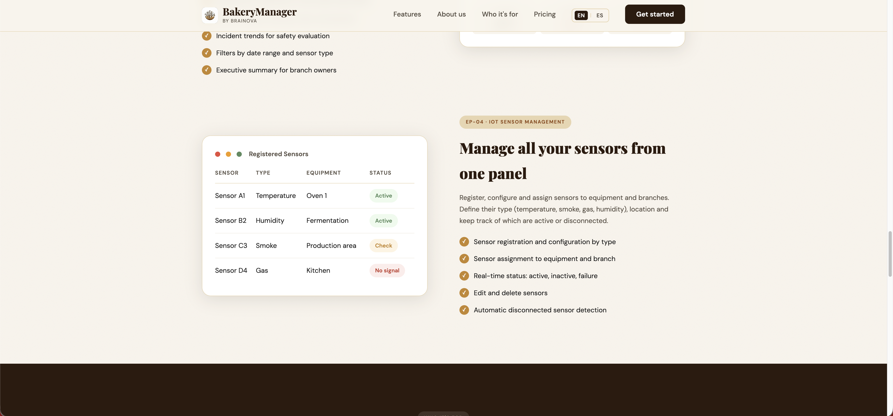
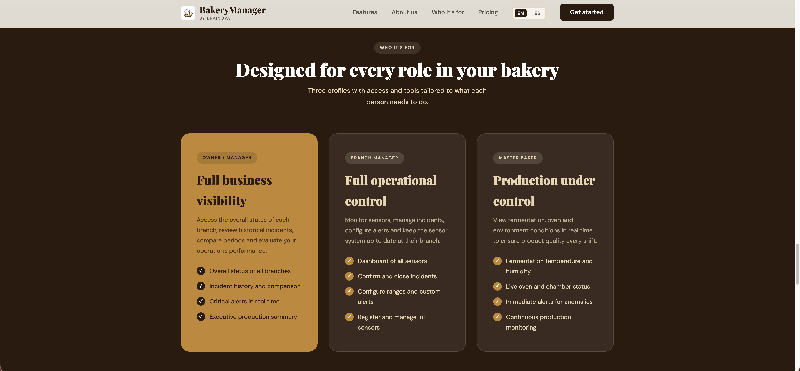
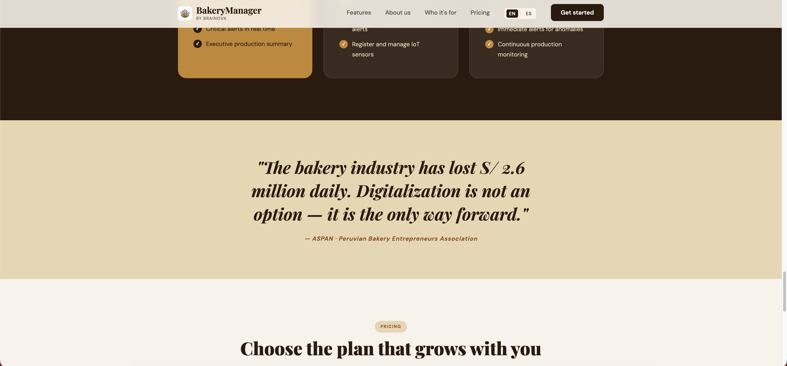
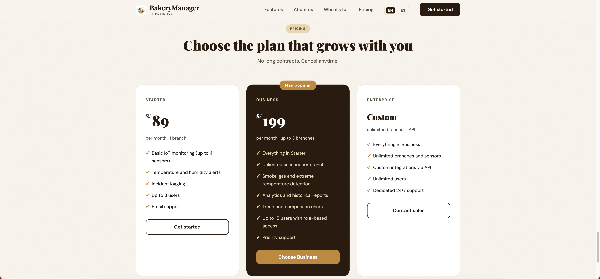
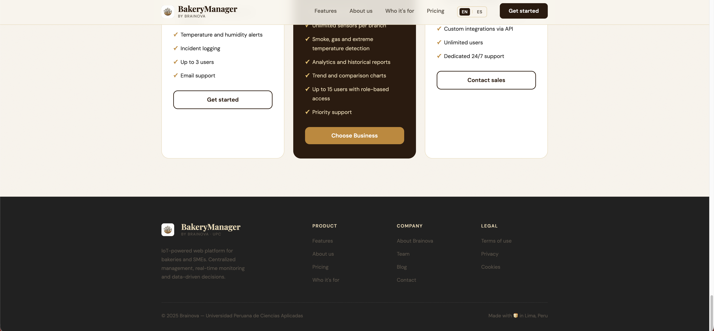

#### 5.2.1.6. Services Documentation Evidence for Sprint Review

Durante el primer Sprint no se desarrollaron ni documentaron Web Services, dado que el enfoque principal estuvo en la diseño e implementación de la Landing Page como primer entregable del sistema. Por lo tanto, no se cuenta con endpoints disponibles ni documentación generada en OpenAPI en esta etapa del proyecto.

La documentación de servicios será considerada en los siguientes Sprints, una vez que se inicie el desarrollo del backend y se establezca la estructura básica de la API que permitirá la integración con las vistas web implementadas.

#### 5.2.1.7. Software Deployment Evidence for Sprint Review

Durante este Sprint, se llevaron a cabo las actividades de despliegue para la primera versión funcional del **Landing Page** de BakeryManager. El objetivo principal fue publicar el sitio web estático en un proveedor cloud para que sea accesible públicamente en internet y pueda ser validado.

Para este primer entregable, el proceso se realizó utilizando **Netlify** como proveedor de servicios, ejecutando un despliegue manual de los artefactos generados.

1. **Inicio de sesión y preparación:** Se ingresó a la consola de administración de Netlify con la cuenta del equipo y se seleccionó la opción para agregar un nuevo sitio de forma manual.
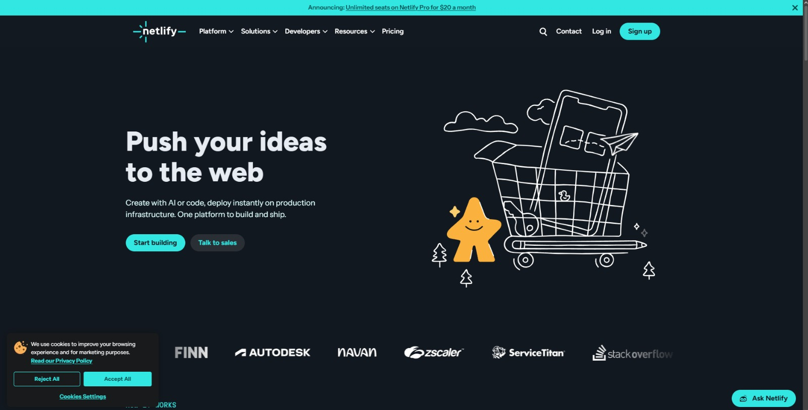

2. **Carga del directorio fuente:** A través de la interfaz de la plataforma, se procedió a seleccionar y cargar directamente la carpeta local que contenía los archivos estáticos finalizados (HTML, CSS, JS) correspondientes al Landing Page.
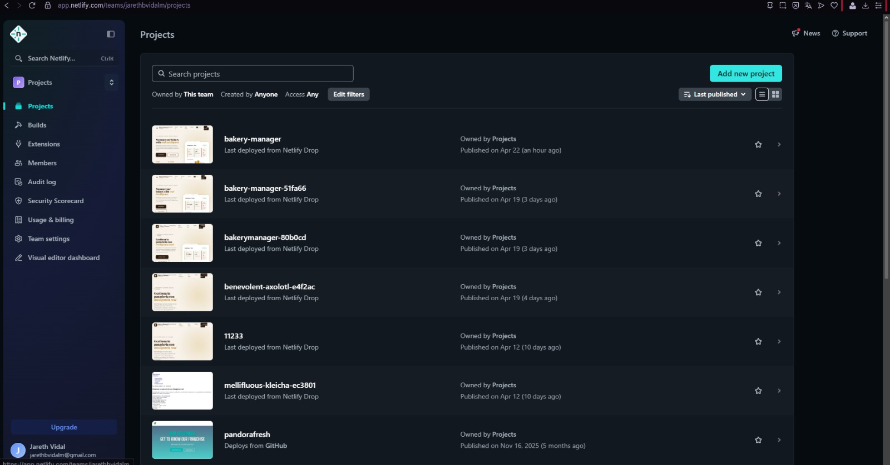
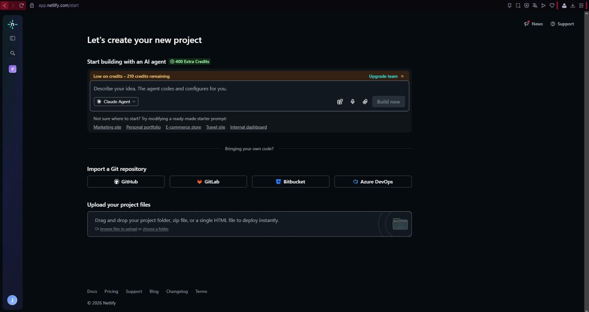

3. **Publicación y generación de URL:** Una vez que Netlify procesó los archivos subidos, el sitio fue desplegado exitosamente en los servidores de producción, asignándole un dominio público.
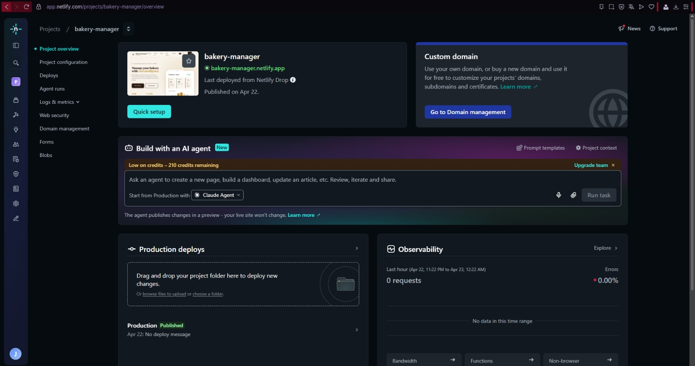

**Evidencias del Despliegue:**
* **Estado del sitio:** El panel de control de Netlify confirma que el sitio de la organización se encuentra en estado "Published".
* **URL Pública del Landing Page:** https://bakery-manager.netlify.app/

#### 5.2.1.8. Team Collaboration Insights during Sprint

Durante el desarrollo del primer Sprint, cada miembro del equipo participó activamente en la implementación de la **Landing Page**. El trabajo fue dividido en secciones según el diseño y el contenido definido previamente.

A continuación, se detalla la participación específica de cada integrante del equipo:

| Nombre | Actividades |
|--------|-------------|
| Molina Vásquez, Manuel Alejandro | Implementación de la sección de Módulo de Sensores |
| Tufiño Argüelles, Luis Angel | Implementación de Branding |
| Céspedes Pillco, Jarod Jack | Implementación de Responsiveness |
| Vidal Malaga, Jareth Beycker | Implementación de la sección de Problemáticas |
| Chipana Huarancca, Emanuel | Implementación de seccion de Planes |

> **Nota:** Algunos integrantes colaboraron en secciones compartidas para asegurar consistencia en diseño y funcionalidad.

##### Evidencia de Colaboración en GitHub

A continuación, se presentan capturas de pantalla de los gráficos de analíticas de colaboración desde el repositorio oficial, donde se evidencia la participación actia de todos los miembros del equipo.

Como se evidencia, el equipo ha trabajador equitativamente. Se ha respetado el flujo de trabajo y se aseguró que cada item del Sprint cuente con participación de todos los miembros.

### 5.2.2. Sprint 2
#### 5.2.2.1. Sprint Planning 2
El **sprint** es aquel periodo corto y de periodo fijo durante el cual es desarrollado un conjunto de tareas o actividades específicas en un proyecto, el cual está estrechamente relacionado con metodologías ágiles como **Scrum**.

El **Sprint #2** tiene como fecha de inicio el **30/04/2026** y plantea elaborar un avance de la **Aplicacion Web** para **BakeryManager**.

| **Sprint #** | Sprint 2 |
| :---- | :---- |
| **Sprint Planning Background** | **Sprint Planning Background** |
| **Date** | 30/04/2026 |
| **Time** | 5:00 PM - 6:30 PM |
| **Location** | Google Meet |
| **Prepared by** | Molina Vásquez Manuel Alejandro |
| **Attendees** | • Molina Vásquez, Manuel Alejandro (u20221g231) • Tufiño Argüelles, Luis Angel (U202216240) • Céspedes Pillco, Jarod Jack (u202318588) • Vidal Malaga, Jareth Beycker (u202316878) • Chipana Huarancca, Emanuel (u202214074) |
| **Sprint Goal & User Stories** | **Sprint Goal & User Stories** |
| **Sprint 2 Goal** | Our focus is on developing and deploying the frontend application of BakeryManager. We believe it delivers a functional and complete user interface to our future users, such as bakers and bakery owners. This will be confirmed when the frontend is successfully deployed and accessible, with all core views implemented and navigable. |
| **Sprint 2 Velocity** | 58  |
| **Sum of Story Point** | 58  |
#### 5.2.2.2. Aspect Leaders and Collaborators

| Team Member (Last Name, First Name) | GitHub Username | Iventory - Leader (L) / Collaborator (C) | Iot Monitoring - Leader (L) / Collaborator (C) | IAM - Leader (L) / Collaborator (C) | Production Monitoring - Leader (L) / Collaborator (C) | VACIO - Leader (L) / Collaborator (C) |
|-------------------------------------|-----------------|--------------------------------------------------|-----------------------------------------------------|------------------------------------------------------|--------------------------------------------------------|-----------------------------------------------------|
| Molina Vásquez, Manuel Alejandro    | AleDusty        | L                                                | C                                                   | C                                                    | C                                                      | C                                                   |
| Tufiño Argüelles, Luis Angel        | LuisTufino2     | C                                                | C                                                   | C                                                    | L                                                      | C                                                   |
| Céspedes Pillco, Jarod Jack         | JJ-UDEV         | C                                                | L                                                   | C                                                    | C                                                      | C                                                   |
| Vidal Malaga, Jareth Beycker        | Jareth341       | C                                                | C                                                   | L                                                    | C                                                      | C                                                   |
| Chipana Huarancca, Emanuel          | Ema-owo         | C                                                | C                                                   | C                                                    | C                                                      | L                                                   |

#### 5.2.2.3. Sprint Backlog 2
| US Id     | User Story Title               | Task Id  | Task Title                          | Description                                                                                                              | Est. (h) | Assigned To      | Status        |
|:----------|:-------------------------------|:---------|:------------------------------------|:-------------------------------------------------------------------------------------------------------------------------|:---------|:-----------------|:--------------|
| **US-01** | Registro de Usuario            | **F-01** | Vista de Register                   | Como usuario nuevo quiero registrarme en BakeryManager para acceder a todas las funcionalidades de la aplicación.        | 4h       | Jareth Vidal     | `Done`        |
| **US-02** | Inicio de Sesión               | **F-02** | Vista de Login                      | Como usuario registrado quiero iniciar sesión para acceder a mi cuenta.                                                  | 3h       | Jareth Vidal     | `Done`        |
| **US-03** | Recuperación de Contraseña     | **F-03** | Vista de Reset Password             | Como usuario registrado quiero recuperar mi contraseña para acceder sin problemas.                                       | 3h       | Jareth Vidal     | `Done`        |
| **US-05** | Cierre de Sesión               | **F-04** | Implementación de Logout            | Como usuario activo quiero cerrar sesión para proteger la privacidad de mis datos.                                       | 2h       | Jareth Vidal     | `Done`        |
| **US-06** | Monitoreo de fermentación      | **F-05** | Vista de fermentación               | Como maestro panadero quiero monitorear temperatura y humedad del área de fermentación para asegurar calidad del pan.    | 5h       | Jarod Céspedes   | `Done`        |
| **US-07** | Control de refrigeración       | **F-06** | Vista de refrigeración              | Como maestro panadero quiero monitorear la temperatura de las refrigeradoras para evitar pérdida de insumos.             | 5h       | Jarod Céspedes   | `Done`        |
| **US-08** | Monitoreo de hornos            | **F-07** | Vista de hornos                     | Como maestro panadero quiero visualizar la temperatura del horno para asegurar una cocción adecuada.                     | 5h       | Jarod Céspedes   | `Done`        |
| **US-09** | Estado de máquinas             | **F-08** | Vista de estado de equipos          | Como encargado de sede quiero conocer el estado de las máquinas para evitar interrupciones.                              | 4h       | Jarod Céspedes   | `In-Progress` |
| **US-15** | Visualización centralizada     | **F-09** | Dashboard principal de sensores     | Como encargado de sede quiero ver todos los sensores en un dashboard para controlar la producción.                       | 8h       | Jarod Céspedes   | `In-Progress` |
| **US-16** | Alertas en tiempo real         | **F-10** | Componente de alertas               | Como maestro panadero quiero recibir alertas inmediatas para actuar rápidamente.                                         | 5h       | Jarod Céspedes   | `To-do`       |
| **US-52** | Visualización en gráficos      | **F-11** | Componente de gráficos analíticos   | Como encargado quiero ver los datos en gráficos para entender mejor la información.                                      | 5h       | Luis Tufiño      | `Done`        |
| **US-53** | Filtro por rango de fechas     | **F-12** | Filtro de fechas en analítica       | Como usuario quiero filtrar datos por fechas para analizar periodos específicos.                                          | 3h       | Luis Tufiño      | `Done`       |
| **US-55** | Resumen general de datos       | **F-13** | Vista de analytics y resumen        | Como jefe quiero ver un resumen de temperaturas, humedad e incidentes para conocer el estado general.                    | 5h       | Luis Tufiño      | `In-Progress` |
| **US-56** | Registro de sensores           | **F-14** | Vista de registro de sensores       | Como encargado quiero registrar nuevos sensores IoT para integrarlos al sistema.                                         | 4h       | Emanuel Chipana  | `Done`        |
| **US-59** | Visualización de sensores      | **F-15** | Vista de listado de sensores        | Como encargado quiero ver todos los sensores registrados para tener control del sistema.                                 | 3h       | Emanuel Chipana  | `Done`        |
| **US-60** | Estado del sensor              | **F-16** | Indicadores de estado de sensores   | Como encargado quiero conocer el estado de los sensores para asegurar su funcionamiento.                                 | 3h       | Emanuel Chipana  | `In-Progress` |
| **US-63** | Edición de sensores            | **F-17** | Vista de edición de sensores        | Como encargado quiero editar la información de los sensores para mantener datos actualizados.                            | 3h       | Manuel Molina    | `Done`        |
| **US-64** | Eliminación de sensores        | **F-18** | Modal de eliminación de sensores    | Como encargado quiero eliminar sensores para mantener el sistema actualizado.                                            | 2h       | Manuel Molina    | `Done`        |
| **US-66** | Registro de usuarios admin     | **F-19** | Vista de gestión de usuarios        | Como administrador quiero registrar nuevos usuarios en el sistema para otorgar acceso a la plataforma.                   | 4h       | Manuel Molina    | `Done`        |
| **US-67** | Gestión de roles y accesos     | **F-20** | Vista de asignación de roles        | Como administrador quiero asignar roles a los usuarios para controlar permisos dentro del sistema.                       | 4h       | Manuel Molina    | `In-Progress` |
| **US-68** | Configuración de permisos      | **F-21** | Vista de configuración de permisos  | Como administrador quiero gestionar permisos de usuarios para controlar qué puede hacer cada rol en el sistema.          | 4h       | Manuel Molina    | `To-do`       |
| **US-57** | Asignación de sensor a equipo  | **F-22** | Vista de asignación de sensores     | Como encargado quiero asignar sensores a equipos para monitorear correctamente.                                          | 3h       | Manuel Molina    | `To-do`       |
| **US-62** | Ubicación del sensor           | **F-23** | Vista de ubicación de sensores      | Como encargado quiero asignar ubicación a cada sensor para identificar dónde está instalado.                             | 3h       | Manuel Molina    | `To-do`       |

#### 5.2.2.4. Development Evidence for Sprint Review
El equipo ha desarrollado el módulo IAM, Inventory, IoT Monitoring y Production durante el Sprint 2.

| **Repository** | **Branch** | Commit ID | Commit Message | Commit Message (Body) | Committed on (Date) |
|:---|:---|:---|:---|:---|:---|
| BakeryManager-frontend | IAM | 272f219 | fix(i18n): apply translate pipe to sign-in and sign-up components | - | 11/05/2026 |
| BakeryManager-frontend | IAM | 186d13c | fix(auth): add mock responses to authentication http service for frontend testing | - | 11/05/2026 |
| BakeryManager-frontend | IAM | b9d1fd8 | fix(layout): hide footer on iam routes | - | 11/05/2026 |
| BakeryManager-frontend | IAM | 1f484c2 | fix(footer): apply translate pipe to footer content | - | 11/05/2026 |
| BakeryManager-frontend | IAM | e8deb91 | fix(auth): implement mock user registration and validation with localStorage | - | 11/05/2026 |
| BakeryManager-frontend | IAM | e61f62b | feat(IAM): implement sign-in and sign-up components with routing and validation | - | 09/05/2026 |
| BakeryManager-frontend | feat/Inventory_Management | 5717c1b | refactor(inventory): redesign inventory ui components and styles for improved ux and maintainability | - | 12/05/2026 |
| BakeryManager-frontend | feat/Inventory_Management | 73af9da | feat(inventory): enhance unit display with translation support in list and form components | - | 11/05/2026 |
| BakeryManager-frontend | feat/Inventory_Management | 2efe644 | feat(inventory): implement inventory service, testing, and integration with translation updates | - | 11/05/2026 |
| BakeryManager-frontend | feat/Inventory_Management | e0ce728 | feat(environment): add environments configuration and integrate Firebase dependencies | - | 11/05/2026 |
| BakeryManager-frontend | feat/Inventory_Management | 4b3acd1 | fix(inventory): improve form validation and error handling during item creation | - | 11/05/2026 |
| BakeryManager-frontend | feat/Inventory_Management | 8bd2459 | feat(server): add json server setup with custom routes for api simulation | - | 11/05/2026 |
| BakeryManager-frontend | feat/Inventory_Management | fbe4fdb | feat(inventory): integrate inventory service to handle api calls and refactor component initialization logic | - | 11/05/2026 |
| BakeryManager-frontend | feat/Inventory_Management | 61dc12d | feat(inventory): add form toggle functionality with fab button and enhance i18n translations | - | 11/05/2026 |
| BakeryManager-frontend | feat/Inventory_Management | c13970b | feat(inventory): enhance inventory item list with detailed documentation and integrate i18n in inventory management | - | 11/05/2026 |
| BakeryManager-frontend | feat/Inventory_Management | a0b9932 | refactor(inventory): remove redundant comments and integrate i18n for dynamic labels | - | 11/05/2026 |
| BakeryManager-frontend | feat/Inventory_Management | 1c61f13 | feat(i18n): add Spanish translations for inventory management module | - | 11/05/2026 |
| BakeryManager-frontend | feat/iot-monitoring | d7be6b6 | feat(environment): add monitoring bounded context related environment variables for both production and development | - | 12/05/2026 |
| BakeryManager-frontend | feat/iot-monitoring | fdec75b | feat(fake-api): add simulated iot data for fake api implementation, and configuration | - | 12/05/2026 |
| BakeryManager-frontend | feat/iot-monitoring | 9dae08f | feat: implement monitoring-store for orchestrating monitoring use cases and managing sensor, incident, and alert data | - | 11/05/2026 |
| BakeryManager-frontend | feat/iot-monitoring | c9cc0c5 | feat: add monitoring api facade for iot operations with sensors, incidents, and alerts | - | 11/05/2026 |
| BakeryManager-frontend | feat/iot-monitoring | 66129bd | feat: add alerts api endpoint for crud integration with alert data | - | 11/05/2026 |
| BakeryManager-frontend | feat/iot-monitoring | dd9719f | feat: add incidents api endpoint for crud integration with incident data | - | 11/05/2026 |
| BakeryManager-frontend | feat/iot-monitoring | a08ae79 | feat: add sensors api endpoint for crud integration with sensor data | - | 11/05/2026 |
| BakeryManager-frontend | feat/iot-monitoring | 6239fca | feat: add alert assembler for mapping alert infrastructure contracts to domain entities and viceversa | - | 11/05/2026 |
| BakeryManager-frontend | feat/iot-monitoring | 455e27b | feat: add alert resource and response interfaces for contract alert payloads and queries | - | 11/05/2026 |
| BakeryManager-frontend | feat/iot-monitoring | 6e29c58 | feat: add incident assembler for mapping incident infrastructure contracts to domain entities and viceversa | - | 11/05/2026 |
| BakeryManager-frontend | feat/iot-monitoring | fd7e9ff | feat: add incident resource and response interfaces for contract incident payloads and queries | - | 11/05/2026 |
| BakeryManager-frontend | feat/iot-monitoring | cc29e82 | fix: correct typo in attribute's name | - | 11/05/2026 |
| BakeryManager-frontend | feat/iot-monitoring | accc5a9 | feat: add sensor assembler for mapping sensor infrastructure contracts to domain entities and viceversa | - | 11/05/2026 |
| BakeryManager-frontend | feat/production-... | 3a6c8c7 | feat(i18n): enhance language support and fallback mechanisms for production monitoring | - | 12/05/2026 |
| BakeryManager-frontend | feat/production-... | ac268a1 | feat(fonts): update font styles to DM Sans and Playfair Display for improved typography | - | 12/05/2026 |
| BakeryManager-frontend | feat/production-... | 9023188 | feat(i18n): add production and IoT monitoring translations for English and Spanish | - | 12/05/2026 |
| BakeryManager-frontend | feat/production-... | 50132c0 | chore(layout): remove footer, keep single language switcher and update sidebar styles | - | 12/05/2026 |
| BakeryManager-frontend | feat/production-... | 112ae85 | feat(styles): enhance language switcher button styles for better visibility | - | 12/05/2026 |
| BakeryManager-frontend | feat/production-... | 13f2468 | feat(routes): add production route and new logo asset | - | 12/05/2026 |
| BakeryManager-frontend | feat/production-... | d66bbc6 | feat(animation): add Angular animations provider to application config | - | 12/05/2026 |
| BakeryManager-frontend | feat/production-... | beae0a8 | feat(i18n): update footer translations for English and Spanish | - | 12/05/2026 |

#### 5.2.2.5. Execution Evidence for Sprint Review

#### 5.2.2.6. Services Documentation Evidence for Sprint Review
Durante el Sprint 2, el equipo no ha realizado el despliegue de Web Services propios, dado que el desarrollo se ha enfocado en el Frontend Web Application. Para simular el consumo de servicios, se utilizó **JSON Server** como fake API local, permitiendo validar la integración de los bounded contexts de IAM, Inventory y Production sin depender del backend real.

| Bounded Context | Endpoint simulado | HTTP Verb | Acción | Descripción |
|:---|:---|:---|:---|:---|
| IAM | `/users` | POST | signUp | Registro de nuevo usuario con email, contraseña y rol |
| IAM | `/users` | POST | signIn | Autenticación de usuario registrado y retorno de token mock |
| Inventory | `/inventory-items` | GET | getAll | Obtiene la lista de todos los insumos registrados |
| Inventory | `/inventory-items` | POST | create | Registra un nuevo insumo con stock inicial y unidad |
| Inventory | `/inventory-items/:id` | PUT | update | Actualiza los datos de un insumo existente |
| Inventory | `/inventory-items/:id` | DELETE | delete | Elimina un insumo del inventario |
| Production | `/ovens` | GET | getAll | Obtiene el estado en tiempo real de los hornos activos |
| Production | `/ovens/:id` | GET | getById | Obtiene el detalle de un horno específico |
| Production | `/ovens` | POST | create | Registra un nuevo horno en el sistema |
| Production | `/ovens/:id` | PUT | update | Actualiza el estado y parámetros de un horno |

#### 5.2.2.7. Software Deployment Evidence for Sprint Review
Firebase es una plataforma de desarrollo de aplicaciones web y móviles proporcionada por Google, diseñada para ayudar a los desarrolladores a crear, gestionar y escalar aplicaciones rápidamente. Firebase ofrece una variedad de servicios que facilitan tanto el desarrollo como la gestión de aplicaciones en tiempo real 

 

 Nos registramos con una cuenta de google y vamos a la consola
 
 
 
 Creamos un nuevo proyecto de firebase
 
 
 Ponemos un nombre para el proyecto
 
 

 Vamos al apartado de hosting

 
 

 Se configura el firebase hosting en nuestro proyecto de intellij idea

 
 Con esto ya tendríamos nuestro hosting desplegado con los siguientes comandos

ng build
sudo npm install -g firebase-tools
firebase login
firebase init
firebase deploy

#### 5.2.2.8. Team Collaboration Insights during Sprint
En este apartado se presenta un resumen de la dinámica de trabajo colaborativo y la gestión de tareas realizada por el equipo durante el Sprint 2. Se incluyen evidencias visuales que muestran la participación activa de los integrantes, así como el registro de los commits y contribuciones en el repositorio. Estas evidencias reflejan el compromiso, la organización y la comunicación efectiva que caracterizaron el desarrollo de este sprint.

