# Capítulo V: Product Implementation, Validation & Deployment

## 5.1. Software Configuration Management

### 5.1.1. Software Development Environment Configuration

A continuación, se listan las herramientas y estándares adoptados por el equipo para el desarrollo colaborativo del sistema:

| Actividad | Herramienta / Guía  | Propósito                   | Tipo de Acceso / Ruta                                         |
| --------- |---------------------|-----------------------------|---------------------------------------------------------------|
| Project Management | Trello              | Seguimiento de backlog, tareas y sprints | [https://trello.com/](https://trello.com/)                         |
| Requirements Management | Gherkin Conventions | Escritura legible de requisitos con formato Given/When/Then | [https://cucumber.io/docs/gherkin/](https://cucumber.io/docs/gherkin/) |
| Product UX/UI Design | Figma               | Prototipos y diseño Responsive | [https://figma.com](https://figma.com)                        |
| Version Control | Git + GitHub        | Gestión colaborativa del código fuente | [https://github.com](https://github.com)                      |
| Software Deployment | Netlify             | Despliegue de Landing Pages | [https://www.netlify.com](https://www.netlify.com)            |

### 5.1.2. Source Code Management

En esta sección el equipo establece los medios y esquema de organización que aplicará para el seguimiento de modificaciones. Para ello se utilizará **GitHub** como plataforma y sistema de control de versiones.

A continuación se indican los URLs de los repositorios de GitHub para cada producto:

- **Business Web Page**: [https://github.com/1ASI0730-2610-20262-TBL-BrainNova/BakeryManager-report-repo](https://github.com/1ASI0730-2610-20262-TBL-BrainNova/BakeryManager-report-repo)

#### GitFlow Workflow

Se implementará el modelo de ramificación propuesto por Vincent Driessen en su artículo *“A successful Git branching model”*, conocido como **GitFlow**. Este modelo organiza el trabajo en las siguientes ramas:

- `main`: Rama principal, contiene siempre el código en producción.
- `develop`: Rama de desarrollo principal, donde se integran las funcionalidades antes de pasar a producción.
- `feature/*`: Ramas creadas a partir de `develop` para desarrollar nuevas funcionalidades.**Convención de nombres:** `feature/<nombre-corto-descriptivo>`_Ejemplo: `feature/login-auth`_
  **Convención de nombres:** `feature/<descripción-corta>`
  _Ejemplo: `feature/version-testing`_

#### Convenciones de Commits

Se utilizará el estándar de **Conventional Commits** para los mensajes de commits. Esto facilitará la automatización en los procesos de integración continua y generación de changelogs.

**Ejemplos:**

- `feat: add login functionality`
- `fix: correct null pointer exception on user service`
- `chore: update dependencies`
- `docs: add and update documents`

### 5.1.3. Source Code Style Guide & Conventions

#### Frontend (Landing Page - HTML, CSS, JavaScript)

##### Convenciones generales:

- **Idioma**: Nombres de variables, funciones y clases están escritos en **inglés**.
- **Formato de archivos**: `.html`, `.css`, `.js`
- **Estilo de código adoptado**:
    - [W3Schools HTML Style Guide](https://www.w3schools.com/html/html5_syntax.asp)
    - [Google HTML/CSS Style Guide](https://google.github.io/styleguide/htmlcssguide.html)

##### Nomenclatura:

- **Clases CSS**: `kebab-case` (ej. `main-container`)
- **IDs HTML**: `camelCase` (ej. `mainContent`)
- **Variables JS**: `camelCase` (ej. `userName`)

### 5.1.4. Software Deployment Configuration

Esta sección detalla los pasos necesarios para desplegar de forma satisfactoria los productos digitales que actualmente componen la solución: el **Business-Web-Page**, partiendo desde sus respectivos repositorios de código fuente.

**1. Business-Web-Page - HTML, CSS y Javascript**

**Tecnología Base**

* **Lenguajes**: HTML5, CSS3, JavaScript
* **Hosting**: Netlify

**Configuración y Despliegue**

* **Repositorio de Código Fuente**:
  La Business-Web-Page se desarrolla utilizando HTML, CSS y JavaScript puro. ...

**Configuración del despliegue en Netlify:**

**Publicación:**

**Actualizaciones:**

---

## 5.2. Landing Page, Services & Applications Implementation

### 5.2.1. Sprint 1

#### 5.2.1.1. Sprint Planning 1
El **sprint** es aquel periodo corto y de periodo fijo durante el cual es desarrollado un conjunto de tareas o actividades específicas en un proyecto, el cual está estrechamente relacionado con metodologías ágiles como **Scrum**.

El **Sprint #1** tiene como fecha de inicio el **07/04/2026** y plantea elaborar una **Landing Page** atractiva para **BakeryManager** que capte la atención de nuestros segmentos objetivos.

| **Sprint #** | Sprint 1 |
| :---- | :---- |
| **Sprint Planning Background** | **Sprint Planning Background** |
| **Date** | 07/04/2026 |
| **Time** | 5:00 PM - 6:30 PM |
| **Location** | Google Meet |
| **Prepared by** | Molina Vásquez Manuel Alejandro |
| **Attendees** | • Molina Vásquez, Manuel Alejandro (u20221g231) • Tufiño Argüelles, Luis Angel (U202216240) • Céspedes Pillco, Jarod Jack (u202318588) • Vidal Malaga, Jareth Beycker (u202316878) • Chipana Huarancca, Emanuel (u202214074) |
| **Sprint Goal & User Stories** | **Sprint Goal & User Stories** |
| **Sprint 1 Goal** | Our focus is on creating, designing and deploying an attractive and informative Landing Page for our project We believe it delivers a nice perspective of the BakeryManager application to our future users, such as bakers This will be confirmed when potential users subscribe to our plans and send positive feedback to the team |
| **Sprint 1 Velocity** | 15 |
| **Sum of Story Point** | 18 |

#### 5.2.1.2. Aspect Leaders and Collaborators

| Team Member (Last Name, First Name) | GitHub Username | Identidad Visual - Leader (L) / Collaborator (C) | Exposición de Pains - Leader (L) / Collaborator (C) | Catálogo de Features - Leader (L) / Collaborator (C) | Sistema de Suscripción - Leader (L) / Collaborator (C) | Adaptabilidad Móvil - Leader (L) / Collaborator (C) |
|-------------------------------------|-----------------|--------------------------------------------------|-----------------------------------------------------|------------------------------------------------------|--------------------------------------------------------|-----------------------------------------------------|
| Molina Vásquez, Manuel Alejandro    | AleDusty        | L                                                | C                                                   | C                                                    | C                                                      | C                                                   |
| Tufiño Argüelles, Luis Angel        | LuisTufino2     | C                                                | C                                                   | C                                                    | L                                                      | C                                                   |
| Céspedes Pillco, Jarod Jack         | JJ-UDEV         | C                                                | L                                                   | C                                                    | C                                                      | C                                                   |
| Vidal Malaga, Jareth Beycker        | Jareth341       | C                                                | C                                                   | L                                                    | C                                                      | C                                                   |
| Chipana Huarancca, Emanuel          | Ema-owo         | C                                                | C                                                   | C                                                    | C                                                      | L                                                   |

#### 5.2.1.3. Sprint Backlog 1

El objetivo principal del Sprint 1 es desarrollar y desplegar una **Landing Page** funcional para el proyecto BakeryManager. A continuación, listamos las historias de usuario (US) que serán trabajadas en esta primera entrega.

| US Id | User Story Title | Task Id | Task Title | Description | Est. (h) | Assigned To | Status |
|:---|:---|:---|:---|:---|:---|:---|:-------|
| **US-71** | Identidad Visual | **W-01** | Implementación de Branding | Como visitante quiero ver una sección de impacto con el branding de BakeryManager para entender la plataforma. | 4h | Luis Tufiño | `Done` |
| **US-72** | Exposición de Pains | **W-02** | Sección de Problemáticas | Como dueño de panadería quiero leer sobre los problemas comunes para sentir que la plataforma entiende mi negocio. | 3h | Jareth Vidal | `Done` |
| **US-73** | Catálogo de Features | **W-03** | Módulos de Sensores | Como usuario interesado quiero ver qué sensores se ofrecen para saber si mejoraré mi producción. | 4h | Manuel Molina | `Done` |
| **US-74** | Sistema de Suscripción | **W-04** | Tabla de Planes | Como cliente potencial quiero ver cuánto cuesta el servicio para evaluar si se ajusta a mi presupuesto. | 3h | Emanuel Chipana | `Done` |
| **US-75** | Adaptabilidad Móvil | **W-05** | Interfaz Responsive | Como dueño de panadería que usa celular quiero navegar por el sitio cómodamente para informarme en mi local. | 4h | Jarod Céspedes | `Done` |
#### 5.2.1.4. Development Evidence for Sprint Review
El equipo ha desarrollado una **Landing Page** atractiva y funcional que cumple con los objetivos planteados durante el Sprint 1.

| **Repository**      | **Branch** | Commit ID | Commit Message | Commit Message (Body) | Committed on (Date) | 
|:--------------------|:-----------|:----------|:---------------|:----------------------|:--------------------|
| **Acceptance Test** | main       |  fa9a2e7925696677093ce01ece70e55bd11c6e10         | initial commit | -                     | 12/04/2026          |
| **Acceptance Test** | main       |3f7feebb31f96bbb05383a2441fd3a15f9cb55ab| initial comit  | -                     | 12/04/2026          |
| **Acceptance Test** | main       |02ce604b2c9c5163e4d2e181ec5d73233f2eae73| feat:complete landing page with IoT monitoring, EN/ES i18n, dashboard, alerts, pricing and logo          | -                     | 19/04/2026          |
#### 5.2.1.5. Execution Evidence for Sprint Review

A continuación, mostramos capturas de pantallas donde se visualiza a la **Landing Page** en ejecución:

  

#### 5.2.1.6. Services Documentation Evidence for Sprint Review

Durante el primer Sprint no se desarrollaron ni documentaron Web Services, dado que el enfoque principal estuvo en la diseño e implementación de la Landing Page como primer entregable del sistema. Por lo tanto, no se cuenta con endpoints disponibles ni documentación generada en OpenAPI en esta etapa del proyecto.

La documentación de servicios será considerada en los siguientes Sprints, una vez que se inicie el desarrollo del backend y se establezca la estructura básica de la API que permitirá la integración con las vistas web implementadas.

#### 5.2.1.7. Software Deployment Evidence for Sprint Review

Durante este Sprint, se llevaron a cabo las actividades de despliegue para la primera versión funcional del **Landing Page** de BakeryManager. El objetivo principal fue publicar el sitio web estático en un proveedor cloud para que sea accesible públicamente en internet y pueda ser validado.

Para este primer entregable, el proceso se realizó utilizando **Netlify** como proveedor de servicios, ejecutando un despliegue manual de los artefactos generados.

1. **Inicio de sesión y preparación:** Se ingresó a la consola de administración de Netlify con la cuenta del equipo y se seleccionó la opción para agregar un nuevo sitio de forma manual.
 

3. **Carga del directorio fuente:** A través de la interfaz de la plataforma, se procedió a seleccionar y cargar directamente la carpeta local que contenía los archivos estáticos finalizados (HTML, CSS, JS) correspondientes al Landing Page.
  

4. **Publicación y generación de URL:** Una vez que Netlify procesó los archivos subidos, el sitio fue desplegado exitosamente en los servidores de producción, asignándole un dominio público.
   

**Evidencias del Despliegue:**
* **Estado del sitio:** El panel de control de Netlify confirma que el sitio de la organización se encuentra en estado "Published".
* **URL Pública del Landing Page:** https://bakery-manager.netlify.app/
#### 5.2.1.8. Team Collaboration Insights during Sprint

Durante el desarrollo del primer Sprint, cada miembro del equipo participó activamente en la implementación de la **Landing Page**. El trabajo fue dividido en secciones según el diseño y el contenido definido previamente.

A continuación, se detalla la participación específica de cada integrante del equipo:

| Nombre | Actividades |
|--------|-------------|
| Molina Vásquez, Manuel Alejandro | Implementación de la sección de Módulo de Sensores |
| Tufiño Argüelles, Luis Angel | Implementación de Branding |
| Céspedes Pillco, Jarod Jack | Implementación de Responsiveness |
| Vidal Malaga, Jareth Beycker | Implementación de la sección de Problemáticas |
| Chipana Huarancca, Emanuel | Implementación de seccion de Planes |

> **Nota:** Algunos integrantes colaboraron en secciones compartidas para asegurar consistencia en diseño y funcionalidad.

##### Evidencia de Colaboración en GitHub

A continuación, se presentan capturas de pantalla de los gráficos de analíticas de colaboración desde el repositorio oficial, donde se evidencia la participación actia de todos los miembros del equipo.

Como se evidencia, el equipo ha trabajador equitativamente. Se ha respetado el flujo de trabajo y se aseguró que cada item del Sprint cuente con participación de todos los miembros.

### 5.2.2. Sprint 2
#### 5.2.2.1. Sprint Planning 2
El **sprint** es aquel periodo corto y de periodo fijo durante el cual es desarrollado un conjunto de tareas o actividades específicas en un proyecto, el cual está estrechamente relacionado con metodologías ágiles como **Scrum**.

El **Sprint #2** tiene como fecha de inicio el **30/04/2026** y plantea elaborar un avance de la **Aplicacion Web** para **BakeryManager**.

| **Sprint #** | Sprint 2 |
| :---- | :---- |
| **Sprint Planning Background** | **Sprint Planning Background** |
| **Date** | 30/04/2026 |
| **Time** | 5:00 PM - 6:30 PM |
| **Location** | Google Meet |
| **Prepared by** | Molina Vásquez Manuel Alejandro |
| **Attendees** | • Molina Vásquez, Manuel Alejandro (u20221g231) • Tufiño Argüelles, Luis Angel (U202216240) • Céspedes Pillco, Jarod Jack (u202318588) • Vidal Malaga, Jareth Beycker (u202316878) • Chipana Huarancca, Emanuel (u202214074) |
| **Sprint Goal & User Stories** | **Sprint Goal & User Stories** |
| **Sprint 2 Goal** | Our focus is on developing and deploying the frontend application of BakeryManager. We believe it delivers a functional and complete user interface to our future users, such as bakers and bakery owners. This will be confirmed when the frontend is successfully deployed and accessible, with all core views implemented and navigable. |
| **Sprint 2 Velocity** | 58  |
| **Sum of Story Point** | 58  |
#### 5.2.2.2. Aspect Leaders and Collaborators

| Team Member (Last Name, First Name) | GitHub Username | Iventory - Leader (L) / Collaborator (C) | Iot Monitoring - Leader (L) / Collaborator (C) | IAM - Leader (L) / Collaborator (C) | Production Monitoring - Leader (L) / Collaborator (C) | VACIO - Leader (L) / Collaborator (C) |
|-------------------------------------|-----------------|--------------------------------------------------|-----------------------------------------------------|------------------------------------------------------|--------------------------------------------------------|-----------------------------------------------------|
| Molina Vásquez, Manuel Alejandro    | AleDusty        | L                                                | C                                                   | C                                                    | C                                                      | C                                                   |
| Tufiño Argüelles, Luis Angel        | LuisTufino2     | C                                                | C                                                   | C                                                    | L                                                      | C                                                   |
| Céspedes Pillco, Jarod Jack         | JJ-UDEV         | C                                                | L                                                   | C                                                    | C                                                      | C                                                   |
| Vidal Malaga, Jareth Beycker        | Jareth341       | C                                                | C                                                   | L                                                    | C                                                      | C                                                   |
| Chipana Huarancca, Emanuel          | Ema-owo         | C                                                | C                                                   | C                                                    | C                                                      | L                                                   |

#### 5.2.2.3. Sprint Backlog 2
| US Id     | User Story Title               | Task Id  | Task Title                          | Description                                                                                                              | Est. (h) | Assigned To      | Status        |
|:----------|:-------------------------------|:---------|:------------------------------------|:-------------------------------------------------------------------------------------------------------------------------|:---------|:-----------------|:--------------|
| **US-01** | Registro de Usuario            | **F-01** | Vista de Register                   | Como usuario nuevo quiero registrarme en BakeryManager para acceder a todas las funcionalidades de la aplicación.        | 4h       | Jareth Vidal     | `Done`        |
| **US-02** | Inicio de Sesión               | **F-02** | Vista de Login                      | Como usuario registrado quiero iniciar sesión para acceder a mi cuenta.                                                  | 3h       | Jareth Vidal     | `Done`        |
| **US-03** | Recuperación de Contraseña     | **F-03** | Vista de Reset Password             | Como usuario registrado quiero recuperar mi contraseña para acceder sin problemas.                                       | 3h       | Jareth Vidal     | `Done`        |
| **US-05** | Cierre de Sesión               | **F-04** | Implementación de Logout            | Como usuario activo quiero cerrar sesión para proteger la privacidad de mis datos.                                       | 2h       | Jareth Vidal     | `Done`        |
| **US-06** | Monitoreo de fermentación      | **F-05** | Vista de fermentación               | Como maestro panadero quiero monitorear temperatura y humedad del área de fermentación para asegurar calidad del pan.    | 5h       | Jarod Céspedes   | `Done`        |
| **US-07** | Control de refrigeración       | **F-06** | Vista de refrigeración              | Como maestro panadero quiero monitorear la temperatura de las refrigeradoras para evitar pérdida de insumos.             | 5h       | Jarod Céspedes   | `Done`        |
| **US-08** | Monitoreo de hornos            | **F-07** | Vista de hornos                     | Como maestro panadero quiero visualizar la temperatura del horno para asegurar una cocción adecuada.                     | 5h       | Jarod Céspedes   | `Done`        |
| **US-09** | Estado de máquinas             | **F-08** | Vista de estado de equipos          | Como encargado de sede quiero conocer el estado de las máquinas para evitar interrupciones.                              | 4h       | Jarod Céspedes   | `In-Progress` |
| **US-15** | Visualización centralizada     | **F-09** | Dashboard principal de sensores     | Como encargado de sede quiero ver todos los sensores en un dashboard para controlar la producción.                       | 8h       | Jarod Céspedes   | `In-Progress` |
| **US-16** | Alertas en tiempo real         | **F-10** | Componente de alertas               | Como maestro panadero quiero recibir alertas inmediatas para actuar rápidamente.                                         | 5h       | Jarod Céspedes   | `To-do`       |
| **US-52** | Visualización en gráficos      | **F-11** | Componente de gráficos analíticos   | Como encargado quiero ver los datos en gráficos para entender mejor la información.                                      | 5h       | Luis Tufiño      | `Done`        |
| **US-53** | Filtro por rango de fechas     | **F-12** | Filtro de fechas en analítica       | Como usuario quiero filtrar datos por fechas para analizar periodos específicos.                                          | 3h       | Luis Tufiño      | `Done`       |
| **US-55** | Resumen general de datos       | **F-13** | Vista de analytics y resumen        | Como jefe quiero ver un resumen de temperaturas, humedad e incidentes para conocer el estado general.                    | 5h       | Luis Tufiño      | `In-Progress` |
| **US-56** | Registro de sensores           | **F-14** | Vista de registro de sensores       | Como encargado quiero registrar nuevos sensores IoT para integrarlos al sistema.                                         | 4h       | Emanuel Chipana  | `Done`        |
| **US-59** | Visualización de sensores      | **F-15** | Vista de listado de sensores        | Como encargado quiero ver todos los sensores registrados para tener control del sistema.                                 | 3h       | Emanuel Chipana  | `Done`        |
| **US-60** | Estado del sensor              | **F-16** | Indicadores de estado de sensores   | Como encargado quiero conocer el estado de los sensores para asegurar su funcionamiento.                                 | 3h       | Emanuel Chipana  | `In-Progress` |
| **US-63** | Edición de sensores            | **F-17** | Vista de edición de sensores        | Como encargado quiero editar la información de los sensores para mantener datos actualizados.                            | 3h       | Manuel Molina    | `Done`        |
| **US-64** | Eliminación de sensores        | **F-18** | Modal de eliminación de sensores    | Como encargado quiero eliminar sensores para mantener el sistema actualizado.                                            | 2h       | Manuel Molina    | `Done`        |
| **US-66** | Registro de usuarios admin     | **F-19** | Vista de gestión de usuarios        | Como administrador quiero registrar nuevos usuarios en el sistema para otorgar acceso a la plataforma.                   | 4h       | Manuel Molina    | `Done`        |
| **US-67** | Gestión de roles y accesos     | **F-20** | Vista de asignación de roles        | Como administrador quiero asignar roles a los usuarios para controlar permisos dentro del sistema.                       | 4h       | Manuel Molina    | `In-Progress` |
| **US-68** | Configuración de permisos      | **F-21** | Vista de configuración de permisos  | Como administrador quiero gestionar permisos de usuarios para controlar qué puede hacer cada rol en el sistema.          | 4h       | Manuel Molina    | `To-do`       |
| **US-57** | Asignación de sensor a equipo  | **F-22** | Vista de asignación de sensores     | Como encargado quiero asignar sensores a equipos para monitorear correctamente.                                          | 3h       | Manuel Molina    | `To-do`       |
| **US-62** | Ubicación del sensor           | **F-23** | Vista de ubicación de sensores      | Como encargado quiero asignar ubicación a cada sensor para identificar dónde está instalado.                             | 3h       | Manuel Molina    | `To-do`       |

#### 5.2.2.4. Development Evidence for Sprint Review
El equipo ha desarrollado el módulo IAM, Inventory, IoT Monitoring y Production durante el Sprint 2.

| **Repository** | **Branch** | Commit ID | Commit Message | Commit Message (Body) | Committed on (Date) |
|:---|:---|:---|:---|:---|:---|
| BakeryManager-frontend | IAM | 272f219 | fix(i18n): apply translate pipe to sign-in and sign-up components | - | 11/05/2026 |
| BakeryManager-frontend | IAM | 186d13c | fix(auth): add mock responses to authentication http service for frontend testing | - | 11/05/2026 |
| BakeryManager-frontend | IAM | b9d1fd8 | fix(layout): hide footer on iam routes | - | 11/05/2026 |
| BakeryManager-frontend | IAM | 1f484c2 | fix(footer): apply translate pipe to footer content | - | 11/05/2026 |
| BakeryManager-frontend | IAM | e8deb91 | fix(auth): implement mock user registration and validation with localStorage | - | 11/05/2026 |
| BakeryManager-frontend | IAM | e61f62b | feat(IAM): implement sign-in and sign-up components with routing and validation | - | 09/05/2026 |
| BakeryManager-frontend | feat/Inventory_Management | 5717c1b | refactor(inventory): redesign inventory ui components and styles for improved ux and maintainability | - | 12/05/2026 |
| BakeryManager-frontend | feat/Inventory_Management | 73af9da | feat(inventory): enhance unit display with translation support in list and form components | - | 11/05/2026 |
| BakeryManager-frontend | feat/Inventory_Management | 2efe644 | feat(inventory): implement inventory service, testing, and integration with translation updates | - | 11/05/2026 |
| BakeryManager-frontend | feat/Inventory_Management | e0ce728 | feat(environment): add environments configuration and integrate Firebase dependencies | - | 11/05/2026 |
| BakeryManager-frontend | feat/Inventory_Management | 4b3acd1 | fix(inventory): improve form validation and error handling during item creation | - | 11/05/2026 |
| BakeryManager-frontend | feat/Inventory_Management | 8bd2459 | feat(server): add json server setup with custom routes for api simulation | - | 11/05/2026 |
| BakeryManager-frontend | feat/Inventory_Management | fbe4fdb | feat(inventory): integrate inventory service to handle api calls and refactor component initialization logic | - | 11/05/2026 |
| BakeryManager-frontend | feat/Inventory_Management | 61dc12d | feat(inventory): add form toggle functionality with fab button and enhance i18n translations | - | 11/05/2026 |
| BakeryManager-frontend | feat/Inventory_Management | c13970b | feat(inventory): enhance inventory item list with detailed documentation and integrate i18n in inventory management | - | 11/05/2026 |
| BakeryManager-frontend | feat/Inventory_Management | a0b9932 | refactor(inventory): remove redundant comments and integrate i18n for dynamic labels | - | 11/05/2026 |
| BakeryManager-frontend | feat/Inventory_Management | 1c61f13 | feat(i18n): add Spanish translations for inventory management module | - | 11/05/2026 |
| BakeryManager-frontend | feat/iot-monitoring | d7be6b6 | feat(environment): add monitoring bounded context related environment variables for both production and development | - | 12/05/2026 |
| BakeryManager-frontend | feat/iot-monitoring | fdec75b | feat(fake-api): add simulated iot data for fake api implementation, and configuration | - | 12/05/2026 |
| BakeryManager-frontend | feat/iot-monitoring | 9dae08f | feat: implement monitoring-store for orchestrating monitoring use cases and managing sensor, incident, and alert data | - | 11/05/2026 |
| BakeryManager-frontend | feat/iot-monitoring | c9cc0c5 | feat: add monitoring api facade for iot operations with sensors, incidents, and alerts | - | 11/05/2026 |
| BakeryManager-frontend | feat/iot-monitoring | 66129bd | feat: add alerts api endpoint for crud integration with alert data | - | 11/05/2026 |
| BakeryManager-frontend | feat/iot-monitoring | dd9719f | feat: add incidents api endpoint for crud integration with incident data | - | 11/05/2026 |
| BakeryManager-frontend | feat/iot-monitoring | a08ae79 | feat: add sensors api endpoint for crud integration with sensor data | - | 11/05/2026 |
| BakeryManager-frontend | feat/iot-monitoring | 6239fca | feat: add alert assembler for mapping alert infrastructure contracts to domain entities and viceversa | - | 11/05/2026 |
| BakeryManager-frontend | feat/iot-monitoring | 455e27b | feat: add alert resource and response interfaces for contract alert payloads and queries | - | 11/05/2026 |
| BakeryManager-frontend | feat/iot-monitoring | 6e29c58 | feat: add incident assembler for mapping incident infrastructure contracts to domain entities and viceversa | - | 11/05/2026 |
| BakeryManager-frontend | feat/iot-monitoring | fd7e9ff | feat: add incident resource and response interfaces for contract incident payloads and queries | - | 11/05/2026 |
| BakeryManager-frontend | feat/iot-monitoring | cc29e82 | fix: correct typo in attribute's name | - | 11/05/2026 |
| BakeryManager-frontend | feat/iot-monitoring | accc5a9 | feat: add sensor assembler for mapping sensor infrastructure contracts to domain entities and viceversa | - | 11/05/2026 |
| BakeryManager-frontend | feat/production-... | 3a6c8c7 | feat(i18n): enhance language support and fallback mechanisms for production monitoring | - | 12/05/2026 |
| BakeryManager-frontend | feat/production-... | ac268a1 | feat(fonts): update font styles to DM Sans and Playfair Display for improved typography | - | 12/05/2026 |
| BakeryManager-frontend | feat/production-... | 9023188 | feat(i18n): add production and IoT monitoring translations for English and Spanish | - | 12/05/2026 |
| BakeryManager-frontend | feat/production-... | 50132c0 | chore(layout): remove footer, keep single language switcher and update sidebar styles | - | 12/05/2026 |
| BakeryManager-frontend | feat/production-... | 112ae85 | feat(styles): enhance language switcher button styles for better visibility | - | 12/05/2026 |
| BakeryManager-frontend | feat/production-... | 13f2468 | feat(routes): add production route and new logo asset | - | 12/05/2026 |
| BakeryManager-frontend | feat/production-... | d66bbc6 | feat(animation): add Angular animations provider to application config | - | 12/05/2026 |
| BakeryManager-frontend | feat/production-... | beae0a8 | feat(i18n): update footer translations for English and Spanish | - | 12/05/2026 |

#### 5.2.2.5. Execution Evidence for Sprint Review

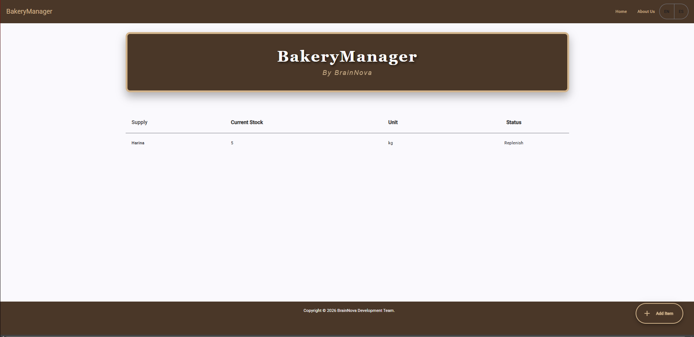

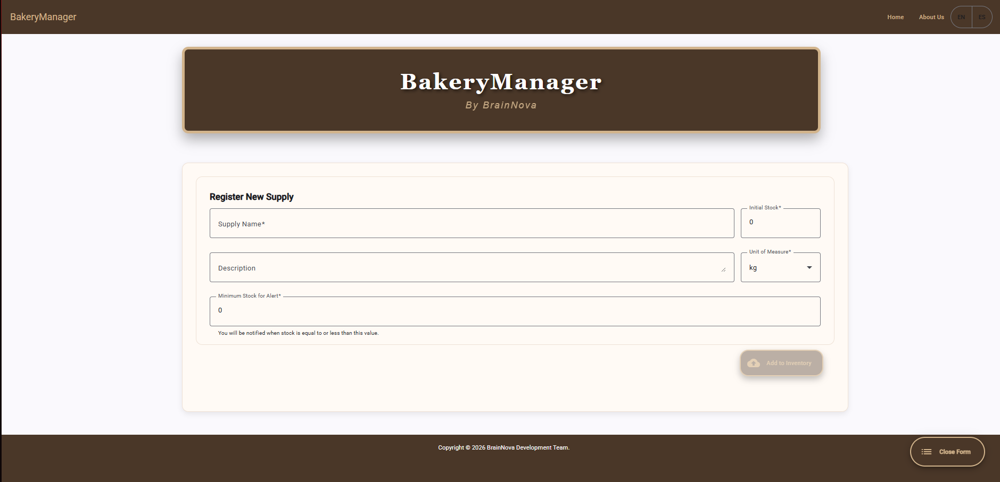

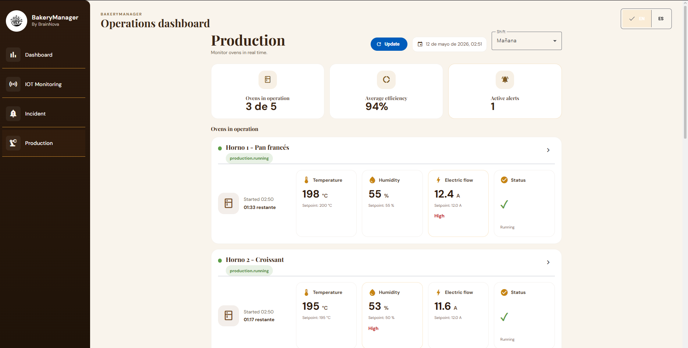

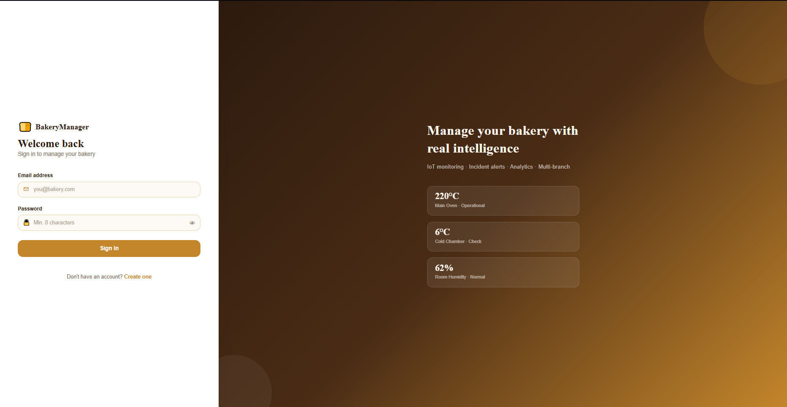

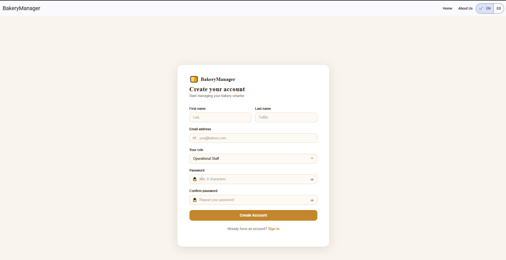
#### 5.2.2.6. Services Documentation Evidence for Sprint Review
Durante el Sprint 2, el equipo no ha realizado el despliegue de Web Services propios, dado que el desarrollo se ha enfocado en el Frontend Web Application. Para simular el consumo de servicios, se utilizó **JSON Server** como fake API local, permitiendo validar la integración de los bounded contexts de IAM, Inventory y Production sin depender del backend real.

| Bounded Context | Endpoint simulado | HTTP Verb | Acción | Descripción |
|:---|:---|:---|:---|:---|
| IAM | `/users` | POST | signUp | Registro de nuevo usuario con email, contraseña y rol |
| IAM | `/users` | POST | signIn | Autenticación de usuario registrado y retorno de token mock |
| Inventory | `/inventory-items` | GET | getAll | Obtiene la lista de todos los insumos registrados |
| Inventory | `/inventory-items` | POST | create | Registra un nuevo insumo con stock inicial y unidad |
| Inventory | `/inventory-items/:id` | PUT | update | Actualiza los datos de un insumo existente |
| Inventory | `/inventory-items/:id` | DELETE | delete | Elimina un insumo del inventario |
| Production | `/ovens` | GET | getAll | Obtiene el estado en tiempo real de los hornos activos |
| Production | `/ovens/:id` | GET | getById | Obtiene el detalle de un horno específico |
| Production | `/ovens` | POST | create | Registra un nuevo horno en el sistema |
| Production | `/ovens/:id` | PUT | update | Actualiza el estado y parámetros de un horno |

#### 5.2.2.7. Software Deployment Evidence for Sprint Review
Firebase es una plataforma de desarrollo de aplicaciones web y móviles proporcionada por Google, diseñada para ayudar a los desarrolladores a crear, gestionar y escalar aplicaciones rápidamente. Firebase ofrece una variedad de servicios que facilitan tanto el desarrollo como la gestión de aplicaciones en tiempo real 

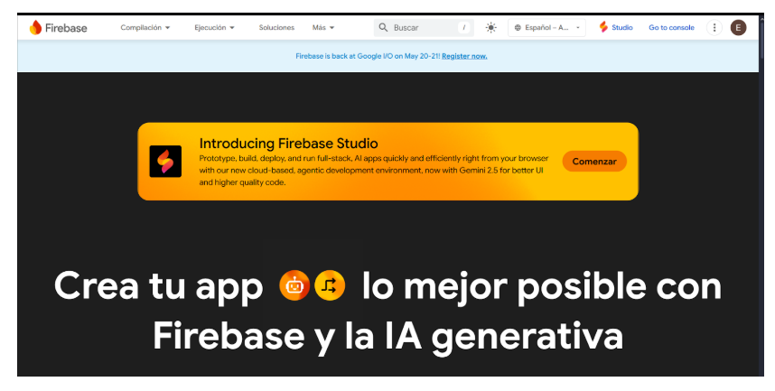

Nos registramos con una cuenta de google y vamos a la consola

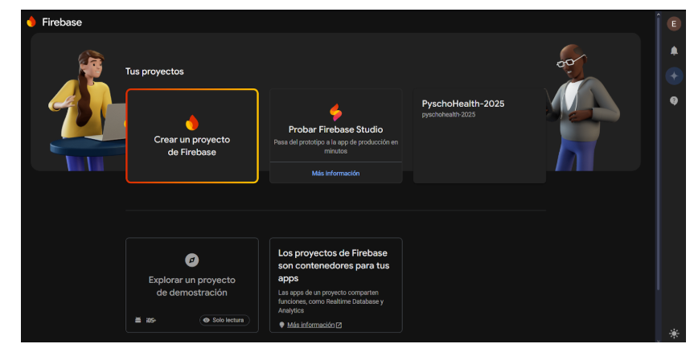

Creamos un nuevo proyecto de firebase

Ponemos un nombre para el proyecto

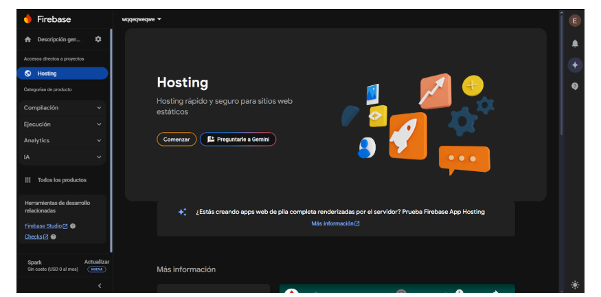

Vamos al apartado de hosting

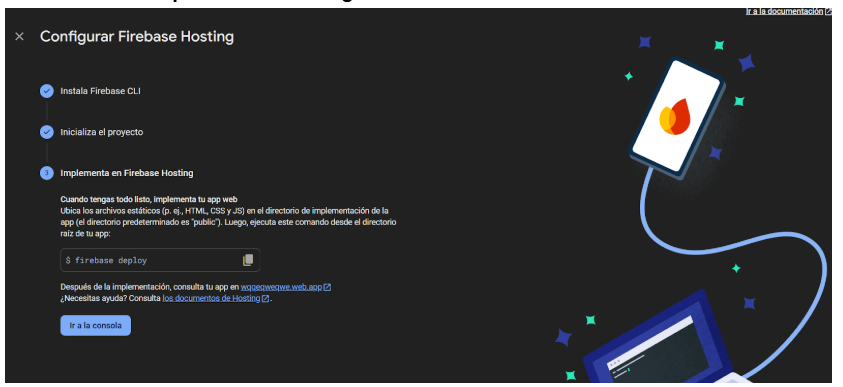

Se configura el firebase hosting en nuestro proyecto de intellij idea

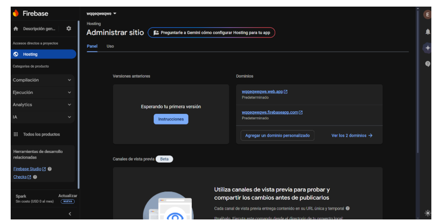

Con esto ya tendríamos nuestro hosting desplegado con los siguientes comandos

ng build
sudo npm install -g firebase-tools
firebase login
firebase init
firebase deploy

#### 5.2.2.8. Team Collaboration Insights during Sprint
En este apartado se presenta un resumen de la dinámica de trabajo colaborativo y la gestión de tareas realizada por el equipo durante el Sprint 2. Se incluyen evidencias visuales que muestran la participación activa de los integrantes, así como el registro de los commits y contribuciones en el repositorio. Estas evidencias reflejan el compromiso, la organización y la comunicación efectiva que caracterizaron el desarrollo de este sprint.

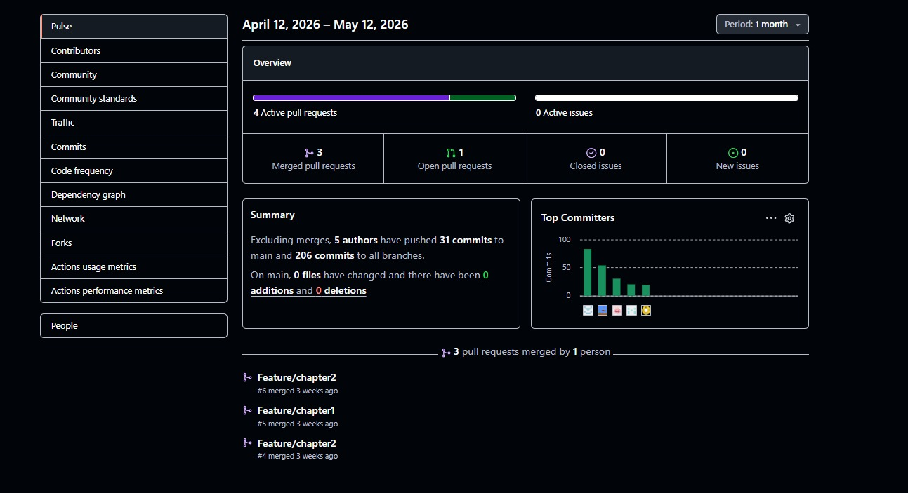

### 5.2.3. Sprint 3

#### 5.2.3.1. Sprint Planning 3

Para este tercer Sprint, el equipo estableció como objetivo principal la implementación y despliegue de la primera versión de los RESTful Web Services de BakeryManager con Spring Boot, bajo arquitectura Domain-Driven Design. Los cuatro Bounded Contexts del backend (Production, Monitoring, Inventory, Shared) fueron distribuidos entre los integrantes del equipo, reemplazando la Fake RESTful API utilizada en el Sprint anterior por un backend real con persistencia JPA, documentación OpenAPI/Swagger y un Dockerfile preparado para deployment. La reunión de planificación se realizó de manera virtual y se acordaron las Technical Stories a abordar, el Sprint Goal y las responsabilidades de cada integrante.

<table border="1" cellpadding="8" cellspacing="0" style="border-collapse: collapse; width: 100%;">
  <tbody>
    <tr><td colspan="2"><strong>Sprint 3</strong></td></tr>
    <tr><td colspan="2"><strong>Sprint Planning Background</strong></td></tr>
    <tr><td><strong>Date</strong></td><td>2026-06-02</td></tr>
    <tr><td><strong>Time</strong></td><td>05:00 PM</td></tr>
    <tr><td><strong>Location</strong></td><td>Reunión virtual vía Google Meet</td></tr>
    <tr><td><strong>Prepared By</strong></td><td>Molina Vásquez, Manuel Alejandro</td></tr>
    <tr><td><strong>Attendees (to planning meeting)</strong></td><td>Molina Vásquez, Manuel Alejandro / Díaz Yurivilca, Sofía / Céspedes Pillco, Jarod Jack / Vidal Malaga, Jareth Beycker / Acosta Elera, Abraam Bernabe</td></tr>
    <tr><td><strong>Sprint 2 Review Summary</strong></td><td>En el Sprint 2 se implementó la Frontend Web Application en Angular con arquitectura de componentes standalone, cubriendo los módulos de IAM, Production Monitoring, IoT Monitoring e Inventory. La aplicación consumió una Fake RESTful API servida con JSON-Server sobre localhost:3000, con navegación entre módulos y primeras vistas funcionales.</td></tr>
    <tr><td><strong>Sprint 2 Retrospective Summary</strong></td><td>El equipo identificó que la Fake API con JSON-Server no provee persistencia real ni validación de reglas de negocio del lado del servidor. Para el Sprint 3 se acordó implementar el Backend real con Spring Boot bajo arquitectura DDD, asignando un Bounded Context por integrante (Production, Monitoring, Inventory, Shared), incorporar persistencia JPA con MySQL, documentar los endpoints con OpenAPI/Swagger y preparar el Dockerfile para el deployment del servicio.</td></tr>
    <tr><td colspan="2"><strong>Sprint Goal &amp; User Stories</strong></td></tr>
    <tr><td><strong>Sprint 3 Goal</strong></td><td>Our focus is on implementing and deploying the first version of the BakeryManager RESTful Web Services with Spring Boot, replacing the Fake RESTful API with a real backend with DDD architecture, JPA persistence per bounded context and OpenAPI documentation. We believe it delivers a functional backend platform in which bakers and bakery managers can manage production batch lifecycles, branch and equipment inventory, IoT sensor registration, incident tracking and stock movements with real data persistence. This will be confirmed when all bounded contexts expose their REST endpoints at /api/v1, the API is documented in Swagger UI and the frontend consumes the real backend successfully.</td></tr>
    <tr><td><strong>Sprint 3 Velocity</strong></td><td>55</td></tr>
    <tr><td><strong>Sum of Story Points</strong></td><td>55</td></tr>
  </tbody>
</table>

---

#### 5.2.3.2. Aspect Leaders and Collaborators

<table border="1" cellpadding="8" cellspacing="0" style="border-collapse: collapse; width: 100%;">
  <thead>
    <tr>
      <th>Team Member</th>
      <th>GitHub Username</th>
      <th>Production BC</th>
      <th>Monitoring BC</th>
      <th>Inventory BC</th>
      <th>Shared</th>
    </tr>
  </thead>
  <tbody>
    <tr>
      <td>Díaz Yurivilca, Sofía</td>
      <td>u20241a195-cmd</td>
      <td align="center"><strong>L</strong></td>
      <td align="center">C</td>
      <td align="center">C</td>
      <td align="center">C</td>
    </tr>
    <tr>
      <td>Vidal Malaga, Jareth Beycker</td>
      <td>Jareth341</td>
      <td align="center"><strong>L</strong></td>
      <td align="center">C</td>
      <td align="center">C</td>
      <td align="center">C</td>
    </tr>
    <tr>
      <td>Céspedes Pillco, Jarod Jack</td>
      <td>JJ-UDEV</td>
      <td align="center">C</td>
      <td align="center"><strong>L</strong></td>
      <td align="center">C</td>
      <td align="center">C</td>
    </tr>
    <tr>
      <td>Molina Vásquez, Manuel Alejandro</td>
      <td>AleDusty</td>
      <td align="center">C</td>
      <td align="center">C</td>
      <td align="center"><strong>L</strong></td>
      <td align="center">C</td>
    </tr>
    <tr>
      <td>Acosta Elera, Abraam Bernabe</td>
      <td>AbraamAcostae</td>
      <td align="center">C</td>
      <td align="center">C</td>
      <td align="center">C</td>
      <td align="center"><strong>L</strong></td>
    </tr>
  </tbody>
</table>

*L = Leader · C = Collaborator*

---
#### 5.2.3.3. Sprint Backlog 3

El objetivo principal de este Sprint fue implementar los RESTful Web Services del backend de BakeryManager con Spring Boot bajo arquitectura DDD. El alcance abarcó cuatro Bounded Contexts: Production, Monitoring, Inventory y la capa Shared con configuración de Swagger/OpenAPI y deployment. Las Technical Stories se descompusieron en Engineering Tasks gestionadas en el tablero Kanban a través de las columnas **Goal, To Do, In Process, To Review y Done**.

**Board público del Sprint 3 (Trello):** https://trello.com/b/4nwSuz3O

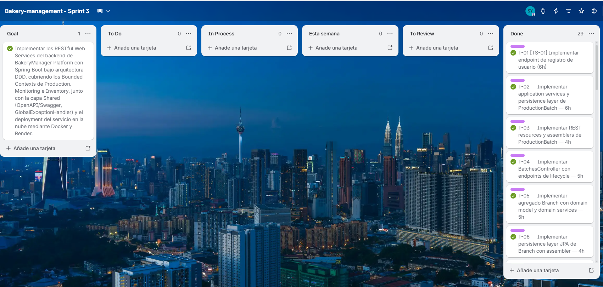

<table border="1" cellpadding="8" cellspacing="0" style="border-collapse: collapse; width: 100%;">
  <thead>
    <tr>
      <th colspan="8">Sprint # Sprint 3</th>
    </tr>
    <tr>
      <th colspan="2">Technical Story</th>
      <th colspan="6">Work-Item / Task</th>
    </tr>
    <tr>
      <th>Id</th>
      <th>Title</th>
      <th>Id</th>
      <th>Title</th>
      <th>Description</th>
      <th>Estimation (Hours)</th>
      <th>Assigned To</th>
      <th>Status</th>
    </tr>
  </thead>
  <tbody>
    <tr>
      <td rowspan="4">TS-01</td>
      <td rowspan="4">Implementar el ciclo de vida de lotes de producción en el Production BC</td>
      <td>T-01</td>
      <td>Implementar el agregado ProductionBatch con lifecycle y comandos</td>
      <td>Implementar el agregado raíz ProductionBatch con sus estados (PLANNED, IN_PROGRESS, COMPLETED, CANCELLED), los comandos como records, queries y eventos de dominio para el ciclo de vida del lote.</td>
      <td>6</td>
      <td>Díaz Yurivilca, Sofía</td>
      <td>Done</td>
    </tr>
    <tr>
      <td>T-02</td>
      <td>Implementar application services y persistence layer de ProductionBatch</td>
      <td>Implementar los command y query services de aplicación, la entidad JPA de persistencia, el repositorio y el assembler para el agregado ProductionBatch.</td>
      <td>6</td>
      <td>Díaz Yurivilca, Sofía</td>
      <td>Done</td>
    </tr>
    <tr>
      <td>T-03</td>
      <td>Implementar REST resources y transform assemblers de ProductionBatch</td>
      <td>Crear los records CreateProductionBatchResource, ProductionBatchResource y CompleteProductionBatchResource con sus assemblers de transformación entre comando, dominio y resource.</td>
      <td>4</td>
      <td>Díaz Yurivilca, Sofía</td>
      <td>Done</td>
    </tr>
    <tr>
      <td>T-04</td>
      <td>Implementar BatchesController con endpoints de lifecycle y documentación Swagger</td>
      <td>Exponer en /api/v1/batches los endpoints POST crear (201), GET /{id} detalle, PATCH /{id}/start iniciar, PATCH /{id}/complete completar con cantidad producida y PATCH /{id}/cancel cancelar. Anotar con @Tag, @Operation y @ApiResponses.</td>
      <td>5</td>
      <td>Díaz Yurivilca, Sofía</td>
      <td>Done</td>
    </tr>
    <tr>
      <td rowspan="4">TS-02</td>
      <td rowspan="4">Implementar la gestión de sedes (Branch) en el Production BC</td>
      <td>T-05</td>
      <td>Implementar el agregado Branch con domain model y domain services</td>
      <td>Implementar el agregado Branch con campos name, location e isActive, los enums de estado, el repositorio de dominio y los command/query services de aplicación para la gestión de sedes.</td>
      <td>5</td>
      <td>Vidal Malaga, Jareth Beycker</td>
      <td>Done</td>
    </tr>
    <tr>
      <td>T-06</td>
      <td>Implementar la persistence layer JPA de Branch con assembler</td>
      <td>Crear BranchPersistenceEntity con campos name, location e isActive, el repositorio JPA con método findActiveBranches, y el BranchPersistenceAssembler para la conversión entre dominio y persistencia.</td>
      <td>4</td>
      <td>Vidal Malaga, Jareth Beycker</td>
      <td>Done</td>
    </tr>
    <tr>
      <td>T-07</td>
      <td>Implementar BranchesController con endpoints CRUD y detalle</td>
      <td>Exponer POST /api/v1/branches crear, PUT /api/v1/branches/{id} actualizar, GET /api/v1/branches listar activas y GET /api/v1/branches/{id} detalle de sede, con resources, assemblers y anotaciones OpenAPI.</td>
      <td>5</td>
      <td>Vidal Malaga, Jareth Beycker</td>
      <td>Done</td>
    </tr>
    <tr>
      <td>T-08</td>
      <td>Implementar endpoints de consulta cruzada y reporte de producción por sede</td>
      <td>Exponer GET /api/v1/branches/{id}/equipment (BranchEquipmentController), GET /api/v1/branches/{id}/batches (BranchBatchesController) y GET /api/v1/branches/{id}/report (BranchReportController) para consultas y reporte agregado por sede.</td>
      <td>5</td>
      <td>Vidal Malaga, Jareth Beycker</td>
      <td>Done</td>
    </tr>
    <tr>
      <td rowspan="3">TS-03</td>
      <td rowspan="3">Implementar la gestión de equipos (Equipment) en el Production BC</td>
      <td>T-09</td>
      <td>Implementar el agregado Equipment con relación a Branch</td>
      <td>Implementar el agregado Equipment con campos name, serialNumber, status (OPERATIONAL, MAINTENANCE, FAULT, OFF) y branchId, la interfaz de repositorio de dominio y los command services para registro y actualización de estado.</td>
      <td>5</td>
      <td>Vidal Malaga, Jareth Beycker</td>
      <td>Done</td>
    </tr>
    <tr>
      <td>T-10</td>
      <td>Implementar la persistence layer JPA de Equipment con assembler</td>
      <td>Crear EquipmentPersistenceEntity con foreign key hacia Branch, el repositorio JPA con método findByBranchId, y el EquipmentPersistenceAssembler para la conversión entre dominio y persistencia.</td>
      <td>4</td>
      <td>Vidal Malaga, Jareth Beycker</td>
      <td>Done</td>
    </tr>
    <tr>
      <td>T-11</td>
      <td>Implementar EquipmentController con endpoints de registro y gestión de estado</td>
      <td>Exponer POST /api/v1/equipment registrar equipo (201), PATCH /api/v1/equipment/{id}/status actualizar estado y GET /api/v1/equipment/{id} detalle, con RegisterEquipmentResource, EquipmentResource, assemblers y anotaciones OpenAPI.</td>
      <td>5</td>
      <td>Vidal Malaga, Jareth Beycker</td>
      <td>Done</td>
    </tr>
    <tr>
      <td rowspan="4">TS-04</td>
      <td rowspan="4">Implementar los endpoints de consulta de incidentes en el Monitoring BC</td>
      <td>T-12</td>
      <td>Implementar el domain model de Incident con campos adicionales y constructores</td>
      <td>Implementar el modelo de dominio Incident con sus campos (tipo, severidad, estado, área), constructores y la interfaz del repositorio de dominio para el Bounded Context de Monitoring.</td>
      <td>4</td>
      <td>Céspedes Pillco, Jarod Jack</td>
      <td>Done</td>
    </tr>
    <tr>
      <td>T-13</td>
      <td>Implementar la persistence layer JPA de Incident</td>
      <td>Crear IncidentPersistenceEntity, el repositorio JPA, el IncidentPersistenceAssembler para la conversión entre dominio y persistencia e implementar el IncidentRepository con el adaptador JPA.</td>
      <td>4</td>
      <td>Céspedes Pillco, Jarod Jack</td>
      <td>Done</td>
    </tr>
    <tr>
      <td>T-14</td>
      <td>Implementar el IncidentQueryService y su implementación</td>
      <td>Definir la interfaz IncidentQueryService con los métodos para GetAllIncidentsQuery y GetIncidentByIdQuery e implementar IncidentQueryServiceImpl con la lógica de consulta sobre el repositorio.</td>
      <td>4</td>
      <td>Céspedes Pillco, Jarod Jack</td>
      <td>Done</td>
    </tr>
    <tr>
      <td>T-15</td>
      <td>Implementar IncidentsController con endpoints GET</td>
      <td>Exponer GET /api/v1/incidents listar todos los incidentes y GET /api/v1/incidents/{id} obtener incidente por ID, con IncidentResource, IncidentResourceAssembler y anotaciones OpenAPI.</td>
      <td>4</td>
      <td>Céspedes Pillco, Jarod Jack</td>
      <td>Done</td>
    </tr>
    <tr>
      <td rowspan="3">TS-05</td>
      <td rowspan="3">Implementar los endpoints CRUD de sensores IoT en el Monitoring BC</td>
      <td>T-16</td>
      <td>Implementar el domain model de Sensor con tipos y estados</td>
      <td>Implementar el agregado Sensor con tipos (TEMPERATURE, HUMIDITY, SMOKE, GAS) y estados (ACTIVE, INACTIVE, DISCONNECTED), el CreateSensorCommand y la interfaz SensorCommandService.</td>
      <td>4</td>
      <td>Céspedes Pillco, Jarod Jack</td>
      <td>Done</td>
    </tr>
    <tr>
      <td>T-17</td>
      <td>Implementar SensorCommandService y SensorRepository con eventos de dominio</td>
      <td>Implementar SensorCommandServiceImpl para manejar CreateSensorCommand, el método save en SensorRepository con publicación de eventos de dominio, y el CreateSensorCommandFromResourceAssembler.</td>
      <td>4</td>
      <td>Céspedes Pillco, Jarod Jack</td>
      <td>Done</td>
    </tr>
    <tr>
      <td>T-18</td>
      <td>Implementar SensorsController con endpoint de creación y documentación OpenAPI</td>
      <td>Exponer POST /api/v1/sensors crear sensor (201) con CreateSensorResource y su assembler, anotar el controlador con anotaciones springdoc-openapi.</td>
      <td>4</td>
      <td>Céspedes Pillco, Jarod Jack</td>
      <td>Done</td>
    </tr>
    <tr>
      <td rowspan="4">TS-06</td>
      <td rowspan="4">Implementar los endpoints de movimientos de stock en el Inventory BC</td>
      <td>T-19</td>
      <td>Implementar el domain model InventoryItem con validaciones y repositorio</td>
      <td>Implementar el agregado InventoryItem con el enum EUnitOfMeasure, setters con validación, la interfaz de repositorio de dominio, la entidad JPA y el adaptador de repositorio JPA.</td>
      <td>5</td>
      <td>Acosta Elera, Abraam Bernabe</td>
      <td>Done</td>
    </tr>
    <tr>
      <td>T-20</td>
      <td>Implementar la capa de application e interfaces REST para InventoryItem</td>
      <td>Implementar la capa de aplicación para InventoryItem, el recurso REST de creación y el InventoryItemsController con endpoints de creación, listado y actualización con documentación Swagger.</td>
      <td>5</td>
      <td>Acosta Elera, Abraam Bernabe</td>
      <td>Done</td>
    </tr>
    <tr>
      <td>T-21</td>
      <td>Implementar el domain model StockMovement con lógica de actualización de cantidad</td>
      <td>Implementar el agregado StockMovement con tipos (ENTRY, EXIT, ADJUSTMENT) y la lógica de actualización de cantidad sobre InventoryItem al registrar el movimiento de stock.</td>
      <td>4</td>
      <td>Acosta Elera, Abraam Bernabe</td>
      <td>Done</td>
    </tr>
    <tr>
      <td>T-22</td>
      <td>Implementar los endpoints REST de entrada, salida y ajuste de stock</td>
      <td>Exponer los endpoints POST de entrada (entry), salida (exit) y ajuste (adjustment) de stock en /api/v1/inventory/movements con resource, assembler y documentación OpenAPI.</td>
      <td>4</td>
      <td>Acosta Elera, Abraam Bernabe</td>
      <td>Done</td>
    </tr>
    <tr>
      <td rowspan="4">TS-07</td>
      <td rowspan="4">Implementar los endpoints de consulta y reporte de inventario en el Inventory BC</td>
      <td>T-23</td>
      <td>Implementar detección de stock bajo y StockQueryController para stock actual</td>
      <td>Implementar los métodos fetchAllItems y detectLowStock en el repositorio JPA, la interfaz StockQueryService, StockQueryServiceImpl, CurrentStockResource, CurrentStockResourceAssembler y el endpoint GET /api/v1/inventory/current.</td>
      <td>5</td>
      <td>Molina Vásquez, Manuel Alejandro</td>
      <td>Done</td>
    </tr>
    <tr>
      <td>T-24</td>
      <td>Implementar historial de movimientos con StockHistoryQueryService</td>
      <td>Implementar la interfaz StockHistoryQueryService, StockHistoryQueryServiceImpl, StockMovementResource, StockMovementResourceAssembler y el endpoint GET /api/v1/inventory/movements/history en StockQueryController.</td>
      <td>5</td>
      <td>Molina Vásquez, Manuel Alejandro</td>
      <td>Done</td>
    </tr>
    <tr>
      <td>T-25</td>
      <td>Implementar el reporte de inventario con InventoryReport domain aggregate</td>
      <td>Implementar el agregado InventoryReport con validación y resumen, la interfaz InventoryQueryService, InventoryQueryServiceImpl con generación de reporte, InventoryReportResource, InventoryReportResourceAssembler e InventoryReportController con GET /api/v1/inventory/report.</td>
      <td>6</td>
      <td>Molina Vásquez, Manuel Alejandro</td>
      <td>Done</td>
    </tr>
    <tr>
      <td>T-26</td>
      <td>Implementar StockItemsController para StockItem domain aggregate</td>
      <td>Implementar el agregado StockItem, la interfaz de repositorio, el command service, la entidad JPA y el StockItemsController con endpoints de creación y listado de ítems de stock.</td>
      <td>4</td>
      <td>Molina Vásquez, Manuel Alejandro</td>
      <td>Done</td>
    </tr>
    <tr>
      <td rowspan="3">TS-08</td>
      <td rowspan="3">Configurar la capa Shared y preparar el deployment del backend</td>
      <td>T-27</td>
      <td>Completar la configuración OpenAPI con Swagger y seguridad JWT</td>
      <td>Completar la OpenApiConfiguration con la descripción de la API, el esquema de seguridad JWT Bearer Authentication, configuración de locale y physical naming strategy para exponer la documentación en Swagger UI.</td>
      <td>5</td>
      <td>Molina Vásquez, Manuel Alejandro</td>
      <td>Done</td>
    </tr>
    <tr>
      <td>T-28</td>
      <td>Implementar el GlobalExceptionHandler en la capa Shared</td>
      <td>Implementar el GlobalExceptionHandler con @RestControllerAdvice que retorna respuestas JSON consistentes con ErrorResource para excepciones de negocio y rutas no mapeadas del API.</td>
      <td>4</td>
      <td>Acosta Elera, Abraam Bernabe</td>
      <td>Done</td>
    </tr>
    <tr>
      <td>T-29</td>
      <td>Preparar el Dockerfile y configuración de deployment</td>
      <td>Configurar el Dockerfile del proyecto Spring Boot, preparar las variables de entorno para la conexión a MySQL en producción y validar el build de la imagen Docker.</td>
      <td>5</td>
      <td>Acosta Elera, Abraam Bernabe</td>
      <td>Done</td>
    </tr>
  </tbody>
</table>

---
#### 5.2.3.4. Development Evidence for Sprint Review

Durante el Sprint 3 el equipo implementó los RESTful Web Services del backend de BakeryManager con Spring Boot y arquitectura DDD. Los commits se realizaron sobre ramas `feature/` individuales por Bounded Context y se consolidaron en `develop` mediante merges.

**Repositorio:** https://github.com/1ASI0730-2610-20262-TBL-BrainNova/bakery-manager-platform

<table border="1" cellpadding="8" cellspacing="0" style="border-collapse: collapse; width: 100%;">
  <thead>
    <tr>
      <th>Repository</th>
      <th>Branch</th>
      <th>Commit Id</th>
      <th>Commit Message</th>
      <th>Committed By</th>
      <th>Committed On</th>
    </tr>
  </thead>
  <tbody>
    <tr>
      <td>bakery-manager-platform</td>
      <td>develop</td>
      <td>1588e41</td>
      <td>feat: add global exception handling</td>
      <td>AbraamAcostae</td>
      <td>May 27, 2026</td>
    </tr>
    <tr>
      <td>bakery-manager-platform</td>
      <td>feature/shared</td>
      <td>442a17e</td>
      <td>feat(shared): complete openapiconfiguration with swagger documentation specs and jwt security configuration</td>
      <td>AleDusty</td>
      <td>Jun 2, 2026</td>
    </tr>
    <tr>
      <td>bakery-manager-platform</td>
      <td>develop</td>
      <td>fe29a98</td>
      <td>feat(production): add Branch aggregate root for production domain model</td>
      <td>Jareth341</td>
      <td>Jun 3, 2026</td>
    </tr>
    <tr>
      <td>bakery-manager-platform</td>
      <td>develop</td>
      <td>490a223</td>
      <td>feat(production): add equipment status enum for equipment state management</td>
      <td>Jareth341</td>
      <td>Jun 3, 2026</td>
    </tr>
    <tr>
      <td>bakery-manager-platform</td>
      <td>develop</td>
      <td>f90a3a1</td>
      <td>feat(monitoring): add sensor status enum class</td>
      <td>JJ-UDEV</td>
      <td>Jun 3, 2026</td>
    </tr>
    <tr>
      <td>bakery-manager-platform</td>
      <td>develop</td>
      <td>e3f1bb4</td>
      <td>feat(monitoring): add sensor type enum class</td>
      <td>JJ-UDEV</td>
      <td>Jun 3, 2026</td>
    </tr>
    <tr>
      <td>bakery-manager-platform</td>
      <td>develop</td>
      <td>a1e6290</td>
      <td>feat(inventory): add inventoryitem domain aggregate with validation</td>
      <td>AleDusty</td>
      <td>Jun 3, 2026</td>
    </tr>
    <tr>
      <td>bakery-manager-platform</td>
      <td>develop</td>
      <td>4159e18</td>
      <td>feat(inventory): add jpa persistence entity for inventory items</td>
      <td>AleDusty</td>
      <td>Jun 3, 2026</td>
    </tr>
    <tr>
      <td>bakery-manager-platform</td>
      <td>develop</td>
      <td>3aec2e2</td>
      <td>feat(inventory): implement inventoryitemrepositoryadapter</td>
      <td>AleDusty</td>
      <td>Jun 3, 2026</td>
    </tr>
    <tr>
      <td>bakery-manager-platform</td>
      <td>feature/inventory</td>
      <td>211a6a4</td>
      <td>feat(inventory): add inventory item endpoints and Swagger docs</td>
      <td>AbraamAcostae</td>
      <td>Jun 8, 2026</td>
    </tr>
    <tr>
      <td>bakery-manager-platform</td>
      <td>feature/create-production-batch</td>
      <td>40e2f4d</td>
      <td>feat(production): implement domain commands as records.</td>
      <td>u20241a195-cmd</td>
      <td>Jun 10, 2026</td>
    </tr>
    <tr>
      <td>bakery-manager-platform</td>
      <td>feature/create-production-batch</td>
      <td>516c4a9</td>
      <td>feat(production): implement domain events for batch lifecycle.</td>
      <td>u20241a195-cmd</td>
      <td>Jun 10, 2026</td>
    </tr>
    <tr>
      <td>bakery-manager-platform</td>
      <td>feature/create-production-batch</td>
      <td>fbbf796</td>
      <td>feat(production): define production batch repository domain interface.</td>
      <td>u20241a195-cmd</td>
      <td>Jun 10, 2026</td>
    </tr>
    <tr>
      <td>bakery-manager-platform</td>
      <td>feature/create-production-batch</td>
      <td>e394002</td>
      <td>feat(production): implement application command and query services</td>
      <td>u20241a195-cmd</td>
      <td>Jun 10, 2026</td>
    </tr>
    <tr>
      <td>bakery-manager-platform</td>
      <td>feature/create-production-batch</td>
      <td>14f894e</td>
      <td>feat(production): implement infrastructure persistence layer.</td>
      <td>u20241a195-cmd</td>
      <td>Jun 10, 2026</td>
    </tr>
    <tr>
      <td>bakery-manager-platform</td>
      <td>feature/create-production-batch</td>
      <td>c2e0dc0</td>
      <td>feat(production): add rest resource records for request and response dtos.</td>
      <td>u20241a195-cmd</td>
      <td>Jun 10, 2026</td>
    </tr>
    <tr>
      <td>bakery-manager-platform</td>
      <td>feature/create-production-batch</td>
      <td>d9e1b2d</td>
      <td>feat(production): add rest transform assemblers for command and response mapping.</td>
      <td>u20241a195-cmd</td>
      <td>Jun 10, 2026</td>
    </tr>
    <tr>
      <td>bakery-manager-platform</td>
      <td>feature/create-production-batch</td>
      <td>2fff5ee</td>
      <td>feat(production): implement rest controllers for production batch endpoints.</td>
      <td>u20241a195-cmd</td>
      <td>Jun 10, 2026</td>
    </tr>
    <tr>
      <td>bakery-manager-platform</td>
      <td>feature/create-production-batch</td>
      <td>4f0da75</td>
      <td>docs(production): add Swagger @Tag, @Operation and @ApiResponses to batch controllers</td>
      <td>u20241a195-cmd</td>
      <td>Jun 10, 2026</td>
    </tr>
    <tr>
      <td>bakery-manager-platform</td>
      <td>feature/list-branches</td>
      <td>7ecaf06</td>
      <td>feat(branch): add method to find active branches</td>
      <td>Jareth341</td>
      <td>Jun 15, 2026</td>
    </tr>
    <tr>
      <td>bakery-manager-platform</td>
      <td>feature/branch-equipment</td>
      <td>c22cce2</td>
      <td>feat(branch): add equipment relationship to branch entity</td>
      <td>Jareth341</td>
      <td>Jun 15, 2026</td>
    </tr>
    <tr>
      <td>bakery-manager-platform</td>
      <td>feature/branch-equipment</td>
      <td>11df8d2</td>
      <td>feat(equipment): implement equipment repository with branch-based retrieval methods</td>
      <td>Jareth341</td>
      <td>Jun 15, 2026</td>
    </tr>
    <tr>
      <td>bakery-manager-platform</td>
      <td>feature/create-sensor</td>
      <td>552a817</td>
      <td>feat(create-sensor): add sensor-command-service interface for handling sensor creation commands.</td>
      <td>JJ-UDEV</td>
      <td>Jun 15, 2026</td>
    </tr>
    <tr>
      <td>bakery-manager-platform</td>
      <td>feature/create-sensor</td>
      <td>35b03a6</td>
      <td>feat(create-sensor): implement sensor-command-service for handling sensor creation.</td>
      <td>JJ-UDEV</td>
      <td>Jun 15, 2026</td>
    </tr>
    <tr>
      <td>bakery-manager-platform</td>
      <td>feature/create-sensor</td>
      <td>875f60c</td>
      <td>feat(create-sensor): add create-sensor endpoint to sensors-controller for sensor creation.</td>
      <td>JJ-UDEV</td>
      <td>Jun 15, 2026</td>
    </tr>
    <tr>
      <td>bakery-manager-platform</td>
      <td>feature/stock-entries</td>
      <td>571d7ed</td>
      <td>feat(inventory): add create stock item request resource</td>
      <td>AbraamAcostae</td>
      <td>Jun 15, 2026</td>
    </tr>
    <tr>
      <td>bakery-manager-platform</td>
      <td>feature/stock-entries</td>
      <td>cb8c031</td>
      <td>feat(inventory): add stock entry controller endpoint</td>
      <td>AbraamAcostae</td>
      <td>Jun 15, 2026</td>
    </tr>
    <tr>
      <td>bakery-manager-platform</td>
      <td>feature/production-report</td>
      <td>a1610f2</td>
      <td>feat(branch): implement branch-persistence-assembler for mapping between domain and persistence entities</td>
      <td>Jareth341</td>
      <td>Jun 16, 2026</td>
    </tr>
    <tr>
      <td>bakery-manager-platform</td>
      <td>feature/production-report</td>
      <td>ed37353</td>
      <td>feat(equipment): implement equipment-persistence-assembler for domain and persistence mapping</td>
      <td>Jareth341</td>
      <td>Jun 16, 2026</td>
    </tr>
    <tr>
      <td>bakery-manager-platform</td>
      <td>feature/production-report</td>
      <td>6d3342a</td>
      <td>feat(branch): implement branch report endpoint to aggregate production batch data</td>
      <td>Jareth341</td>
      <td>Jun 16, 2026</td>
    </tr>
    <tr>
      <td>bakery-manager-platform</td>
      <td>feature/create-branch</td>
      <td>4142a52</td>
      <td>feat(branch): update API endpoints to include versioning and add operation descriptions</td>
      <td>Jareth341</td>
      <td>Jun 17, 2026</td>
    </tr>
    <tr>
      <td>bakery-manager-platform</td>
      <td>feature/update-equipment</td>
      <td>87b8744</td>
      <td>fix(equipment): update API endpoints to include versioning and add operation descriptions</td>
      <td>Jareth341</td>
      <td>Jun 17, 2026</td>
    </tr>
    <tr>
      <td>bakery-manager-platform</td>
      <td>feature/get-all-incidents</td>
      <td>35742ae</td>
      <td>feat(get-all-incidents): enhance incident model with additional fields and constructors</td>
      <td>JJ-UDEV</td>
      <td>Jun 17, 2026</td>
    </tr>
    <tr>
      <td>bakery-manager-platform</td>
      <td>feature/get-all-incidents</td>
      <td>be54654</td>
      <td>feat(get-all-incidents): add incident-query-service interface for handling query</td>
      <td>JJ-UDEV</td>
      <td>Jun 17, 2026</td>
    </tr>
    <tr>
      <td>bakery-manager-platform</td>
      <td>feature/get-all-incidents</td>
      <td>b8d6d62</td>
      <td>feat(get-all-incidents): implement incident-query-service-impl for handling query</td>
      <td>JJ-UDEV</td>
      <td>Jun 17, 2026</td>
    </tr>
    <tr>
      <td>bakery-manager-platform</td>
      <td>feature/get-all-incidents</td>
      <td>ea79004</td>
      <td>feat(get-all-incidents): add incident-persistence-entity for incident data storage</td>
      <td>JJ-UDEV</td>
      <td>Jun 17, 2026</td>
    </tr>
    <tr>
      <td>bakery-manager-platform</td>
      <td>feature/get-all-incidents</td>
      <td>74784dd</td>
      <td>feat(get-all-incidents): implement incidents-controller for retrieving all incidents</td>
      <td>JJ-UDEV</td>
      <td>Jun 17, 2026</td>
    </tr>
    <tr>
      <td>bakery-manager-platform</td>
      <td>feature/get-incident-by-id</td>
      <td>5892f6d</td>
      <td>feat(get-incident-by-id): add endpoint to retrieve incident by id</td>
      <td>JJ-UDEV</td>
      <td>Jun 17, 2026</td>
    </tr>
    <tr>
      <td>bakery-manager-platform</td>
      <td>feature/stock-movement</td>
      <td>54d2856</td>
      <td>feat(inventory): add stock movement domain model and quantity update logic</td>
      <td>AbraamAcostae</td>
      <td>Jun 17, 2026</td>
    </tr>
    <tr>
      <td>bakery-manager-platform</td>
      <td>feature/stock-movement</td>
      <td>e99e82e</td>
      <td>feat(inventory): add stock entry/exit/adjustment REST endpoints</td>
      <td>AbraamAcostae</td>
      <td>Jun 17, 2026</td>
    </tr>
    <tr>
      <td>bakery-manager-platform</td>
      <td>feature/deployment_preparation</td>
      <td>d64a094</td>
      <td>preparation for new deployment</td>
      <td>AbraamAcostae</td>
      <td>Jun 17, 2026</td>
    </tr>
    <tr>
      <td>bakery-manager-platform</td>
      <td>feature/low-stock</td>
      <td>cdd5d0d</td>
      <td>feat(inventory): add methods to fetch all items and detect low-stock items</td>
      <td>AleDusty</td>
      <td>Jun 17, 2026</td>
    </tr>
    <tr>
      <td>bakery-manager-platform</td>
      <td>feature/current</td>
      <td>1317e64</td>
      <td>feat(inventory): add currentStockresource for representing current stock details</td>
      <td>AleDusty</td>
      <td>Jun 17, 2026</td>
    </tr>
    <tr>
      <td>bakery-manager-platform</td>
      <td>feature/current</td>
      <td>06cab24</td>
      <td>feat(inventory): add stockquerycontroller for handling stock-level queries</td>
      <td>AleDusty</td>
      <td>Jun 17, 2026</td>
    </tr>
    <tr>
      <td>bakery-manager-platform</td>
      <td>feature/history</td>
      <td>9d0b93b</td>
      <td>feat(inventory): add stockhistoryqueryservice interface for retrieving inventory movement history</td>
      <td>AleDusty</td>
      <td>Jun 17, 2026</td>
    </tr>
    <tr>
      <td>bakery-manager-platform</td>
      <td>feature/history</td>
      <td>bf290b1</td>
      <td>feat(inventory): implement stockhistoryqueryserviceimpl for retrieving inventory movement history</td>
      <td>AleDusty</td>
      <td>Jun 17, 2026</td>
    </tr>
    <tr>
      <td>bakery-manager-platform</td>
      <td>feature/history</td>
      <td>76f9b3f</td>
      <td>feat(inventory): add endpoint to retrieve stock movement history</td>
      <td>AleDusty</td>
      <td>Jun 17, 2026</td>
    </tr>
    <tr>
      <td>bakery-manager-platform</td>
      <td>feature/report</td>
      <td>6893fdc</td>
      <td>feat(inventory): add inventoryreport domain aggregate with validation and summary functionality</td>
      <td>AleDusty</td>
      <td>Jun 17, 2026</td>
    </tr>
    <tr>
      <td>bakery-manager-platform</td>
      <td>feature/report</td>
      <td>af4b6e6</td>
      <td>feat(inventory): implement inventoryqueryServiceimpl with report generation functionality</td>
      <td>AleDusty</td>
      <td>Jun 17, 2026</td>
    </tr>
    <tr>
      <td>bakery-manager-platform</td>
      <td>feature/report</td>
      <td>ce3b4e2</td>
      <td>feat(inventory): add inventoryreportresource for inventory report representation</td>
      <td>AleDusty</td>
      <td>Jun 17, 2026</td>
    </tr>
  </tbody>
</table>

#### 5.2.3.5. Execution Evidence for Sprint Review

Durante el Sprint 3 se implementó y ejecutó el backend de BakeryManager con Spring Boot. Los endpoints REST quedan organizados por Bounded Context:

**Production BC** — Agregados: ProductionBatch, Branch, Equipment

*ProductionBatch:*
- `POST /api/v1/batches` — Crear nuevo lote de producción (201 Created)
- `GET /api/v1/batches/{id}` — Obtener lote por ID (200 OK)
- `PATCH /api/v1/batches/{id}/start` — Iniciar lote (200 OK)
- `PATCH /api/v1/batches/{id}/complete` — Completar lote con cantidad producida (200 OK)
- `PATCH /api/v1/batches/{id}/cancel` — Cancelar lote (200 OK)

*Branch:*
- `POST /api/v1/branches` — Crear sede (201 Created)
- `PUT /api/v1/branches/{id}` — Actualizar sede (200 OK)
- `GET /api/v1/branches` — Listar sedes activas (200 OK)
- `GET /api/v1/branches/{id}` — Detalle de sede (200 OK)
- `GET /api/v1/branches/{id}/batches` — Lotes de producción de la sede (200 OK)
- `GET /api/v1/branches/{id}/equipment` — Equipos de la sede (200 OK)
- `GET /api/v1/branches/{id}/report` — Reporte de producción de la sede (200 OK)

*Equipment:*
- `POST /api/v1/equipment` — Registrar equipo (201 Created)
- `PATCH /api/v1/equipment/{id}/status` — Actualizar estado del equipo (200 OK)
- `GET /api/v1/equipment/{id}` — Detalle de equipo (200 OK)

**Monitoring BC** — Agregados: Incident, Sensor, Alert

*Incidents:*
- `GET /api/v1/incidents` — Listar todos los incidentes (200 OK)
- `GET /api/v1/incidents/{id}` — Obtener incidente por ID (200 OK)

*Sensors:*
- `POST /api/v1/sensors` — Registrar sensor IoT (201 Created)

**Inventory BC** — Agregados: InventoryItem, StockItem, StockMovement, InventoryReport

*Inventory Items:*
- `POST /api/v1/inventory/items` — Crear ítem de inventario (201 Created)
- `GET /api/v1/inventory/items` — Listar ítems de inventario (200 OK)
- `PUT /api/v1/inventory/items/{id}` — Actualizar ítem de inventario (200 OK)

*Stock:*
- `POST /api/v1/inventory/movements` — Registrar movimiento de stock (entry/exit/adjustment) (201 Created)
- `GET /api/v1/inventory/current` — Consultar stock actual (200 OK)
- `GET /api/v1/inventory/movements/history` — Historial de movimientos de stock (200 OK)
- `GET /api/v1/inventory/report` — Reporte de inventario con detección de stock bajo (200 OK)

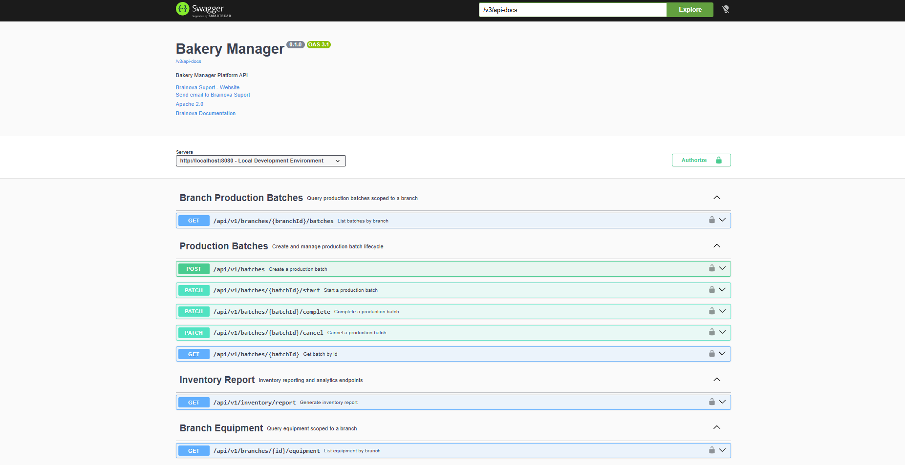

---

#### 5.2.3.6. Services Documentation Evidence for Sprint Review

El backend de BakeryManager documenta automáticamente sus endpoints mediante **springdoc-openapi** con anotaciones `@Tag`, `@Operation`, `@ApiResponses` y `@ApiResponse`. La configuración OpenAPI incluye el esquema de seguridad JWT Bearer Authentication y se expone a través de Swagger UI.

- **Swagger UI:** `http://localhost:8080/swagger-ui/index.html`
- **OpenAPI JSON:** `http://localhost:8080/v3/api-docs`

<table border="1" cellpadding="8" cellspacing="0" style="border-collapse: collapse; width: 100%;">
  <thead>
    <tr>
      <th>Bounded Context</th>
      <th>Method</th>
      <th>Endpoint</th>
      <th>Description</th>
      <th>Response Codes</th>
    </tr>
  </thead>
  <tbody>
    <tr><td>Production BC</td><td>POST</td><td>/api/v1/batches</td><td>Create a new production batch</td><td>201, 400</td></tr>
    <tr><td>Production BC</td><td>GET</td><td>/api/v1/batches/{id}</td><td>Get production batch by id</td><td>200, 404</td></tr>
    <tr><td>Production BC</td><td>PATCH</td><td>/api/v1/batches/{id}/start</td><td>Start a planned production batch</td><td>200, 404</td></tr>
    <tr><td>Production BC</td><td>PATCH</td><td>/api/v1/batches/{id}/complete</td><td>Complete a batch with produced quantity</td><td>200, 404</td></tr>
    <tr><td>Production BC</td><td>PATCH</td><td>/api/v1/batches/{id}/cancel</td><td>Cancel a production batch</td><td>200, 404</td></tr>
    <tr><td>Production BC</td><td>POST</td><td>/api/v1/branches</td><td>Create a new branch</td><td>201, 400</td></tr>
    <tr><td>Production BC</td><td>PUT</td><td>/api/v1/branches/{id}</td><td>Update branch information</td><td>200, 404</td></tr>
    <tr><td>Production BC</td><td>GET</td><td>/api/v1/branches</td><td>Get all active branches</td><td>200</td></tr>
    <tr><td>Production BC</td><td>GET</td><td>/api/v1/branches/{id}</td><td>Get branch detail</td><td>200, 404</td></tr>
    <tr><td>Production BC</td><td>GET</td><td>/api/v1/branches/{id}/batches</td><td>Get production batches for a branch</td><td>200, 404</td></tr>
    <tr><td>Production BC</td><td>GET</td><td>/api/v1/branches/{id}/equipment</td><td>Get equipment for a branch</td><td>200, 404</td></tr>
    <tr><td>Production BC</td><td>GET</td><td>/api/v1/branches/{id}/report</td><td>Get production report for a branch</td><td>200, 404</td></tr>
    <tr><td>Production BC</td><td>POST</td><td>/api/v1/equipment</td><td>Register new equipment</td><td>201, 400</td></tr>
    <tr><td>Production BC</td><td>PATCH</td><td>/api/v1/equipment/{id}/status</td><td>Update equipment operational status</td><td>200, 404</td></tr>
    <tr><td>Production BC</td><td>GET</td><td>/api/v1/equipment/{id}</td><td>Get equipment detail</td><td>200, 404</td></tr>
    <tr><td>Monitoring BC</td><td>GET</td><td>/api/v1/incidents</td><td>Get all incidents</td><td>200</td></tr>
    <tr><td>Monitoring BC</td><td>GET</td><td>/api/v1/incidents/{id}</td><td>Get incident by id</td><td>200, 404</td></tr>
    <tr><td>Monitoring BC</td><td>POST</td><td>/api/v1/sensors</td><td>Register new IoT sensor</td><td>201, 400</td></tr>
    <tr><td>Inventory BC</td><td>POST</td><td>/api/v1/inventory/items</td><td>Create inventory item</td><td>201, 400</td></tr>
    <tr><td>Inventory BC</td><td>GET</td><td>/api/v1/inventory/items</td><td>List all inventory items</td><td>200</td></tr>
    <tr><td>Inventory BC</td><td>PUT</td><td>/api/v1/inventory/items/{id}</td><td>Update inventory item</td><td>200, 404</td></tr>
    <tr><td>Inventory BC</td><td>POST</td><td>/api/v1/inventory/movements</td><td>Register stock movement (entry/exit/adjustment)</td><td>201, 400</td></tr>
    <tr><td>Inventory BC</td><td>GET</td><td>/api/v1/inventory/current</td><td>Get current stock levels</td><td>200</td></tr>
    <tr><td>Inventory BC</td><td>GET</td><td>/api/v1/inventory/movements/history</td><td>Get stock movement history</td><td>200</td></tr>
    <tr><td>Inventory BC</td><td>GET</td><td>/api/v1/inventory/report</td><td>Get inventory report with low-stock detection</td><td>200</td></tr>
  </tbody>
</table>

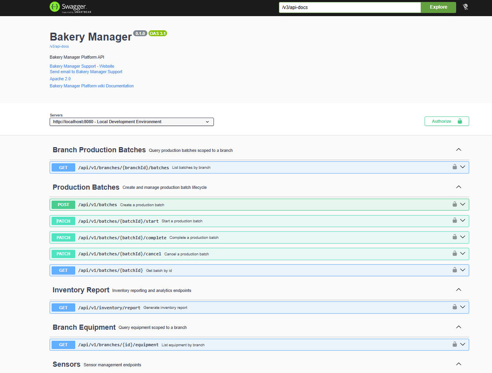
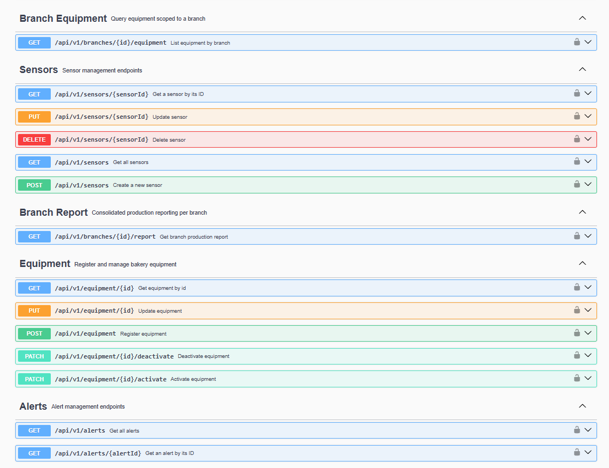
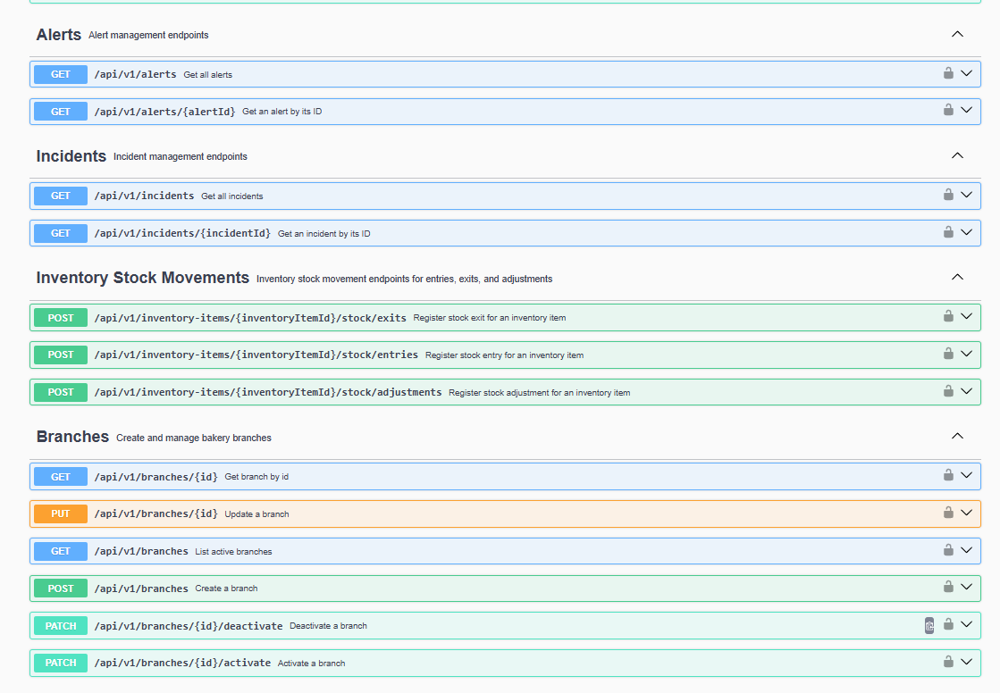
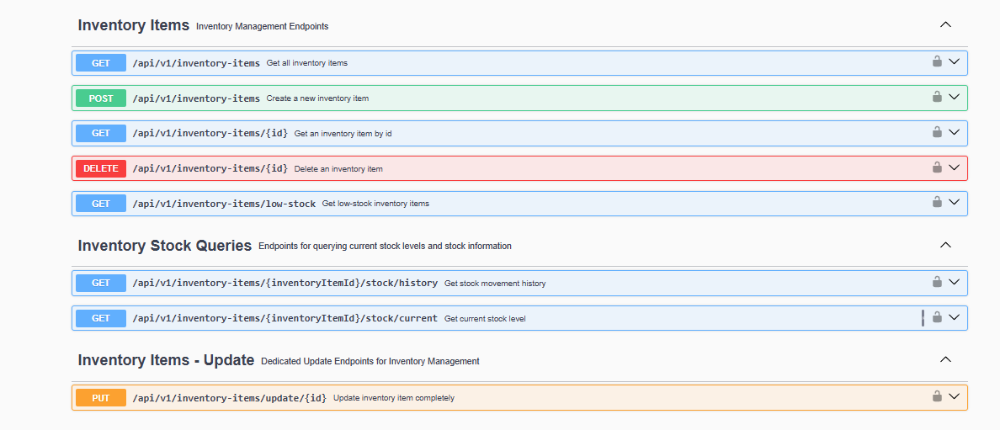

---
#### 5.2.3.7. Software Deployment Evidence for Sprint Review

Durante el Sprint 3 se realizó el deployment del backend de BakeryManager Platform 
en la nube. A continuación se presenta la evidencia del proceso de despliegue.

**Repositorio Backend:** https://github.com/1ASI0730-2610-20262-TBL-BrainNova/bakery-manager-platform  
**URL del backend desplegado:** https://bakery-manager-platform-pkoa.onrender.com

**Configuración del Dockerfile**

Se configuró un Dockerfile multi-stage para construir y ejecutar la aplicación 
Spring Boot. La primera etapa usa `maven:3.9.16-eclipse-temurin-26` para compilar 
el proyecto y la segunda usa `eclipse-temurin:26-jre` como runtime, activando el 
perfil `prod` mediante `SPRING_PROFILES_ACTIVE`.

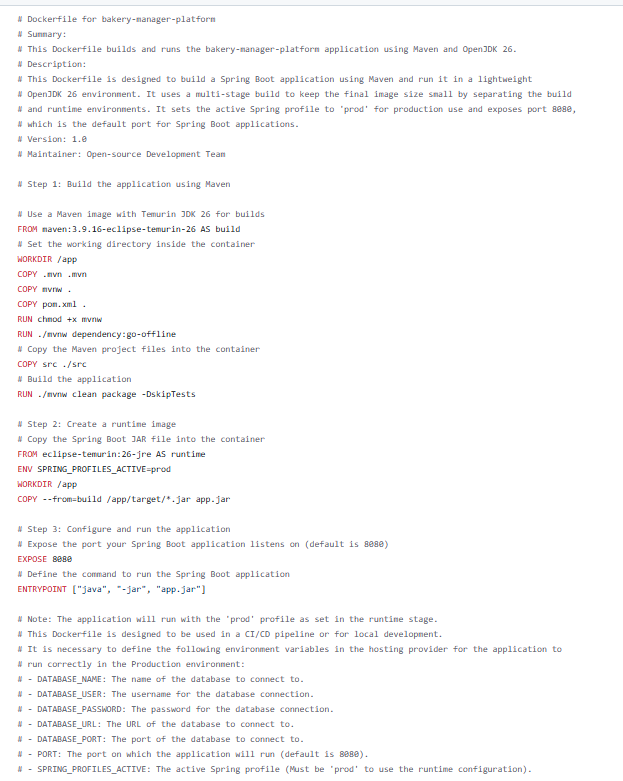

**Despliegue en Render**

El servicio fue desplegado en Render como Web Service con runtime Docker, conectado 
al repositorio GitHub de la organización. Las variables de entorno para la conexión 
a MySQL (Clever Cloud) fueron configuradas en el panel de Render.

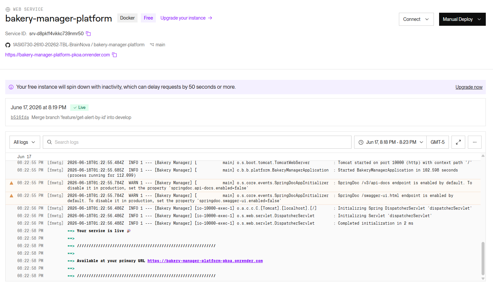

**Logs de inicio en producción**

Los logs confirman que la aplicación inició correctamente: Spring Boot 4.0.6, 
perfil `prod` activo, conexión exitosa a MySQL mediante HikariCP y Tomcat 
escuchando en el puerto asignado.

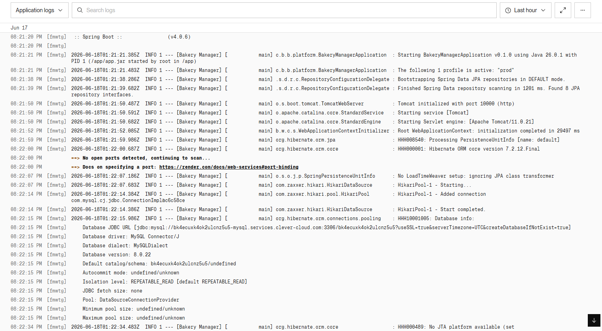

---

#### 5.2.3.8. Team Collaboration Insights during Sprint

Durante el Sprint 3 el equipo trabajó bajo la estrategia **GitFlow** con ramas `feature/` individuales por Bounded Context, consolidando en `develop` mediante merges. Las revisiones de integración se coordinaron por Google Meet y se respetó la separación por paquetes DDD (`production`, `monitoring`, `inventory`, `shared`).

<table border="1" cellpadding="8" cellspacing="0" style="border-collapse: collapse; width: 100%;">
  <thead>
    <tr>
      <th>Team Member</th>
      <th>GitHub Username</th>
      <th>Bounded Context</th>
      <th>Contributions</th>
    </tr>
  </thead>
  <tbody>
    <tr>
      <td>Díaz Yurivilca, Sofía</td>
      <td>u20241a195-cmd</td>
      <td>Production BC</td>
      <td>Implementación completa del ciclo de vida de lotes de producción en el Production BC: agregado ProductionBatch con estados PLANNED, IN_PROGRESS, COMPLETED y CANCELLED; domain commands, queries y events como records; command y query services de aplicación; persistence layer JPA; REST resources (CreateProductionBatchResource, ProductionBatchResource, CompleteProductionBatchResource); transform assemblers; BatchesController con endpoints POST crear, GET detalle, PATCH start/complete/cancel; y anotaciones Swagger con @Tag, @Operation y @ApiResponses. Scaffolding inicial del Production BC (branch, equipment, batch) con persistence layer y controllers base.</td>
    </tr>
    <tr>
      <td>Vidal Malaga, Jareth Beycker</td>
      <td>Jareth341</td>
      <td>Production BC</td>
      <td>Implementación de los agregados Branch y Equipment dentro del Production BC. Branch: domain model, method findActiveBranches, relación branch-equipment, BranchPersistenceEntity, BranchPersistenceAssembler, BranchesController (POST, PUT, GET lista, GET detalle), BranchEquipmentController (GET /branches/{id}/equipment), BranchBatchesController (GET /branches/{id}/batches) y BranchReportController (GET /branches/{id}/report con reporte agregado de producción por sede). Equipment: EquipmentPersistenceEntity con FK hacia Branch, EquipmentPersistenceAssembler, EquipmentController (POST registrar, PATCH actualizar estado, GET detalle). Versionado de API (/api/v1) y anotaciones OpenAPI en todos los endpoints.</td>
    </tr>
    <tr>
      <td>Céspedes Pillco, Jarod Jack</td>
      <td>JJ-UDEV</td>
      <td>Monitoring BC</td>
      <td>Implementación del Monitoring BC con los agregados Incident, Sensor y Alert. Sensors: domain model con tipos (TEMPERATURE, HUMIDITY, SMOKE, GAS) y estados (ACTIVE, INACTIVE, DISCONNECTED), SensorCommandService interface e implementación, SensorRepository con publicación de domain events, CreateSensorResource, CreateSensorCommandFromResourceAssembler, SensorsController con endpoint POST /api/v1/sensors. Incidents: domain model con campos adicionales, IncidentRepository interface e implementación JPA, IncidentPersistenceEntity, IncidentPersistenceAssembler, IncidentQueryService interface e implementación, IncidentResource, IncidentResourceAssembler, IncidentsController con GET /api/v1/incidents y GET /api/v1/incidents/{id}.</td>
    </tr>
    <tr>
      <td>Molina Vásquez, Manuel Alejandro</td>
      <td>AleDusty</td>
      <td>Inventory BC + Shared</td>
      <td>Inventory BC: InventoryItem domain aggregate con validación y enum EUnitOfMeasure, repositorio JPA con findByName y existsByName, adaptador de repositorio; detección de low-stock (métodos fetchAllItems y detectLowStock); StockQueryController con endpoint GET /api/v1/inventory/current (CurrentStockResource, CurrentStockResourceAssembler, StockQueryService e implementación); historial de movimientos con StockHistoryQueryService, StockHistoryQueryServiceImpl, StockMovementResource, StockMovementResourceAssembler y endpoint GET /api/v1/inventory/movements/history; reporte de inventario con InventoryReport domain aggregate, InventoryQueryService, InventoryQueryServiceImpl, InventoryReportResource, InventoryReportResourceAssembler e InventoryReportController con GET /api/v1/inventory/report. Shared: OpenApiConfiguration completa con Swagger, JWT Bearer Authentication, locale resolution y physical naming strategy.</td>
    </tr>
    <tr>
      <td>Acosta Elera, Abraam Bernabe</td>
      <td>AbraamAcostae</td>
      <td>Inventory BC + Shared</td>
      <td>Inventory BC: endpoints CRUD de InventoryItem (InventoryItemsController con creación, listado y actualización); StockMovement domain model con tipos ENTRY, EXIT y ADJUSTMENT y lógica de actualización de cantidad sobre InventoryItem; endpoints REST POST de entrada, salida y ajuste de stock en /api/v1/inventory/movements (StockEntryController con recursos y assembler). Shared: GlobalExceptionHandler con @RestControllerAdvice para respuestas JSON consistentes con ErrorResource. Deployment: Dockerfile del proyecto Spring Boot, configuración de variables de entorno para MySQL en producción y preparación del entorno de deployment.</td>
    </tr>
  </tbody>
</table>

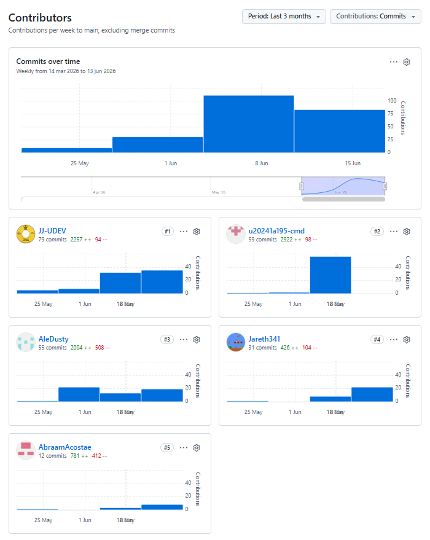

---

### 5.3. Validation Interviews

#### 5.3.1. Diseño de Entrevistas

Las entrevistas de validación tienen como objetivo verificar que los flujos implementados en BakeryManager satisfacen las necesidades reales de los usuarios objetivo. Se diseñaron preguntas orientadas a evaluar la usabilidad, la claridad de la interfaz y la utilidad funcional de las principales características del sistema.

**Segmentos objetivo:**
- **Propietarios y Administradores de Panaderías:**  Usuario operativo que gestiona la producción diaria y monitorea las condiciones de fermentación y cocción mediante sensores IoT.
- **Personal Operativo ( Encargados de Producción):** Usuario supervisor que necesita control sobre equipos, incidentes, inventario y reportes de eficiencia.

**Preguntas para el segmento Propietarios y Administradores de Panaderías:**

1. ¿Con qué frecuencia necesita monitorear la temperatura de los hornos y las cámaras de fermentación durante un turno de producción?
2. Cuando revisa el panel de monitoreo IoT, ¿encuentra fácilmente los datos de temperatura y humedad que necesita para tomar decisiones?
3. ¿Qué tan útil le resulta recibir alertas en tiempo real cuando un sensor detecta valores fuera del rango establecido?
4. Al crear un nuevo lote de producción desde el modal, ¿los campos solicitados (código de lote, producto, cantidad planificada, sede y equipo) son suficientes para registrar su flujo de trabajo real?
5. ¿El flujo de iniciar, completar con cantidad real y cancelar un lote refleja cómo usted gestiona la producción en su panadería actualmente?
6. ¿Le parece relevante registrar la cantidad real producida al completar un lote, para poder comparar con lo planificado?
7. ¿La sección de reporte de producción por sede (total de lotes, completados, cancelados y porcentaje de eficiencia) le entrega información útil para evaluar su turno?
8. ¿Qué funcionalidad adicional consideraría necesaria para mejorar su trabajo diario dentro de la plataforma?

**Preguntas para el segmento Personal Operativo ( Encargados de Producción):**

1. ¿Cómo lleva actualmente el control del estado de los equipos (hornos, cámaras de refrigeración) y sensores en su sede?
2. Al visualizar el panel centralizado de sensores y equipos, ¿puede identificar rápidamente cuáles tienen alertas activas o están desconectados?
3. Cuando ocurre un incidente (humo, temperatura extrema, fallo de equipo), ¿el flujo de registro y consulta de incidentes en la plataforma le parece intuitivo y suficiente?
4. ¿La información disponible en el historial de incidentes (tipo, severidad, área, estado) le ayuda a priorizar la atención y evaluar la seguridad de su sede?
5. ¿Los endpoints de inventario disponibles (registro de entradas/salidas/ajustes, stock actual, historial y reporte de stock bajo) cubren sus necesidades operativas diarias?
6. ¿La gestión de sedes y equipos desde la plataforma podría reemplazar el método que utiliza actualmente para llevar ese control?
7. ¿Qué tan importante es para usted poder consultar el historial de temperaturas, movimientos de inventario e incidentes desde un mismo lugar?
8. ¿Recomendaría BakeryManager a otros encargados de panaderías? ¿Por qué?

---

#### 5.3.2. Registro de Entrevistas

Link de entrevista:   https://1drv.ms/v/c/1c11d3c075083248/IQDayl4VSgOGRZW-_bPVooBKASTv2BM5axkaPZpE24N3BXM?e=rG3rp5

**Entrevista 1 — Segmento: Propietarios y Administradores de Panaderías**

| Campo | Detalle |
|---|---|
| **Entrevistado** | Maria Lopez Garcia |
| **Edad** | 38 |
| **Distrito** | Los Olivos |
| **Entrevistador** | Jareth Vidal |
| **Inicio en el video** | 0:01 |
| **Final en el video** | 4:03 |

**Resumen:**
> La propietaria María López García validó positivamente la propuesta de BakeryManager, destacando que el reporte de eficiencia por sede y la comparación entre la producción planificada y la real son las funciones más críticas del sistema para controlar las mermas y auditar pérdidas monetarias. Aunque su perfil de uso es estratégico y no operativo (revisa el panel solo 2 o 3 veces al día), considera vital recibir alertas IoT en tiempo real en su celular para evitar pérdidas de masa durante la madrugada, priorizando una interfaz visual simplificada tipo semáforo. Finalmente, planteó dos requerimientos clave para el backlog: la necesidad de integrar los lotes con recetas para automatizar el descuento de insumos en el inventario, y la obligatoriedad de registrar un motivo de cancelación al anular la producción.

---

**Entrevista 2 — Segmento: Propietarios y Administradores de Panaderías**

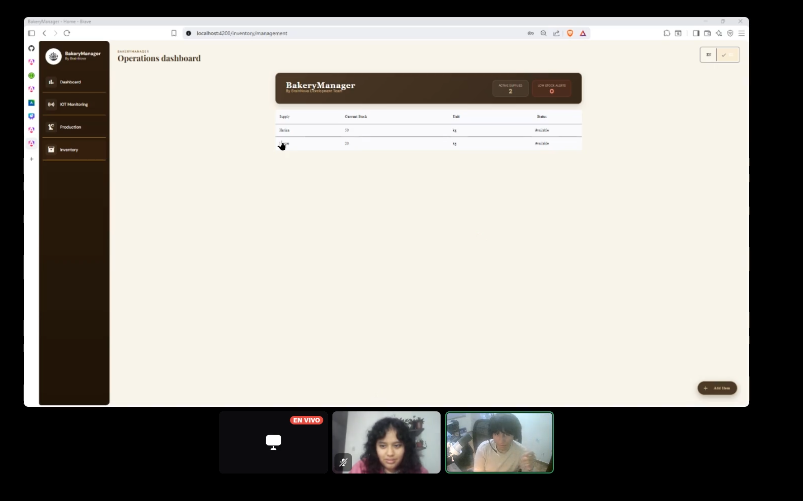

| Campo                  | Detalle              |
|------------------------|----------------------|
| **Entrevistado**       | Alexander Brito      |
| **Edad**               | 25                   |
| **Distrito**           | Callao               |
| **Entrevistador**      | Sofia Diaz Yurivilca |
| **Inicio en el video** | 4:04                 |
| **Final en el video**  | 18:52                |

**Resumen:**
El entrevistado fue **Alexander Brito**, de **25 años**, residente en **Canta Callao**. Durante la entrevista mencionó que actualmente el control de sensores, temperaturas e información operativa se realiza de manera manual, principalmente mediante papel o registros personales, lo que puede generar desorden y pérdida de información.

También señaló que BakeryManager le parece una plataforma intuitiva y útil, ya que permite centralizar la información de sensores, incidentes, producción e inventario en un solo lugar. Destacó especialmente la importancia del monitoreo de temperatura, las alertas visibles y la posibilidad de consultar datos sin tener que revisar cada equipo manualmente.

Finalmente, indicó que recomendaría la plataforma no solo para panaderías, sino también para otros negocios de cocina con equipos industriales, porque considera que ayuda a organizar mejor los procesos, reducir errores y tener mayor control de la operación diaria.

---

**Entrevista 3 — Segmento: Personal Operativo**

| Campo | Detalle                         |
|---|---------------------------------|
| **Entrevistado** | Mathias Sarmiento               |
| **Edad** | 27                              |
| **Distrito** | San Martín                      |
| **Entrevistador** | Molina Vásquez Manuel Alejandro |
| **Inicio en el video** | 18:53                           |
| **Final en el video** | 25:47                           |

**Resumen:**

Actualmente, el control de la planta es muy manual y depende de pizarras, cuadernos y la revisión visual de las máquinas, por lo que una herramienta digital es totalmente necesaria. El panel centralizado de la plataforma soluciona esto al permitir una identificación rápida y visual de las alertas de temperatura o desconexiones, asegurando una reacción inmediata antes de que se afecte la producción.

Por otro lado, la gestión de incidentes es intuitiva y rápida; su historial estructurado ayuda a priorizar revisiones, evaluar la seguridad en tiempo real y mantener informado al turno entrante sin quitar tiempo a la operación. Asimismo, el módulo de inventario cubre con éxito las necesidades diarias, donde el reporte de stock bajo destaca por evitar de manera excelente el desabastecimiento de insumos a mitad de la producción.

Finalmente, la plataforma es capaz de reemplazar por completo los cuadernos y hojas de Excel, centralizando toda la información en un solo lugar para evitar malentendidos o pérdida de datos. Al integrar el historial de temperaturas, el inventario y las fallas, se genera un gran ahorro de tiempo operativo. Por ello, se recomienda totalmente BakeryManager por eliminar el papeleo, ofrecer flujos claros y dar un control real en tiempo real.

**Resumen General:**

A continuación, se presenta la propuesta para completar la sección del Resumen General de las entrevistas de validación:  Resumen General:
Las entrevistas de validación realizadas a los diferentes segmentos de usuarios confirman que BakeryManager responde a una necesidad crítica y urgente de digitalización en el sector. Los entrevistados coinciden en que la transición de métodos tradicionales manuales (pizarras, cuadernos y hojas de Excel) hacia un panel centralizado previene de manera efectiva el desorden, la pérdida de información y los malentendidos operativos entre turnos. Los propietarios y administradores valoran estratégicamente la capacidad de comparar la producción planificada con la real, la generación de reportes de eficiencia por sede y la recepción de alertas IoT en tiempo real para mitigar mermas y pérdidas económicas. Por su parte, el personal operativo destaca la naturaleza intuitiva y ágil de los flujos de gestión de incidentes y el control de inventarios, ponderando especialmente el reporte de stock bajo para evitar el desabastecimiento a mitad de un turno. Como oportunidades de mejora para el backlog del producto, se identificó el valor de integrar las recetas a los lotes de producción para automatizar los descuentos de insumos y la obligatoriedad de registrar un motivo de cancelación al anular un lote. En conclusión, la plataforma fue validada de forma altamente positiva y recomendada unánimemente por su capacidad para eliminar el papeleo y otorgar un control real y en tiempo real de la operación fabril.
---
#### 5.3.3. Evaluaciones según heurísticas

**UX Heuristics & Principles Evaluation**
**Usability – Inclusive Design – Information Architecture**

| | |
|---|---|
| **Carrera:** | Ingeniería de Software |
| **Curso:** | Aplicaciones Open Source |
| **Sección:** | 20262 |
| **Profesores:** | Angel Velásquez Núñez |
| **Auditor:** | Equipo BrainNova — BakeryManager |
| **Cliente(s):** | Propietarios y Administradores de Panaderías / Personal Operativo (Encargados de Producción) |

**Site o App a evaluar:** BakeryManager — Frontend Web Application

**URL:** `https://bakery-manager-43fb0.web.app/sign-in`

**TAREAS A EVALUAR:**

El alcance de esta evaluación incluye la revisión de la usabilidad de las siguientes tareas:

1. Registro e inicio de sesión de usuario (IAM)
2. Visualización del panel de monitoreo IoT (temperatura, humedad, estado de sensores y equipos)
3. Creación de un lote de producción mediante el modal
4. Inicio, completar con cantidad real producida y cancelación de un lote
5. Visualización del reporte de producción por sede
6. Registro y consulta de incidentes
7. Gestión de inventario (entradas, salidas y ajustes de stock)
8. Navegación general y consistencia visual de la aplicación

**ESCALA DE SEVERIDAD:**

| Nivel | Descripción |
|---|---|
| 1 | Problema superficial: puede ser obviado fácilmente o resuelto rápido por el usuario. |
| 2 | Problema menor: ocurre esporádicamente, afecta la experiencia pero no bloquea al usuario. |
| 3 | Problema mayor: ocurre frecuentemente. Necesita ser corregido con alta prioridad. |
| 4 | Problema catastrófico: el usuario no puede completar la tarea. Debe corregirse antes del lanzamiento. |

**TABLA DE RESUMEN:**

| # | Problema | Escala de severidad | Heurística/Principio violado |
|---|---|---|---|
| 1 | El modal de completar lote se cierra sin mostrar confirmación de que la operación fue exitosa. | 2 | Usability: Visibility of system status |
| 2 | El panel IoT no muestra el timestamp de la última actualización de datos de cada sensor. | 3 | Usability: Visibility of system status |
| 3 | No existe confirmación antes de ejecutar "Cancelar" en un lote con estado IN_PROGRESS. | 3 | Usability: User control and freedom |
| 4 | Los mensajes de error en el formulario de creación de lote no especifican el formato esperado por campo. | 2 | Usability: Help users recognize, diagnose and recover from errors |
| 5 | En pantallas menores a 360px el porcentaje de progreso del lote queda truncado y no es legible. | 1 | Inclusive Design: Proporcionar experiencia comparable |

**DESCRIPCIÓN DE PROBLEMAS:**

**Problema #1:** El modal de completar lote se cierra sin confirmación de éxito.
- **Severidad:** 2
- **Heurística violada:** Usability — Visibility of system status
- **Descripción:** Cuando el usuario confirma la cantidad producida y cierra el modal de completar lote, no aparece ningún mensaje de feedback (toast o notificación) que indique que el lote fue completado exitosamente. El usuario debe buscar visualmente el cambio de estado en la tarjeta.
- **Recomendación:** Implementar una notificación tipo toast que muestre "Lote completado exitosamente" por 3 segundos tras cerrar el modal.

**Problema #2:** El panel IoT no indica cuándo se actualizaron los datos de los sensores.
- **Severidad:** 3
- **Heurística violada:** Usability — Visibility of system status
- **Descripción:** Los valores de temperatura y humedad mostrados en el dashboard no tienen un indicador de cuándo fue la última sincronización. El usuario no puede distinguir si está viendo datos en tiempo real o desactualizados, lo que puede llevar a decisiones incorrectas.
- **Recomendación:** Mostrar un timestamp "Última actualización: HH:MM:SS" junto a cada tarjeta de sensor, actualizado automáticamente con cada sincronización.

**Problema #3:** Cancelar un lote en progreso se ejecuta sin confirmación previa.
- **Severidad:** 3
- **Heurística violada:** Usability — User control and freedom
- **Descripción:** Al presionar el botón "Cancelar" sobre un lote con estado IN_PROGRESS, la acción se ejecuta de inmediato sin solicitar confirmación. Esta acción es irreversible y puede activarse accidentalmente.
- **Recomendación:** Agregar un modal de confirmación con el mensaje "¿Estás seguro de que deseas cancelar este lote? Esta acción no se puede deshacer." antes de ejecutar el PATCH /cancel.

**Problema #4:** Los mensajes de error en el formulario de creación de lote son genéricos.
- **Severidad:** 2
- **Heurística violada:** Usability — Help users recognize, diagnose and recover from errors
- **Descripción:** Cuando el usuario deja campos obligatorios vacíos en el modal de creación de lote, el sistema resalta el campo con borde rojo pero no indica qué valor o formato se espera.
- **Recomendación:** Agregar textos de ayuda descriptivos bajo cada campo con el formato y rango esperado al momento de detectar el error.

**Problema #5:** El porcentaje de progreso del lote se trunca en pantallas pequeñas.
- **Severidad:** 1
- **Heurística violada:** Inclusive Design — Proporcionar experiencia comparable
- **Descripción:** En dispositivos con pantallas menores a 360px de ancho, el texto con la cantidad producida vs planificada y el porcentaje en la tarjeta del lote queda cortado y no es legible completamente.
- **Recomendación:** Ajustar el layout de la batch-card para pantallas pequeñas mostrando el porcentaje en una segunda línea independiente con font-size reducido.

---

### 5.4. Video About-the-Product

El Video About-the-Product presenta las principales funcionalidades implementadas en BakeryManager a lo largo de los tres sprints del proyecto: la Landing Page comercial, la aplicación web frontend en Angular y los RESTful Web Services del backend en Spring Boot.

**Contenido del video:**
- Presentación de la Landing Page con identidad visual BakeryManager (paleta Cream Caramel, tipografía Playfair Display)
- Flujo de autenticación: registro e inicio de sesión
- Dashboard de monitoreo IoT: temperatura, humedad y estado de sensores y equipos
- Gestión de lotes de producción: crear lote desde modal, iniciar, completar con cantidad real producida y generar reporte de eficiencia por sede
- Panel de incidentes: consulta y detalle de incidentes
- Gestión de inventario: movimientos de stock (entrada/salida/ajuste), consulta de stock actual y reporte con detección de stock bajo
- Documentación de la API en Swagger UI con los tres Bounded Contexts (Production, Monitoring, Inventory)

**Duración:** `8:19`

**Link del video:** `https://upcedupe-my.sharepoint.com/:v:/g/personal/u202316878_upc_edu_pe/IQADN-2B6Hy-T5a2X1Z84LNCATdc8bUC6yw_ctWvAz0GsJ0?nav=eyJyZWZlcnJhbEluZm8iOnsicmVmZXJyYWxBcHAiOiJTdHJlYW1XZWJBcHAiLCJyZWZlcnJhbFZpZXciOiJTaGFyZURpYWxvZy1MaW5rIiwicmVmZXJyYWxBcHBQbGF0Zm9ybSI6IldlYiIsInJlZmVycmFsTW9kZSI6InZpZXcifX0%3D&e=xfyQfu`

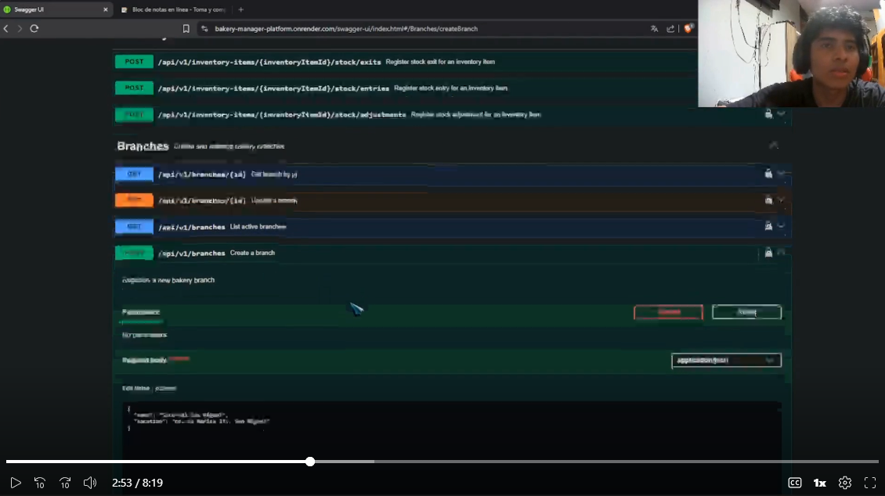
